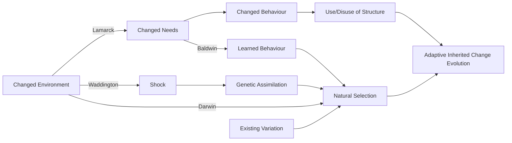

# Genetic Algorithms

**Reference:** *Essentials of Metaheuristics, 2nd Ed.* — Sean Luke, Lulu, 2016

---

## Introduction

- **Origin:** Holland, 1970s
- **Inspiration:** Darwinian model of evolution and modern genetics
- **Core biological operations:**
  - Mutation
  - Crossover (recombination, "mating")
  - Selection

## Comparison with $(\mu, \lambda)$ Evolution Strategies

Genetic Algorithms share similarities with $(\mu, \lambda)$ ES, but differ in:

- Focus on the individual vector as a **chromosome / genome**
  - Traditionally **binary encoding**, not real/floating point (though other encodings are possible)
- **Crossover** is a fundamental operation (not only mutation)
- Many approaches to parent selection (sometimes probabilistic)

---

## Algorithm 20 — The Genetic Algorithm (GA)

```
1:  popsize ← desired population size       ▷ Basically λ. Make it even.
2:  P ← {}
3:  for popsize times do
4:      P ← P ∪ {new random individual}
5:  Best ← □
6:  repeat
7:      for each individual P_i ∈ P do
8:          AssessFitness(P_i)
9:          if Best = □ or Fitness(P_i) > Fitness(Best) then
10:             Best ← P_i
11:     Q ← {}                              ▷ Begin deviation from (μ, λ)
12:     for popsize/2 times do
13:         Parent P_a ← SelectWithReplacement(P)
14:         Parent P_b ← SelectWithReplacement(P)
15:         Children C_a, C_b ← Crossover(Copy(P_a), Copy(P_b))
16:         Q ← Q ∪ {Mutate(C_a), Mutate(C_b)}
17:     P ← Q                               ▷ End of deviation
18: until Best is the ideal solution or we have run out of time
19: return Best
```

---

## Initialisation

### Algorithm 21 — Generate a Random Bit-Vector

```
1:  v⃗ ← a new vector ⟨v_1, v_2, ..., v_l⟩
2:  for i from 1 to l do
3:      if 0.5 > a random number chosen uniformly between 0.0 and 1.0 inclusive then
4:          v_i ← true
5:      else
6:          v_i ← false
7:  return v⃗
```

Many other representations are possible (e.g., trees in genetic programming, molecule representations).

---

## Mutation

### Algorithm 22 — Bit-Flip Mutation

```
1:  p ← probability of flipping a bit              ▷ Often p is set to 1/l
2:  v⃗ ← boolean vector ⟨v_1, v_2, ..., v_l⟩ to be mutated

3:  for i from 1 to l do
4:      if p ≥ random number chosen uniformly from 0.0 to 1.0 inclusive then
5:          v_i ← ¬(v_i)
6:  return v⃗
```

---

## Crossover Operators

### Algorithm 23 — One-Point Crossover

```
1:  v⃗ ← first vector ⟨v_1, v_2, ..., v_l⟩ to be crossed over
2:  w⃗ ← second vector ⟨w_1, w_2, ..., w_l⟩ to be crossed over

3:  c ← random integer chosen uniformly from 1 to l inclusive
4:  if c ≠ 1 then
5:      for i from c to l do
6:          Swap the values of v_i and w_i
7:  return v⃗ and w⃗
```

#### Disadvantages of One-Point Crossover

- Highly likely that $v_1$ and $v_l$ will get separated:
$$p = \frac{l-1}{l}$$
- Unlikely that $v_i$ and $v_{i+1}$ will get separated:
$$p = \frac{1}{l}$$

➡ **Linkage** is greater between some genes than others. If $v_1$ and $v_l$ are both needed in a good solution, this biases against it. More generally, the issue is the *distance between genes*.

---

### Algorithm 24 — Two-Point Crossover

```
1:  v⃗ ← first vector ⟨v_1, v_2, ..., v_l⟩ to be crossed over
2:  w⃗ ← second vector ⟨w_1, w_2, ..., w_l⟩ to be crossed over

3:  c ← random integer chosen uniformly from 1 to l inclusive
4:  d ← random integer chosen uniformly from 1 to l inclusive
5:  if c > d then
6:      Swap c and d
7:  if c ≠ d then
8:      for i from c to d - 1 do
9:          Swap the values of v_i and w_i
10: return v⃗ and w⃗
```

**Note:** Equivalent to crossing the outsides — best visualised as rings.

> **Diagram (Ring Visualisation):** Two chromosomes are drawn as circular rings (toruses), each labelled with $v_l$ and $v_1$ adjacent to one another. Two cut points $c$ and $d$ are marked on each ring. Coloured arrows (green and red) show that the segment between $c$ and $d$ is swapped between the two rings. This shows that on a ring, $v_1$ and $v_l$ are now treated the same as any other adjacent pair $v_i$ and $v_{i+1}$.

#### Two-Point Crossover Properties
- $v_1$ and $v_l$ now treated the same as any other adjacent $v_i$ and $v_{i+1}$
- However, $v_1$ and $v_{l/2}$ (genes far apart) are still more likely to be broken than short-distance genes
- Open question: do "chunks" have a meaning?

---

### Algorithm 25 — Uniform Crossover

```
1:  p ← probability of swapping an index            ▷ Often p = 1/l. At any rate, p ≤ 0.5
2:  v⃗ ← first vector ⟨v_1, v_2, ..., v_l⟩ to be crossed over
3:  w⃗ ← second vector ⟨w_1, w_2, ..., w_l⟩ to be crossed over

4:  for i from 1 to l do
5:      if p ≥ random number chosen uniformly from 0.0 to 1.0 inclusive then
6:          Swap the values of v_i and w_i
7:  return v⃗ and w⃗
```

---

## Crossover is Not Global Mutation

### Key Limitations

- Initial population may not have enough **diversity** to explore the whole space
- If every individual in a column has the same value (e.g., all `1`), crossover **can never** produce a different value (e.g., a `0`) at that position

### Hypercube Interpretation

- Binary vectors of length $l$ all sit on the corners of a hypercube in $l$-dimensional space
- **Crossover alone** can only produce children on corners of the same hypercube
- Any time all parents share one gene value, the hypercube **collapses** in that dimension (cf. direct methods)
- This collapse **can never be restored** by crossover alone
- Eventually the population will **converge** to a single point (individual chromosome)
- Usually convergence is **premature** — unless it happens to coincide with an optimal (or good enough) solution

---

## So Why Crossover?

### Intuition / Building Block Theory

- Just because it's in biology doesn't mean it makes for the best computer algorithm — justification is needed
- Highly fit individuals share common traits
- Those traits are expressed by **"building blocks"** in the genome
- **Theory:** Crossover spreads good building blocks through the population
  - Found in some practical examples
  - Many empirical attempts to demonstrate this generally
  - Theoretical formalisation known as **schema theory**
  - Complex and not entirely satisfactory

### Epistasis and Linkage

- Crossover relies on the assumption of **epistasis**: the degree to which genes are functionally intertwined in affecting fitness
- Effects of crossover on epistatic genes depend on **linkage** — how likely they are to survive crossover:
  - **One-point crossover:** depends on distance and position
  - **Two-point crossover:** depends on distance
  - **Uniform crossover:** depends on $p$

---

## Selection Methods

### Background

- Recall **truncation selection** in ES's: keep best $\mu$ individuals; each is parent of a fixed number of offspring
- `SelectWithReplacement` is open to a wide range of options:
  - Individuals could get picked more than once
  - Low fitness individuals could be picked (might want these less frequently)

---

### Fitness-Proportionate Selection (Roulette Selection)

- Original and common approach
- Select individuals in proportion to their fitness
- Achieved by "sizing" and "stacking" individuals according to fitness

Let the sum of fitnesses be:
$$s = \sum_i f_i$$

Choose random $r \in [0, s]$, and select the individual whose stacked fitness range contains $r$.

#### Algorithm 30 — Fitness-Proportionate Selection

```
Perform once per generation                         ▷ Or whenever any fitnesses change
1:  global p⃗ ← population copied into a vector of individuals ⟨p_1, p_2, ..., p_l⟩

3:  global f⃗ ← ⟨f_1, f_2, ..., f_l⟩ fitnesses of individuals in p⃗  ▷ Must all be ≥ 0
4:  if f⃗ is all 0.0s then                          ▷ Deal with all 0 fitnesses gracefully
5:      Convert f⃗ to all 1.0s
6:  for i from 2 to l do                            ▷ Convert f⃗ to a CDF; f_l = s
7:      f_i ← f_i + f_{i-1}

Perform each time
9:   n ← random number from 0 to f_l inclusive
10:  for i from 2 to l do                           ▷ Could use binary search
11:      if f_{i-1} < n ≤ f_i then
12:          return p_i
13:  return p_1
```

#### Issues with Fitness-Proportionate Selection

- Assumes fitness is meaningful in an **absolute** sense, not just relative
  - In general, fitness *value* may be relatively meaningless other than for *comparing* two solutions (cf. evaluation metrics: MSE, RMSE, RSS)
- If all fitnesses are similar values (even though some are better), there is roughly equal probability of choosing any individual

---

### Stochastic Universal Sampling (SUS)

- Baker, 1987
- Stack individuals as in roulette, then select $n$ individuals at **regular intervals** from the stacked range
- Properties:
  - **Low variance resampling**
  - Ensures any individual with $f_i \geq \dfrac{s}{n}$ gets chosen at least once
  - Preserves fitter individuals while retaining some probability of choosing less fit (leans towards exploitation)
- Complexity: $O(n)$

#### Algorithm 31 — Stochastic Universal Sampling

```
Perform once per n individuals produced            ▷ Usually n = l (once per generation)
1:  global p⃗ ← copy of population ⟨p_1, p_2, ..., p_l⟩, shuffled randomly

3:  global f⃗ ← ⟨f_1, f_2, ..., f_l⟩ fitnesses in same order as p⃗   ▷ All must be ≥ 0
4:  global index ← 0
5:  if f⃗ is all 0.0s then
6:      Convert f⃗ to all 1.0s
7:  for i from 2 to l do                            ▷ Convert f⃗ to a CDF; f_l = s
8:      f_i ← f_i + f_{i-1}
9:  global value ← random number from 0 to f_l/n inclusive

Perform each time
11: while f_{index} < value do
12:     index ← index + 1
13: value ← value + f_l / n
14: return p_{index}
```

---

### Tournament Selection

- A **non-parametric** selection algorithm — only considers the **rank order** of individuals
- Most popular selection mechanism for GAs and others

#### Algorithm 32 — Tournament Selection

```
1:  P ← population
2:  t ← tournament size, t ≥ 1

3:  Best ← individual picked at random from P with replacement
4:  for i from 2 to t do
5:      Next ← individual picked at random from P with replacement
6:      if Fitness(Next) > Fitness(Best) then
7:          Best ← Next
8:  return Best
```

#### Properties

- Not sensitive to size of fitness values
- Simple (and easily parallelised)
- Tuneable via **tournament size** $t$:
  - $t = 1$ → random selection
  - $t \gg \text{popsize}$ → tournament selection approaches truncation selection with $\mu = 1$

---

## Elitism

- The fittest individual(s) are **automatically preserved** for the next generation → **elite group**
- Favours exploitation, similar to $(\mu + \lambda)$
- **Caution:** May cause lack of diversity and premature convergence
- Mitigations:
  - Increase mutation rate
  - Breed in diversity from outside the elite group
  - Reduce how many elites are stored

### Algorithm 33 — The Genetic Algorithm with Elitism

```
1:  popsize ← desired population size
2:  n ← desired number of elite individuals       ▷ popsize - n should be even

3:  P ← {}
4:  for popsize times do
5:      P ← P ∪ {new random individual}
6:  Best ← □
7:  repeat
8:      for each individual P_i ∈ P do
9:          AssessFitness(P_i)
10:         if Best = □ or Fitness(P_i) > Fitness(Best) then
11:             Best ← P_i
12:     Q ← {the n fittest individuals in P, breaking ties at random}
13:     for (popsize - n)/2 times do
14:         Parent P_a ← SelectWithReplacement(P)
15:         Parent P_b ← SelectWithReplacement(P)
16:         Children C_a, C_b ← Crossover(Copy(P_a), Copy(P_b))
17:         Q ← Q ∪ {Mutate(C_a), Mutate(C_b)}
18:     P ← Q
19: until Best is the ideal solution or we have run out of time
20: return Best
```

---

## Tree-Style Genetic Programming

- Use meta-heuristics to **evolve highly fit computer programs**
- Individuals are represented as expression trees (e.g., arithmetic / mathematical expressions with operators like $+, \cdot, \sin, \cos, \sqrt{\cdot}$ and operands like $x$, $y$, constants)
- **Mutation:** Replace a subtree node with a different subtree (e.g., replacing a constant `0.981` with the expression `x + y`)
- **Crossover:** Swap subtrees between two parent program trees to produce offspring programs

---

## Many Faces of Evolution



**Key theories illustrated:**
- **Lamarck:** Changed environment → changed needs → changed behaviour → use/disuse of structure → adaptive inherited change
- **Baldwin:** Learned behaviour influences natural selection
- **Waddington:** Environmental shock → genetic assimilation → natural selection
- **Darwin:** Existing variation + natural selection → adaptive inherited change (evolution)