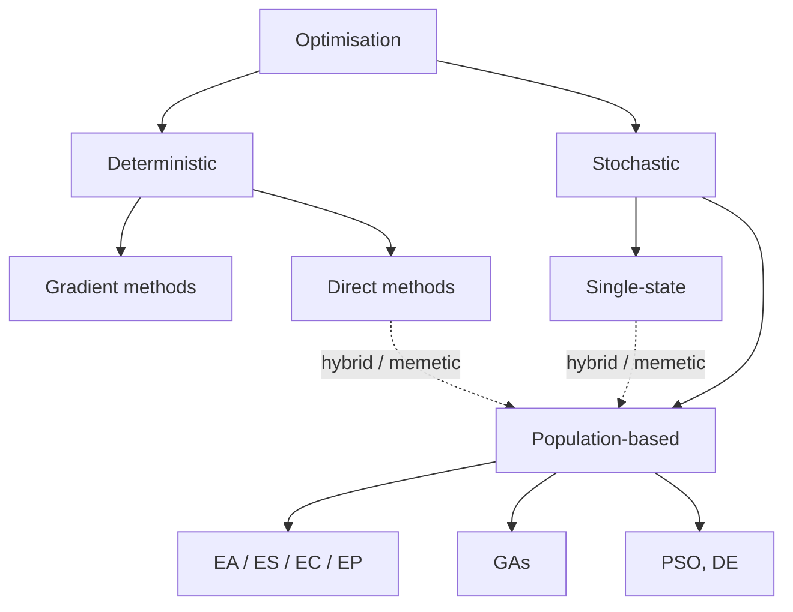

# Emergent Behaviour and Hybrid Algorithms

**Reference:** *Essentials of Metaheuristics, 2nd Ed.* — Sean Luke, Lulu, 2016

---

## Particle Swarm Optimisation (PSO)

- Modelled on swarming or flocking behaviour of animals (e.g., a flock of seagulls fishing).
- Members move according to their own trajectory, but modify behaviour based on other members of the flock.
- Other members dive for fish, their locality may be considered more promising:
  - Most divers getting fish — most promising?
  - Biggest fish — most promising?

### Decision-Making of Each Individual

Each individual makes a "decision" — should I go to:
- Where I've found fish?
- Where biggest/most fish have been found?
- Most promising location nearby?
- Some combination of the above?

Over time, the flock tends to converge on the highest concentration / largest fish — this is the **emergent behaviour** of the group.

### Balance of Behaviours

- **Collective behaviour** — promotes *exploitation*.
- **Individual behaviour** — continues *exploration*.

---

## 2D / 3D Visualisation

> **Diagram (2D Trajectory Plot):** A 2D contour plot with x-axis and y-axis ranging from −1.00 to 1.00, showing concentric elliptical contour lines centered near the origin (red ×). Particles (gray dots) are scattered, primarily in the upper-right quadrant, with curved trajectory lines showing them spiraling inward toward the center (the global optimum). Source: pyswarms.readthedocs.io

> **Diagram (3D Trajectory Plot):** A 3D surface plot showing a paraboloid (bowl-shaped) function with axes x, y (range −1.00 to 1.00) and z-axis (range 0.0 to 0.8). Particles (gray dots) are scattered above the bowl surface, converging toward the minimum at the bottom of the bowl (red ×). Source: pyswarms.readthedocs.io

### Multimodal Example

> **Diagram (Multimodal Contour Plot):** A 2D contour plot from −3 to 3 on both axes, with a color bar ranging from −5 to 20. The landscape contains multiple local minima (blue concentric rings) and local maxima distributed in a grid-like pattern. Red × markers indicate particle positions, and orange arrows show velocity vectors of particles moving across the multimodal fitness landscape. Source: Ephramac

---

## Another View — Laws of Gravity / Motion

- **Agent (particle) has its own momentum** → favours *exploration*.
- **Gravitational pull** towards:
  - Individual best
  - Global best
  - (Local best)
  → favours *exploitation*.
- **Friction** (optional) → favours *exploitation*.

---

## Algorithm — Definitions

| Symbol | Meaning |
|---|---|
| $\vec{x} = (x_1, x_2, \ldots)$ | Particle's location |
| $\vec{v} = (v_1, v_2, \ldots)$ | Particle's velocity |
| $\vec{v}^t = \vec{x}^t - \vec{x}^{(t-1)}$ | Discretised "velocity" |
| $\vec{a}^t = \vec{v}^t - \vec{v}^{(t-1)}$ | "Acceleration" |
| $\vec{x}^*$ | Fittest location of $\vec{x}$ so far |
| $\vec{x}^+$ | Fittest location in *neighbourhood* of $\vec{x}$ so far |
| $\vec{x}^!$ | Fittest location discovered by *anyone* in flock so far |

---

## Algorithm — Steps

- Assess fitness of each individual (particle) and update recorded bests.
- Update each particle's position using some (randomised weighted linear) combination of:
  - Particle's velocity vector
  - Vector towards $\vec{x}^*$
  - Vector towards $\vec{x}^+$
  - Vector towards $\vec{x}^!$

### Velocity Update Equation

$$v_i \leftarrow \alpha v_i + b(x_i^* - x_i) + c(x_i^+ - x_i) + d(x_i^! - x_i)$$

---

## Partial Algorithm (PSO Update Loop)

```
for each particle x ∈ P with velocity v do
    x*  ← previous fittest location of x
    x+  ← previous fittest location of informants of x
    x!  ← previous fittest location any particle
    for each dimension i do
        b ← random number from 0.0 to β inclusive       (stochastic)
        c ← random number from 0.0 to γ inclusive       (stochastic)
        d ← random number from 0.0 to δ inclusive       (stochastic)
        v_i ← α·v_i + b(x_i* − x_i) + c(x_i+ − x_i) + d(x_i! − x_i)

for each particle x ∈ P with velocity v do
    x ← x + ε·v
```

### Hyper-parameters

- $\alpha, \beta, \gamma, \delta$ — relative contributions of momentum and attraction.
- $\epsilon$ — tuner for how fast the particle moves (cf. step size).

> **Q:** How would you expect the various hyper-parameters to affect exploration vs exploitation?

---

## Algorithm 39 — Particle Swarm Optimization (PSO)

```
1:  swarmsize ← desired swarm size
2:  α ← proportion of velocity to be retained
3:  β ← proportion of personal best to be retained
4:  γ ← proportion of the informants' best to be retained
5:  δ ← proportion of global best to be retained
6:  ε ← jump size of a particle

7:  P ← {}
8:  for swarmsize times do
9:      P ← P ∪ {new random particle x with a random initial velocity v}
10: Best ← □
11: repeat
12:     for each particle x ∈ P with velocity v do
13:         AssessFitness(x)
14:         if Best = □ or Fitness(x) > Fitness(Best) then
15:             Best ← x
16:     for each particle x ∈ P with velocity v do      ▷ Determine how to Mutate
17:         x*  ← previous fittest location of x
18:         x+  ← previous fittest location of informants of x   ▷ (including x itself)
19:         x!  ← previous fittest location any particle
20:         for each dimension i do
21:             b ← random number from 0.0 to β inclusive
22:             c ← random number from 0.0 to γ inclusive
23:             d ← random number from 0.0 to δ inclusive
24:             v_i ← α·v_i + b(x_i* − x_i) + c(x_i+ − x_i) + d(x_i! − x_i)
25:     for each particle x ∈ P with velocity v do      ▷ Mutate
26:         x ← x + ε·v
27: until Best is the ideal solution or we have run out of time
28: return Best
```

---

## Other Conceptualisations of PSO

### "Personal" vs "Social"

$$v_i^{t+1} = \underbrace{v_i^t}_{\text{Inertia}} + \underbrace{c_1 r_1 (pbest_i^t - p_i^t)}_{\text{Personal influence}} + \underbrace{c_2 r_2 (gbest^t - p_i^t)}_{\text{Social influence}}$$

Source: https://www.baeldung.com/cs/pso

### "Cognitive" vs "Social"

> **Diagram (PSO Vector Update):** Shows a particle's position update from $x_i(t)$ (position before update) to $x_i(t+1)$ (position after update). Three contributing vectors are illustrated:
> - **Current motion (inertia):** $v_i(t)$ — the existing velocity vector.
> - **Cognitive acceleration / Personal influence:** $c_1 r_1 [\hat{x}_i(t) - x_i(t)]$ — vector pointing toward the individual best solution $\hat{x}_i(t)$.
> - **Social acceleration / Social influence:** $c_2 r_2 [g(t) - x_i(t)]$ — vector pointing toward the global best candidate solution $g(t)$.
>
> The new velocity $v_i(t+1)$ is the resultant sum of these three contributions.

---

## Differential Evolution (DE)

- Primarily for **multi-dimensional real-valued spaces** (like PSO).
- **Children compete directly against their immediate parents.**
- Size of mutations based on current variance in the population (**adaptive mutation**, cf. one-fifth rule).

### Example Mutation Operator

- Form a new child by vector addition from 3 others.
- The more spread the population, the bigger the step is likely.

> **Diagram (DE Mutation, Figure 15):** Shows a 2D scatter plot of population individuals (black dots). Three individuals labelled A, B, and C are highlighted. A vector is drawn from B to C, then this vector is added to a copy of individual A to produce a new "Child" point displaced from A. Caption: *Differential Evolution's primary mutation operator. A copy of individual A is mutated by adding to it the vector between two other individuals B and C, producing a child.*

*Comparison hint: This mutation operator is reminiscent of Nelder-Mead simplex moves (reflection, expansion, outside contraction, inside contraction, shrinkage).*

---

## Hybrid Optimisation Algorithms

- **Single-state algorithms** (e.g., hill climbs) are *very efficient* at finding local optima → exploitation.
- **Population-based algorithms** are much better at finding global regions with good optima → exploration.
- Combining them gives the best of both worlds → **hybrid algorithms**.
- One of the simplest hybrid strategies: use hill climbing to locally optimise population members within an EA-like (or GA-like) algorithm.

---

## Algorithm 36 — An Abstract Hybrid Evolutionary and Hill-Climbing Algorithm

```
1:  t ← number of iterations to Hill-Climb

2:  P ← Build Initial Population
3:  Best ← □
4:  repeat
5:      AssessFitness(P)
6:      for each individual P_i ∈ P do
7:          P_i ← Hill-Climb(P_i) for t iterations          ▷ Replace P_i in P
8:          if Best = □ or Fitness(P_i) > Fitness(Best) then
9:              Best ← P_i
10:     P ← Join(P, Breed(P))
11: until Best is the ideal solution or we have run out of time
12: return Best
```

---

## Memetic Algorithms — "Did Lamarck Get the Last Laugh?"

- Hybrid algorithms are sometimes called **memetic algorithms**.
- Think of a **meme** as a "social version" of a **gene**:
  - Memes are passed around, they spread, and they affect individual behaviour.
  - Learning occurs *within* the population/generation.
- Open question: Can memes also be passed down *between* generations? (Lamarckian inheritance.)

---

## Adaptive Algorithms — Roadmap



### Population-Based Methods Detail

- **EA / ES / EC / EP / GA / +**
- Schemes: $(\mu, \lambda)$, $(\mu + \lambda)$
- **Mutation:** Gaussian, bit-flip, adaptive, self-adaptive
- **Crossover:** 1-point, 2-point, uniform
- **Selection:** fitness-proportionate, SUS, tournament, elitism
- **Other:** particle swarm, differential evolution, …

**Hybrid / memetic** algorithms span across single-state, direct methods, and population-based methods.

---
