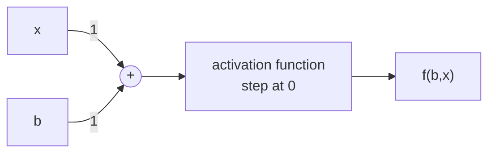
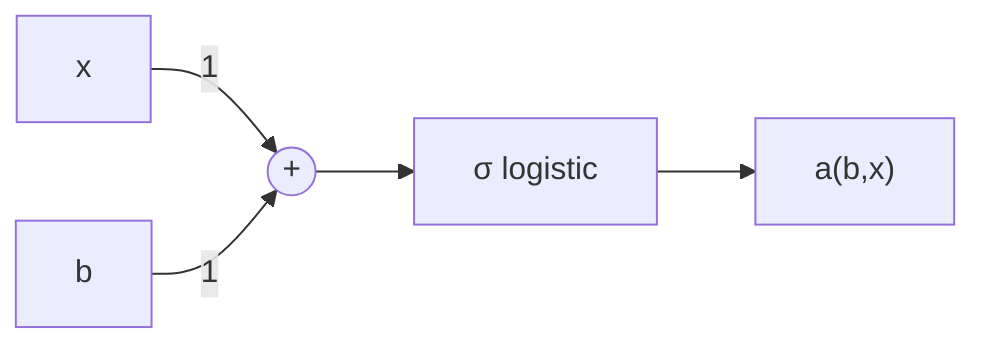
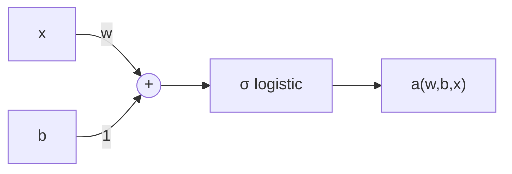

# Perceptrons to Neurons: 1-d Classifiers

**Reference:** Michael Neilsen, *Neural Networks and Deep Learning*, 2019 — http://neuralnetworksanddeeplearning.com

---

## 1. The Classification Problem

**Goal:** Learn the escape velocity of the moon by trial and error — i.e., learn a function $f$ that takes a velocity and returns a binary decision (leave? yes/no). Such a function is called a **classifier**.


### Sample Trials

| Trial | Speed (km/s) | Success? | x | y |
|-------|--------------|----------|-----|-----|
| 1 | 1 | no | 1 | 0 |
| 2 | 5 | yes | 5 | 1 |
| 3 | 3 | yes | 3 | 1 |
| 4 | 2 | no | 2 | 0 |
| 5 | 2.5 | yes | 2.5 | 1 |
| 6 | 2.2 | no | 2.2 | 0 |

---

## 2. The Perceptron

A perceptron applies a step (threshold) function to the input:

$$f(x) = \begin{cases} 1, & x > T \\ 0, & x \leq T \end{cases}$$

where $T$ is the **threshold parameter**. The decision rule is $f(x) > 0.5$.

> **Diagram:** Input $x$ feeds into a black box containing a step function plot (jumping from 0 to 1 at $x = T$). Output $f(x)$ exits to the right, compared against 0.5. A biological neuron analogy is shown below: a pre-synaptic ("sending") cell fires an *action potential* across a *synapse* to a post-synaptic ("receiving") cell.

---

## 3. Introducing the Bias

**Math trick:** Replace the threshold $T$ with an input called a **bias** $b$.

Note: $x > T \equiv x - T > 0$, so let $b = -T$:

$$f(b, x) = \begin{cases} 1, & x + b > 0 \\ 0, & x + b \leq 0 \end{cases}$$

The threshold is shifted to $0$, and $b$ becomes a learned input.



This is called the **activation function**.

---

## 4. Learning Goal

- Find $f$ that correctly classifies the examples → Find $b$ that correctly classifies the examples
- **Optimise the 1-dimensional vector** $[b]$

---

## 5. Cost Function (Mean Squared Error)

Define a **cost (error) function**:

$$C(b) = \frac{1}{2n}\sum_x \big(y(x) - a(b, x)\big)^2$$

where $a$ is the activation function:

$$a(b, x) = \begin{cases} 1, & x + b > 0 \\ 0, & x + b \leq 0 \end{cases}$$

**Goal:** Find $b$ which minimises $C(b)$.

---

## 6. Sigmoid Functions

**Problem:** The Heaviside step function is not continuously differentiable.

**Solution:** Approximate it with a continuously differentiable function — a **sigmoid** ("squished S").

### Properties of sigmoids
- Monotonically increasing
- Constrained by horizontal asymptotes
- First derivative is a bell-shaped curve (e.g. normal distribution)

### Common sigmoids
$\text{erf}\!\left(\frac{\sqrt{\pi}}{2}x\right)$, $\tanh(x)$, $\frac{2}{\pi}\text{gd}\!\left(\frac{\pi}{2}x\right)$, $\frac{x}{\sqrt{1+x^2}}$, $\frac{2}{\pi}\arctan\!\left(\frac{\pi}{2}x\right)$, $\frac{x}{1+|x|}$

### The Logistic Function (the chosen sigmoid)

$$\sigma(z) = \frac{1}{1 + e^{-z}}$$

- One example of a sigmoid
- Has terrific mathematical properties (smooth, differentiable, bounded in $(0,1)$)
- Commonly used in neural networks (where *sigmoid* and *logistic function* are often used interchangeably)

---

## 7. The Logistic Neuron

Replace the conditional step with the logistic activation:

$$a(b, x) = \frac{1}{1 + e^{-(x+b)}}$$



Decision rule remains $a(b, x) > 0.5$.

---

## 8. Gradient Descent — Derivation of $\dfrac{dC}{db}$

Starting from:

$$C(b) = \frac{1}{2n}\sum_x \big(y(x) - a(b,x)\big)^2,\quad a(b,x) = \sigma(x+b) = \frac{1}{1+e^{-(x+b)}}$$

By the chain rule:

$$\frac{d}{db}C(b) = -\frac{1}{n}\sum_x \left(y(x) - \frac{1}{1+e^{-(x+b)}}\right)\!\left(\frac{e^{-(x+b)}}{(1+e^{-(x+b)})^2}\right)$$

### Sigmoid Simplification

Recognising $\sigma'(z) = \sigma(z)(1-\sigma(z))$, this collapses to:

$$\frac{d}{db}C(b) = -\frac{1}{n}\sum_x \big(y(x) - a(b,x)\big)\big(e^{-(x+b)}\,a(b,x)^2\big)$$

Or, equivalently:

$$\boxed{\,\frac{d}{db}C(b) = -\frac{1}{n}\sum_x \big(y(x) - a(b,x)\big)\cdot a(b,x)\cdot\big(1 - a(b,x)\big)\,}$$

---

## 9. Implementation (Python / NumPy)

```python
def logistic(z):
    return 1 / (1 + np.exp(-z))

def activation(b, xs):
    return logistic(xs + b)

def residuals(b, xs, ys):
    return np.abs(ys - activation(b, xs))

def cost(b, xs, ys):
    return 0.5 * np.mean(np.square(residuals(b, xs, ys)))

def d_C(b, xs, ys):
    return -np.mean((ys - activation(b, xs)) * activation(b, xs) * (1 - activation(b, xs)))
```

### 1-D Gradient Descent Algorithm

```
Algorithm: 1-D Gradient Descent
1: x ← random initial value
2: repeat
3:     x ← x − α f'(x)
4: until stopping criterion reached
5: return x
```

### Python implementation

```python
def gradient_descent(alpha, epsilon, xs, ys):
    b = -10 * rng.random()         # random number between -10 and 0
    c = cost(b, xs, ys)
    last_c = np.inf
    while (np.abs(c - last_c) > epsilon):   # note: stops on cost-change
        b = b - alpha * d_C(b, xs, ys)
        last_c = c
        c = cost(b, xs, ys)
        print("b:", b, "cost:", c)
    return b
```

### Run configuration

```python
Velocities = np.array([1, 5, 3, 2, 2.5, 2.2])
Escape     = np.array([0, 1, 1, 0, 1, 0])
xs, ys = Velocities, Escape
alpha   = 10
epsilon = 1e-9
gradient_descent(alpha, epsilon, xs, ys)
```

### Convergence Results (1-D)

Across multiple random initialisations, gradient descent converges to approximately the same $b$:

| Trial | Final $b$ | Final cost |
|-------|-----------|------------|
| 1 | $-2.5028$ | $0.06293$ |
| 2 | $-2.5028$ | $0.06293$ |
| 3 | $-2.5028$ | $0.06293$ |

The decision boundary $x = -b \approx 2.503$ km/s.

---

## 10. How Well Did We Do?

True escape velocity of the moon: **2.38 km/s**. Learned threshold: **2.503 km/s**.

| Trial | x | y | Classified Correctly? |
|-------|-----|-----|----------------------|
| 1 | 1 | 0 | ✔︎ |
| 2 | 2 | 0 | ✔︎ |
| 3 | 2.2 | 0 | ✔︎ |
| 4 | 2.5 | 1 | ✘ |
| 5 | 3 | 1 | ✔︎ |
| 6 | 5 | 1 | ✔︎ |

The sample at $x=2.5$ (y=1) is misclassified because it lies very close to the decision boundary. The 1-parameter model cannot resolve it.

### Discussion Questions
- Why does gradient descent always stop at $\approx -2.5027$?
- Is it "wrong"?
- How could this be improved without new data?
- What is the trade-off?
- Does this reveal limits of the **expressiveness of the hypothesis space**?

---

## 11. Why We Need More Parameters

Choice of:
- **Language:** logistic function with threshold parameter only
- **Error metric:** MSE
- **Algorithm:** Gradient Descent

…is *insufficient* to correctly classify all sample data.

Coming up with a problem-specific error metric is "cheating" — bespoke human intervention means we **no longer have a generic solver**. The principled fix is to add another **degree of freedom**.

---

## 12. 2-D Classifier: Adding a Weight

Introduce a weight $w$ on the input:

$$a(w, b, x) = \frac{1}{1 + e^{-(wx + b)}}$$

$$C(w, b) = \frac{1}{2n}\sum_x \big(y(x) - a(w, b, x)\big)^2$$



### Intuitive Effects of the Weight $w$
- Acts as a **scaling/transformation on the x-axis** (changes the slope/steepness of the sigmoid)
- Increasing $w$ → steeper transition → closer approximation to a true step function
- Combined effect of $w$ and $b$: $w$ controls **sharpness**, $b$ controls **position** (decision boundary at $x = -b/w$)
- Downside: very large $w$ makes the model brittle (saturation, vanishing gradients)

---

## 13. Multi-dimensional Gradient Descent

```
Algorithm: Gradient Descent
1: x⃗ ← random initial vector
2: repeat
3:     x⃗ ← x⃗ − α ∇f(x⃗)
4: until stopping criterion reached
5: return x⃗
```

with gradient:

$$\nabla f = \begin{bmatrix} \dfrac{\partial f}{\partial x_1} \\ \dfrac{\partial f}{\partial x_2} \\ \vdots \\ \dfrac{\partial f}{\partial x_n} \end{bmatrix}$$

### Partial Derivatives of the 2-D Cost Function

$$\boxed{\,\frac{\partial}{\partial w}C(w, b) = -\frac{1}{n}\sum_x x\cdot\big(y(x) - a(w,b,x)\big)\cdot a(w,b,x)\cdot\big(1 - a(w,b,x)\big)\,}$$

$$\boxed{\,\frac{\partial}{\partial b}C(w, b) = -\frac{1}{n}\sum_x \big(y(x) - a(w,b,x)\big)\cdot a(w,b,x)\cdot\big(1 - a(w,b,x)\big)\,}$$

(The only difference is the extra factor of $x$ in $\partial/\partial w$.)

---

## 14. 2-D Implementation

```python
def activation_2d(params, xs):
    return logistic(params[0]*xs + params[1])   # params = [w, b]

def residuals_2d(params, xs, ys):
    return np.abs(ys - activation_2d(params, xs))

def cost_2d(params, xs, ys):
    return 0.5 * np.mean(np.square(residuals_2d(params, xs, ys)))

def d_C_2d(params, xs, ys):
    a = activation_2d(params, xs)
    d_Cw = -np.mean(xs * (ys - a) * a * (1 - a))
    d_Cb = -np.mean(     (ys - a) * a * (1 - a))
    return np.array([d_Cw, d_Cb]).T

def gradient_descent_2d(alpha, epsilon, xs, ys):
    b = -8 * rng.random()        # random in [-8, 0]
    w =  2 * rng.random()        # random in [0, 2]
    params = np.array([w, b]).T
    c = cost_2d(params, xs, ys)
    last_c = np.inf
    while (np.abs(c - last_c) > epsilon
           and not np.allclose(np.round(activation_2d(params, xs)), ys)):
        params = params - alpha * d_C_2d(params, xs, ys)
        last_c = c
        c = cost_2d(params, xs, ys)
    return params
```

**Note the dual stopping criterion:** either (a) cost change below $\epsilon$, **or** (b) all examples classified correctly (`np.allclose(np.round(activation), ys)`).

---

## 15. Sample 2-D Results

The 2-D model **correctly classifies all six training points** (the 1-D model could not):

| Run | Final $[w, b]$ | Decision boundary $-b/w$ | Final cost |
|-----|----------------|--------------------------|------------|
| A | $[1.7457,\ -4.3394]$ | $2.486$ | $0.0471$ |
| B | $[2.0014,\ -4.8778]$ | $2.437$ | $0.0430$ |
| C | $[0.6797,\ -1.4958]$ | $2.2007$ | $0.0762$ |

All three runs find $-b/w$ in the neighbourhood of the true escape velocity (2.38 km/s), with the steeper sigmoids (larger $w$) giving boundaries closer to it.

---

## 16. Convergence Behaviour

### Smooth ("Happy") Convergence
- Initialisation $w = 1.5886,\ b = -1.6249$ → cost drops smoothly from ~0.14 to ~0.065 over ~20 iterations.

### Nonlinear ("Still Happy") Convergence
- Initialisation $w = 4,\ b = -1$ → cost plateau near 0.24 for ~80 iterations, then a sudden drop to ~0.05 (typical nonlinear-function behaviour).

### The Hidden Divergence
- Looking at the first 20 iterations, $w$ and $b$ *appear* to stabilise.
- Zooming out to 2000 iterations: $w$ keeps increasing (→ +∞) and $b$ keeps decreasing (→ −∞), while the **ratio** $-b/w$ stays roughly constant (~2.4) and cost stays near minimum.

**Reason:** MSE with a logistic activation is minimised by making the sigmoid arbitrarily steep (a perfect step). $w \to \infty$ and $b \to -\infty$ together preserve the decision boundary while squeezing residual error toward zero.

---

## 17. Discussion / Implications

- **Why divergence?** The sigmoid only asymptotically reaches 0 and 1. To drive MSE to zero, the network keeps sharpening the sigmoid (growing $|w|$) without bound.
- **Is it "wrong"?** No — the classification is correct; only the parameter magnitudes grow.
- **Is it a problem?** Yes — unbounded weights cause numerical issues, vanishing gradients elsewhere in networks, and saturated neurons that resist further learning.
- **Stopping criterion:** Cost-change thresholds are insufficient on their own; combining with a classification-correctness check (as in the code above) prevents wasted iterations.
- **"Number-correctly-classified" cost** would avoid divergence (a perfect classifier ends training) but is **non-differentiable** and **piecewise-constant** — incompatible with gradient descent.