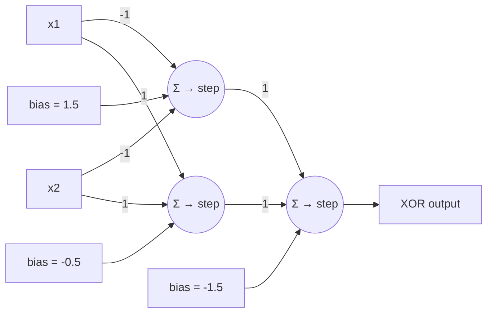

# Neurons to Logic: n-d Classifiers

## 1. Introduction & Motivation

The goal is to move from a single biological/artificial neuron model toward composing neurons into logic gates and multi-input classifiers, analogous to digital ICs (e.g., the 7400 NAND gate IC).

## 2. Case Study: Decoding 7-Segment Displays

Most older devices use 7-segment LED displays, controlled by 7 switches/bits (1 byte register, with the 8th bit for the decimal point).

- **Encoding direction**: Binary character representations (BCD, ASCII, Unicode) → 7 segment bits (standard BCD-to-7-segment decoder ICs like the 4056).
- **Decoding direction (our problem)**: Use a neuron to *recognise/decode* the digit from segment activations — a computer vision–style classification problem.

### Segment Activation Table (Digit → Segments {a, b, c, d, e, f, g})

| Digit | a | b | c | d | e | f | g |
|---|---|---|---|---|---|---|---|
| 0 | × | × | × | × | × | × |   |
| 1 |   | × | × |   |   |   |   |
| 2 | × | × |   | × | × |   | × |
| 3 | × | × | × | × |   |   | × |
| 4 |   | × | × |   |   | × | × |
| 5 | × |   | × | × |   | × | × |
| 6 | × |   | × | × | × | × | × |
| 7 | × | × | × |   |   |   |   |
| 8 | × | × | × | × | × | × | × |
| 9 | × | × | × |   |   | × | × |

- **Input dimension**: $n=7$ (plus bias)
- **Output**: Binary (e.g., "Is a 9? y/n")

## 3. Multi-Input Neurons — Biological Context

- Real neurons can have thousands of inputs (e.g., Purkinje cells: >1000 dendrites, tens of thousands of synaptic connections).
- Human brain: ~86 billion neurons; ~7000 synaptic connections each on average; a 3-year-old has ~$10^{15}$ synapses.

## 4. Geometric Understanding of Classifiers

### 4.1 Single-Input (1-D)

A 1-input neuron splits the real line at the threshold point:

$$x = -\frac{b}{w}$$

Classes: $x \leq -\frac{b}{w}$ (rejected) or $x > -\frac{b}{w}$ (accepted).

### 4.2 2-Input Neuron

$$a(\vec{w}, b, \vec{x}) = \frac{1}{1 + e^{-(w_1 x_1 + w_2 x_2 + b)}}$$

Decision rule: $a(\vec{w}, b, \vec{x}) > 0.5$.

**Threshold line equation** (derived from setting the exponent to zero):

$$x_2 = -\frac{w_1}{w_2} x_1 - \frac{b}{w_2}$$

This is the equation of a line ($y = c_1 x + c_0$). A **1-d line divides the 2-d input plane** into two regions. Intercepts: $-b/w_1$ on the $x_1$-axis and $-b/w_2$ on the $x_2$-axis.

### 4.3 3-Input Neuron

$$a(\vec{w}, b, \vec{x}) = \frac{1}{1 + e^{-(w_1 x_1 + w_2 x_2 + w_3 x_3 + b)}}$$

A **2-d plane divides 3-d space**. Intercepts of the plane: $-b/w_1$, $-b/w_2$, $-b/w_3$.

### 4.4 n-Input Neuron — Generalisation

$$a(\vec{w}, b, \vec{x}) = \frac{1}{1 + e^{-(w_1 x_1 + w_2 x_2 + \ldots + w_n x_n + b)}} = \frac{1}{1 + e^{-\left(\sum_{i=1}^{n} w_i x_i\right) + b}} = \frac{1}{1 + e^{-(\vec{w}\cdot\vec{x} + b)}}$$

where $\vec{w}\cdot\vec{x}$ is the dot product. An $n$-input neuron divides the input space with a **hyperplane**.

> **Key insight**: A neuron with $n$ inputs partitions $\mathbb{R}^n$ via an $(n-1)$-dimensional hyperplane defined by $\vec{w}\cdot\vec{x} + b = 0$.

## 5. Implementation (NumPy)

Segments numbered 0–6 (top to bottom, left to right); digits 0–9. The activation works for both an $n \times 1$ input and an $n \times s$ batch input — NumPy broadcasts `dot` automatically.

```python
# Return 1 x s array of activations
def activation_nd(weights, b, inputs):
    return logistic(np.dot(weights, inputs) + b)
```

### Training Data Construction

```python
DIGITS = {
    0: [0,1,2,4,5,6],
    1: [2,5],
    2: [0,2,3,4,6],
    3: [0,2,3,5,6],
    4: [1,2,3,5],
    5: [0,1,3,5,6],
    6: [0,1,3,4,5,6],
    7: [0,2,5],
    8: [0,1,2,3,4,5,6],
    9: [0,1,2,3,5]
}

inputs = np.zeros((10, 7), dtype=int)
for key in DIGITS:
    inputs[key][DIGITS[key]] = 1
inputs = inputs.T          # shape: (7 parameters) × (10 trials)

# Target label for "is a 1"
one = np.array([[0, 1, 0, 0, 0, 0, 0, 0, 0, 0]])
```

Shapes: inputs $7 \times 10$ (n=7 parameters × s=10 trials); target $1 \times 10$.

## 6. Training Experiments

### 6.1 Classifying '1' (easy case)
- Cost converges quickly (~within ~20 iterations from ~0.25 to ~0.03).
- Activation for class '1' crosses the 0.5 threshold around iteration ~450; all other digit activations driven toward 0.
- Succeeds regularly **irrespective of starting weight/bias initialisation**, with relatively few iterations.

### 6.2 Classifying '7' (hard case)
- Often fails: '7's activation plateaus below the 0.5 threshold (e.g., ~0.4).
- Starting position has a much larger effect; smaller $\epsilon$ and longer runs don't reliably help.
- Hard to separate '7' from '1' since segments of '1' (b, c) ⊂ segments of '7' (a, b, c).
- Sometimes appears stuck in a **local minimum**.

### 6.3 Convergence Observations
Hypotheses to consider regarding convergence of: cost functions, activations, and weights — they may all plateau without reaching a separating solution if the optimisation lands in a poor basin.

## 7. Hypothesis Space: Does a Solution Exist?

> **Critical distinction**: "Does a solution exist in our hypothesis space?" vs. "Can our algorithm find it?" These are independent questions. **GIGO** — answering them is essential in research/practice.

### 7.1 Solution 1 — Geometric Interpretation (Hypercube)

- Each combination of segments is a point in 7-D space; valid combinations form vertices of the **7-dimensional unit hypercube** at the origin.
- $2^7 = 128$ vertices total; 10 of them correspond to the digits 0–9.
- **Question**: For each vertex, does a hyperplane exist that partitions it from all others?
- **Answer**: YES — any single vertex of a hypercube can be "sliced off" by a hyperplane.

### 7.2 Solution 2 — Counting the "Hits" (Constructive Proof)

**Strategy**: Score each input vector by
- $+1$ for each correctly lit segment,
- $-1$ for each incorrectly lit segment.

Implemented as a neuron with weights $w_i = +1$ for "must be on" segments and $w_i = -1$ for "must be off" segments, plus an appropriate threshold.

For the digit '7' (segments a, b, c → pattern `1010010`):
- Bias $b = -2.5$
- Weights chosen so only the exact '7' pattern crosses the threshold.

> **Neuron-as-scoring-circuit (digit '7' example)**: Inputs from the 7 segments, where on-segments for '7' (a, b, c) carry weight +1, and off-segments (d, e, f, g) carry weight -1. The summing junction adds these weighted inputs plus a bias of -2.5; the sigmoid then outputs ~1 only when the input is exactly the '7' pattern (sum = 3 + bias = 0.5).

Only the '7' pattern reaches threshold and outputs 1. The construction generalises to **any digit or character** → a single-digit solution exists for every digit.

### 7.3 Solution 3 — Neurons as Logic Gates

A 2-input neuron can implement basic Boolean gates by choosing weights and bias appropriately.

**AND gate**: $w_1 = w_2 = 1,\ b = -1.5$

| $x_1$ | $x_2$ | output |
|---|---|---|
| 0 | 0 | 0 |
| 0 | 1 | 0 |
| 1 | 0 | 0 |
| 1 | 1 | 1 |

**OR gate**: $w_1 = w_2 = 1,\ b = -0.5$

**Exercise**: Find weights for **NOR** and **NAND** gates.

#### Perceptrons vs Neurons
Strictly, a perceptron (step activation) gives clean 0/1 outputs. Sigmoid neurons approximate this — output $>0.5$ suffices, and a neuron can be made *arbitrarily close* to a perceptron by scaling weights (Minsky & Papert, *Perceptrons*, 1969).

#### Logic Decoder
Treating 1/0 inputs as True/False, a neuron can implement a logical function of $n$ inputs:

$$f([x_0, \bar{x}_1, x_2, \bar{x}_3, \bar{x}_4, x_5, \bar{x}_6]) = \text{True}$$

Any Boolean function can be composed from NAND gates alone.

## 8. Pairs of Digits

### 8.1 '1 or 7' — Logical Solution

Direct construction (Solution 1 — logical):

$$f(\vec{i}) = \bar{i}_0 \cdot \bar{i}_1 \cdot i_2 \cdot \bar{i}_3 \cdot \bar{i}_4 \cdot i_5 \cdot \bar{i}_6 + i_0 \cdot \bar{i}_1 \cdot i_2 \cdot \bar{i}_3 \cdot \bar{i}_4 \cdot i_5 \cdot \bar{i}_6 = \bar{i}_1 \cdot i_2 \cdot \bar{i}_3 \cdot \bar{i}_4 \cdot i_5 \cdot \bar{i}_6$$

This reduces from 7 dimensions to 6 — equivalent to accepting a single vertex on a 6-D hypercube, which a neuron can do.

### 8.2 Lower-Dimensional Reduction

When the universe is restricted to numeric digits, fewer input bits are needed to disambiguate. Exercises:
- 5 vs 6 → 1 bit (segment e)
- 7 vs 8 → fewer bits than full 7
- (8 or 9) vs (1 or 2) → small subset
- 7 vs (1 or 2) → small subset

For '1 or 7' restricted to digits, the classifier reduces to an expression of only 2 inputs — a single point in 2-D.

### 8.3 Geometrical Interpretation
- The 10 digits occupy 10 of 128 vertices of a 7-D hypercube.
- Any **pair of adjacent vertices** (sharing an edge, i.e. Hamming distance 1) can be partitioned from the rest by a hyperplane.
- '1' = `0010010`, '7' = `1010010` differ in exactly one bit → adjacent → linearly separable from the rest.

## 9. The XOR Problem — '4 or 7'

### 9.1 Reduction

'4 or 7' separable from {0..9} **only if** {4, 7} separable from {1, 4, 7, 9}.

Bits b, c, d, e (indices 2, 4, 5, 6) have no discriminative value across {1, 4, 7, 9} → reduce to 3-D using $i_0, i_1, i_2$ (= segments a, f, g).

| Digit | $i_0$ | $i_1$ | $i_2$ | out |
|---|---|---|---|---|
| 1 | 0 | 0 | 0 | 0 |
| 4 | 1 | 1 | 0 | 1 |
| 7 | 0 | 0 | 1 | 1 |
| 9 | 1 | 1 | 1 | 0 |

Columns $i_0$ and $i_1$ are identical → collapse to 2-D:

| Digit | $i_0$ | $i_2$ | out |
|---|---|---|---|
| 1 | 0 | 0 | 0 |
| 4 | 1 | 0 | 1 |
| 7 | 0 | 1 | 1 |
| 9 | 1 | 1 | 0 |

### 9.2 XOR Identified

$$\text{out} = i_0 \oplus i_2$$

> **2-D layout of the XOR problem**: On the $i_0$–$i_2$ plane, the four points sit at the corners of the unit square: '1' at (0,0) and '9' at (1,1) belong to class 0 (output = 0); '4' at (1,0) and '7' at (0,1) belong to class 1 (output = 1). The two classes occupy opposite diagonals — no single straight line can separate them.

➡ **Not linearly separable** — a single neuron cannot solve this.

### 9.3 Consequences

A single neuron (the hypothesis space we've defined) is:
- **Expressive enough** to solve any single-digit 7-segment classifier;
- **Not expressive enough** to solve two-digit classification problems in general.

### 9.4 Historical Significance
- *Perceptrons: An Introduction to Computational Geometry*, Minsky & Papert (1969) highlighted that a single perceptron cannot implement XOR.
- Contributed to a funding decline and the "AI Winter".

## 10. XOR Solution — Adding More Neurons

XOR is solvable by composing multiple neurons in layers — equivalent to building XOR from a NAND gate and an OR gate feeding into an AND gate.

### Architecture (Modares, 2012)



**Weights / biases**:
- Neuron 1 (hidden): $w_1 = -1,\ w_2 = -1,\ b = 1.5$ — implements **NAND**.
- Neuron 2 (hidden): $w_1 = 1,\ w_2 = 1,\ b = -0.5$ — implements **OR**.
- Neuron 3 (output): $w_{a_1} = 1,\ w_{a_2} = 1,\ b = -1.5$ — implements **AND** of the two hidden outputs.

Composed: $\text{XOR}(A, B) = \text{AND}(\text{NAND}(A,B),\ \text{OR}(A,B))$.

> **Geometric interpretation**: Neurons 1 and 2 each define a separating line in the original $(x_1, x_2)$ plane. The hidden activations $(a_1, a_2)$ form a new feature space in which the four input points become linearly separable, allowing neuron 3 to partition them with a single hyperplane.

## 11. Key Takeaways

- An $n$-input neuron is a **linear classifier** in $\mathbb{R}^n$ — it partitions space with a hyperplane.
- For the 7-segment problem, every **single-digit** classifier exists in the single-neuron hypothesis space (provable by hypercube geometry and by explicit "hit-counting" construction).
- **Multi-digit (e.g., '4 or 7')** classifiers reduce to XOR, which is **not linearly separable** — single neurons fail.
- Solution: **stack neurons into layers** (multi-layer perceptron) — any Boolean function is realisable (NAND universality).
- The existence of a solution in the hypothesis space is independent of whether gradient descent (or any algorithm) can find it.