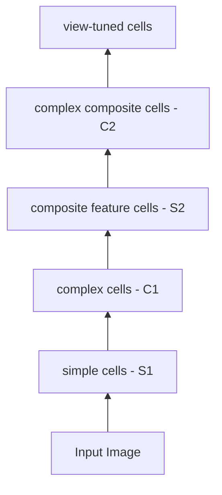
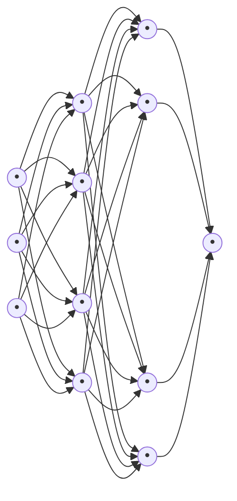

```markdown
# Neural Networks and Function Representation

**References:** Nielsen, 2019
**Image:** Reading a Neural Network's Mind, Larry Hardesty, MIT News, 2017
© Siwen Luo, UWA

---

## Why Neural Networks?

- We've seen that single neurons are limited in the functions they can implement
  - in particular, can't implement XOR (or things that reduce to XOR)
  - can only divide the space with a hyperplane
  - ***linearly separable*** patterns
- These problems can be overcome using a ***network*** of neurons
  - ➡ allows us to compose *more complex regions* from linearly separable regions
- In fact neural networks can approximate ***any* continuous function!!!**
  - more on this later…

---

## Inspiration - Biological Brains

Allen Mouse Brain Connectivity Atlas - the first detailed map of any mammal's neural network

**Reference:** "A mesoscale connectome of the mouse brain", Oh *et al.*, *Nature*. October 2014, Vol. 508 Issue 7495, p207-214.

> **Diagram description:** Two colorful 3D visualizations of the Allen Mouse Brain Connectivity Atlas. The left image shows a top-down view of a mouse brain with a dense, multi-colored network of neural connections (in orange, yellow, green, blue, magenta, red) appearing as fibrous, branching structures forming the overall brain shape. The right image shows a side/angled view of similar connection bundles emerging from a central region, with circular nodes at the tips representing endpoints of neural projections. Small reference brain outlines (in green and white) appear in the upper corners of each image.

---

## Case Study - Recognising Hand Written Digits

- Taking our *7-bit digit* classification a bit further, and following Nielsen, we'll use an example of a classic neural network success story - *recognising handwritten digits*

> **Image description:** A handwritten sequence reading "504192" in black ink on white background, showing typical variability in handwritten digits.

- Handwriting recognition (classification) is actually a really important skill
  - first — recognition
    - eg. the post office
    - digitising pre-digital age manuscripts and texts
    - accessibility, eg visually impaired
  - next — search! (and hence classification, news, sentiment analysis, etc…)
    - now most drawing/note taking packages that allow freehand annotation have handwriting search and/or conversion to text

---

## Case Study - Recognising Hand Written Digits (continued)

- Example of something humans are insanely good at, but (traditional) computers found incredibly difficult
  - over 7 billion people in the world, each with unique handwriting (hence reliance on signatures)
  - quality of writing
  - quality of media
  - contrast, colours, lighting
  - positioning on page/item (postcode squares)
  - security and trust (use in elections?)
- Traditional "rule based" techniques are too brittle
  - require *approximation, "judgement", graceful degradation*

---

## Mimicking the Visual Cortex

- More generally, computer vision has been one of the key drivers - and massive success stories - of soft computing and neural nets

> **Image description:** A photograph showing the interior view from a self-driving car's perspective. The dashboard displays "SELF DRIVING MODE" with a speed indicator showing 40. Through the windshield, a city street scene is visible with multiple yellow bounding boxes drawn around detected objects: vehicles (cars), pedestrians, traffic signs, and traffic lights. The image demonstrates computer vision object detection in an autonomous driving context.

---

## Mark I Perceptron

In fact Rosenblatt's original Mk I perceptron was intended for image recognition

- 400 cadmium sulfide photocells
- 20 x 20 pixel image
- randomly connected to neurons
- potentiometers encode adaptive weights

*An image of the perceptron from Rosenblatt's "The Design of an Intelligent Automaton," 1958. Cornell Chronicle*

> **Diagram description (FIG. 1 & FIG. 2 from Rosenblatt's paper):**
> - **FIG. 1** — Organization of a biological brain. (Red areas indicate active cells, responding to the letter X.)
> - **FIG. 2** — Organization of a perceptron. Shows four stages connected left-to-right:
>   1. **Mosaic of Sensory Points** (leftmost oval with dots, some red) — connected via "Topographic Connections"
>   2. **Projection area (In some models)** (second oval) — connected via "Random Connections"
>   3. **Association System (A-units)** (third oval with dots) — connected to
>   4. **Response Units** labeled R₁, R₂, ..., Rₙ on the right, with R₁ producing the "Output Signal"
>   - "Feedback Circuits" run backward from the response units to the association system.

---

## Mimicking the Visual Cortex

- **V1**
  - primary visual cortex
  - 140 million neurons
  - 10s of billions of connections
- **V2, V3, V4, V5**
  - (some evidence of) progressively more complex image processing
- "Tuned by evolution over hundreds of millions of years"
- Perhaps not so surprising then that 60+ years on we've still got a long way to go!

*V1, aka Brodmann area 17 (Wikipedia)*

---

## Human Visual System

*Some* biological evidence suggests animal visual cortices operate in a hierarchy

- from simple features (eg orientation of edge)
- to complex features (eg faces)

- V1 picks up primitive features, eg colour, orientation, spatial frequency,…
- V2 may recognise patterns such as contours
- a deeper layer compound shapes, motion, and so on

*"Hierarchical models of object recognition in cortex", M. Riesenhuber and T. Poggio, Nature Neuroscience, 1999*



> **Diagram details:** The hierarchy shows a feedforward visual processing pipeline with two types of operations:
> - **Solid arrows** represent **weighted sum** operations (S1 → C1 transitions, etc.)
> - **Dashed arrows** represent **MAX** operations (pooling)
>
> Layers from bottom to top:
> 1. Input image (small tilted square with sketch)
> 2. **simple cells (S1)** — multiple groups of edge-orientation detectors (shown as small circles with line orientations: −, /, |, \)
> 3. **complex cells (C1)** — pooling over orientations
> 4. **"composite feature" cells (S2)** — combine multiple C1 outputs
> 5. **"complex composite" cells (C2)** — higher-level combinations
> 6. **view-tuned cells** — top-level object/view representations (shown as filled black shapes)

---

## Layers in ANN's

- Conjecture that ANN's do similarly
  - analogy of how human vision is thought to work
  - deeper layers do more abstract programming
  - doesn't just apply to vision
  - ➡ *principle* of increasing abstraction
- However deeper networks generally harder to train
  - ➡ ***more expressive***
  - ➡ ***harder to find solution***

*"Convolutional Deep Belief Networks for Scalable Unsupervised Learning of Hierarchical Representations", H. Lee et. al., ICML, 2009.*

> **Image description:** Two grids of small grayscale image patches showing learned features from a deep convolutional network trained on "faces, cars, airplanes, motorbikes". 
> - **Top grid:** Lower-layer features showing edge-like and simple curvature patches (Gabor-like filters).
> - **Bottom grid:** Higher-layer features showing more complex, recognizable parts — faces, car parts, airplane silhouettes, and motorbike shapes — demonstrating increasing abstraction with depth.

---

## Case Study: Symbolic vs Sub-symbolic

- **Symbolic or "rule based" approach**
  - 7 has a line across the top
  - 7 has a line across the middle?
  - 4 comes to a point at the top?
    - lack of consistency
    - many exceptions
  - ➡ 'brittle"
- **Sub-symbolic approach**
  - sub-symbolic representation - *"degree of 4-ness"*
  - may not be intuitively meaningful - eg. vector of real numbers
  - less brittle - ***graceful degradation***

> **Image description:** A 10×10 grid of handwritten digits (0–9) showing the wide variability of handwriting styles. Each cell contains a different person's rendering of various digits in black ink.

---

## Artificial Neural Networks (ANNs, NNs)

- Sub-symbolic representation
  - values at nodes in the network
- Difficult to understand relationship between values and "real world"
- ***Learns*** its own values from many examples
  - 1000s, 1000000s, 1000000000s depending on difficulty
  - made possible (sometimes) by exponential growth in computing power
- Can be considered an ***encoding*** of the things (eg images) learned
- "Recognition" = classification

> **Annotation note:** "Remember - conceptually just our 7 segment display with a lot more segments (now called pixels) and graded input (vs binary)"

> **Diagram description:** A schematic showing a 28×28 pixelated grayscale image of a handwritten "6" on the left. Arrows lead from labeled pixels (pixel 1, pixel 2, ..., pixel 784) into a dense neural network represented as a black box with a large "?" symbol in the center, indicating the hidden mechanism. The output side shows multiple output neurons (circles) on the right. Caption: "What's in the box?" / "Image: Looking inside neural nets"

---

## Neural Network Architectures

**Source:** The Neural Network Zoo, Fjodor van Veen, Asimov Institute, 2016

> **Diagram description — "A mostly complete chart of Neural Networks" by Fjodor van Veen & Stefan Leijnen (©2019):**
>
> **Legend of cell types:**
> - Input Cell (solid yellow circle)
> - Backfed Input Cell (yellow circle outline)
> - Noisy Input Cell (yellow triangle)
> - Hidden Cell (solid green circle)
> - Probabilistic Hidden Cell (green circle outline)
> - Spiking Hidden Cell (green triangle)
> - Capsule Cell (green square)
> - Output Cell (solid orange/red circle)
> - Match Input Output Cell (orange circle outline)
> - Recurrent Cell (solid blue circle)
> - Memory Cell (blue circle outline)
> - Gated Memory Cell (blue triangle)
> - Kernel (pink circle)
> - Convolution or Pool (pink circle outline)
>
> **Architectures illustrated:**
> - Perceptron (P)
> - Feed Forward (FF)
> - Radial Basis Network (RBF)
> - Deep Feed Forward (DFF)
> - Recurrent Neural Network (RNN)
> - Long / Short Term Memory (LSTM)
> - Gated Recurrent Unit (GRU)
> - Auto Encoder (AE)
> - Variational AE (VAE)
> - Denoising AE (DAE)
> - Sparse AE (SAE)
> - Markov Chain (MC)
> - Hopfield Network (HN)
> - Boltzmann Machine (BM)
> - Restricted BM (RBM)
> - Deep Belief Network (DBN)
> - Deep Convolutional Network (DCN)
> - Deconvolutional Network (DN)
> - Deep Convolutional Inverse Graphics Network (DCIGN)

---

## Feed-forward Networks

- Many variants of ANNs
- Primarily based on the *feed-forward network (FFNN)*
  - ***input "layer"*** (not really a layer)
  - one or more ***hidden layers***
  - **output layer**
- Note
  - biases typically not shown
  - neuron outputs all the same (only one output per node)



*Image: Demystifying Deep Learning, Mukul Rathi*

---

## The Layers

### Input "layer"

- Just numbers passed in

### Hidden layers

- "Hidden" in the sense of no I/O
  - (we can examine them in research, but they don't drive any outputs)
- Where a lot of the "magic" happens

---

## The Layers (Output)

### Output layer

- Often a single node, eg binary classifier
- Often has a different activation function
  - not restricted to [0,1]
  - eg. linear ("accumulation")

> **Diagram description:** A single neuron block. Inputs $\vec{x}$ enter via weight vector $\vec{w}$, with bias input of 1 multiplied by $b$. These are summed (⊕) and passed through a **linear activation function** (shown as a straight line through origin in the activation box, rather than a sigmoid). Output is $f(\vec{w}, b, \vec{x})$.

$$f(\vec{w}, b, \vec{x}) = \vec{w} \cdot \vec{x} + b$$

---

## Design

- *Input* and *output* layers often decided by problem representation
- eg classifier for handwritten digit '9'
  - assume 64 x 64 pixel greyscale images
  - 4096 input neurons
  - values 0-255 scaled to 0-1
  - single output neuron
    - <0.5 "not a 9"
    - >0.5 "is a 9"

> **Diagram description:** A feed-forward network is shown with an input layer (large bracket containing ~6 input nodes representing the 4096 inputs), followed by two hidden layers (~4 nodes each), then converging to a single output node labeled "9?" indicating the binary classification output.

---

## Design (Hidden Layers)

- *Hidden layers* are a "dark art"
  - how many layers?
  - how many nodes in each layer?
  - lots of research into heuristics and trade-offs
- How many in practice..?
  - no hard and fast rules
  - some empirical precedents
- In fact, lots of research using *adaptive algorithms* to design neural network *configuration* or *topology*, as well as weights
  - ➡ ***neuro-evolution***
  - analogous to the '*hardware*' and the '*software*'

---

## Training the Network

Recall training a single neuron

- set of sample inputs with answers
- "examples"
- ***training set***
- "teacher"
- ***supervised learning***

- Escape velocity of the moon
  - single input, single output…

| Speed   | Success? |
|---------|----------|
| 1 km/s  | no       |
| 5 km/s  | yes      |
| 3 km/s  | yes      |
| 2 km/s  | no       |
| 2.5 km/s| yes      |
| 2.2 km/s| no       |

| Trial | x   | y |
|-------|-----|---|
| 1     | 1   | 0 |
| 2     | 5   | 1 |
| 3     | 3   | 1 |
| 4     | 2   | 0 |
| 5     | 2.5 | 1 |
| 6     | 2.2 | 0 |

---

## MNIST Dataset

- Became one of the most quintessential datasets for testing neural networks
  - created in 1998 from US Census Bureau employees and US high school students (bias?)
  - normalised to 28 x 28
  - 60k training images, 10k testing images (*distinct!*)
  - Original
    - National Institute of Standards and Technology, LeCun, Cortes, Burges
    - many replicas, eg kaggle

> **Image description:** A 10-row grid of handwritten digits, with each row containing many variations of a single digit from 0 through 9. Each row shows roughly 15-16 different handwritten renderings of the same digit, demonstrating the variability captured in the MNIST dataset.

---

## Training the Network (MNIST)

- multiple input, multiple output
- $\vec{x}$ - 784-dimensional vector
- $\vec{y}$ - 10-dimensional vector
  - eg. $\vec{y} = [0,0,0,0,0,0,1,0,0,0]^T$ for a '6'
  - use functional representation $y(\vec{x}) = \vec{y}$

### Goal

- **ideal**

$$f(\vec{x}) = y(\vec{x}) \text{ for all } \vec{x}$$

- **reality**

$$f(\vec{x}) \approx y(\vec{x}) \text{ for all samples } \vec{x}$$

- ➡ network is only ever as good as data it is trained with!

> **Diagram description:** Four small grayscale 28×28 sample MNIST digit images displayed (showing digits 5, 0, 4, 1). A large feed-forward neural network is shown with input vector $\vec{x}$ on the left (many input nodes), passing through two dense hidden layers (each with ~8 nodes, fully connected), and outputting vector $\vec{y}$ on the right (10 nodes).

---

## Cost Function

- Need some measure of the "difference" or better still "distance" between network estimates and "teacher"
  - *cost function, objective function, loss function, fitness function, error function,…*

- Think in terms of vector spaces
  - Assume the network has $M$ inputs and $N$ outputs
    - the network is a function $f : \mathbb{R}^M \to \mathbb{R}^N$
    - if $\vec{x} \in \mathbb{R}^M$, then $f(\vec{x}) \in \mathbb{R}^N$, $y(\vec{x}) \in \mathbb{R}^N$
  - we want a measure for the "distance" between $f(\vec{x})$ and $y(\vec{x})$
  - recall that this is equivalent to some measure of the "distance" from the origin to

$$\vec{v} = f(\vec{x}) - y(\vec{x})$$

> **Diagram description:** A conceptual "hypothesis space" illustration shaped like an irregular black blob. Inside the blob:
> - A yellow arrow points to a yellow octahedron labeled "hypothesis (instance) $f(\vec{x})$"
> - A blue arrow points to a blue diamond/crystal shape labeled "real world thing $y(\vec{x})$"
> - A red double-headed dashed arrow between them labeled "error ('distance')"
>
> This visualizes how the model's prediction and the true target are both points in hypothesis space, with the error being their separation.

---

## Norms & Single Sample Loss

- A ***norm*** is a function from a vector space to nonnegative real numbers that behaves like a *distance*
  - equivalently *"length" of a difference vector*

### Absolute value norm

- Simplest case, 1 dimension

$$\|v\| = |v|$$

### Euclidean norm or $L^2$ norm

- most familiar norm on $n$-dimensional Euclidean space $\mathbb{R}^n$
- from Pythagorean theorem

$$\|\vec{v}\|_2 = \sqrt{v_1^2 + \cdots + v_n^2}$$

---

## Cost Function - Mean Squared Error

- Returning to cost function, need to include contribution from $S$ samples
  - again, there is a choice of cost function - different functions may give different results
  - most familiar is ***mean squared error*** (aka ***least squares***, aka ***quadratic cost function***)

$$MSE \equiv \frac{1}{n} \sum_{s=1}^{S} \left( \| f(\vec{x_s}) - y(\vec{x_s}) \|_2 \right)^2$$

- note - don't need to perform square root since $L^2$ norm is squared

---

## Quadratic Cost Function

- Following Nielsen we'll write this a little differently (and shorthand) as

$$C(w, b) \equiv \frac{1}{2n} \sum_{\vec{x}} \left( \| y(\vec{x}) - a \|_2 \right)^2$$

- where
  - $w$ denotes the collection of all weights
  - $b$ denotes all biases
  - $n$ is the number of training samples
  - $a$ (activations) is the network outputs (actually a function of $w, b, x$)

- Note that a constant of $\frac{1}{2}$ has been introduced - this conveniently cancels the 2 from differentiation, and doesn't affect the result

---

## Training = Minimisation

- **Goal:** find weights and biases to minimise

$$C(w, b) \equiv \frac{1}{2n} \sum_{\vec{x}} \left( \| y(\vec{x}) - a \|_2 \right)^2$$

- note there could be millions of $w, b$
- can't solve analytically, but can use gradient descent!

---

## Gradient Descent in n Dimensions

Recall gradient descent in the general case…

**Algorithm: Gradient Descent**

1. $\vec{x} \leftarrow$ random initial vector
2. **repeat**
3. $\quad \vec{x} \leftarrow \vec{x} - \alpha \nabla f(\vec{x})$
4. **until** stopping criterion reached
5. **return** $\vec{x}$

$$\nabla f = \begin{bmatrix} \frac{\partial f}{\partial x_1} \\ \frac{\partial f}{\partial x_2} \\ \vdots \\ \frac{\partial f}{\partial x_n} \end{bmatrix}$$

In our problem, minimise $C(w, b)$

- the $\vec{x}$ is all the weights $w$ and biases $b$ in the network
- $\nabla C$ is all the partial derivatives of $C$ wrt $w$'s and $b$'s

$$\nabla C = \begin{bmatrix} \frac{\partial C}{\partial w_1} \\ \vdots \\ \frac{\partial C}{\partial w_p} \\ \frac{\partial C}{\partial b_1} \\ \vdots \\ \frac{\partial C}{\partial b_q} \end{bmatrix}$$

**Problem:** *How do we calculate all these partial derivatives?*

**Next:** The secret sauce ☞ ***backpropagation!***

---

## What Does NN Learning Look Like?

Intuition is fairly straightforward

- Remember weights and biases are parameters of our network
- We want to minimise the cost function $C$
- We want to reduce the cost by changing the *weights* and *biases*
  - make the output closer to the desired output (across all samples)
  - like controlling a process using a panel of "sliders"
- But *some sliders will have more effect than others!*
- *How do we decide how far, and in which direction, to move each one?*

---

## What Does NN Learning Look Like? (Gradient Descent)

We know one (efficient) way to find an optimum

- ➡ ***gradient descent!***
  - multidimensional gradient descent problem where the number of dimensions equals the number of weights and biases in the whole network

- If we know the gradients wrt weights and biases - that is, $\nabla C(w, b)$ - then we can do gradient descent

$$\nabla C = \begin{bmatrix} \frac{\partial C}{\partial w_1} \\ \vdots \\ \frac{\partial C}{\partial w_p} \\ \frac{\partial C}{\partial b_1} \\ \vdots \\ \frac{\partial C}{\partial b_q} \end{bmatrix}$$

---

## What Does NN Learning Look Like? (Goal)

- That is, we want to know $\frac{\partial C}{\partial w}$ for each weight $w$, and $\frac{\partial C}{\partial b}$ for each bias $b$
  - $\frac{\partial C}{\partial w}$ tells us how much the cost function changes wrt $w$, similarly for $b$

**Goal:** compute the partial derivatives (vector components of the direction of maximum slope) $\frac{\partial C}{\partial w}$ and $\frac{\partial C}{\partial b}$ of the cost function $C$ with respect to all weights $w$ and biases $b$

---

## Notation

- $w^l_{jk}$ - weight of connection from $k^{th}$ neuron in $(l-1)^{th}$ layer to $j^{th}$ neuron in $l^{th}$ layer
- Similarly for activations $a^l_j$ and biases $b^l_j$

> **Diagram description:** Two neural network diagrams side-by-side, each showing 3 layers (layer 1, layer 2, layer 3).
> - **Left diagram:** A specific weight $w^3_{24}$ is highlighted by a bold arrow from the 4th neuron ($k$) in layer 2 to the 2nd neuron ($j$) in layer 3. The notation indicates layers $l-1$ and $l$.
> - **Right diagram:** Highlights activation $a^3_1$ (1st neuron in layer 3) and bias $b^2_3$ (3rd neuron in layer 2).

---

## From Nets to Matrices

Then activation is given by (easy to show!)

$$a^l_j = \sigma\left( \sum_k w^l_{jk} a^{l-1}_k + b^l_j \right)$$

- where $\sigma$ is the **logistic function** (the activation), $a^{l-1}_k$ is the **previous layer activation**, and $w^l_{jk}, b^l_j$ are **this layer's weights and biases**.

Let $w^l$ be a matrix of weights for layer $l$, such that $w_{jk}$ is in row $j$, column $k$.

Define $a^l$ and $b^l$ as you would expect.

Then the above equation can be written in the "beautiful and compact" vectorised form:

$$\boxed{a^l = \sigma(w^l a^{l-1} + b^l)}$$

We've reduced the layer outputs to a matrix equation!

(Note: $\sigma$ is applied element-wise.)

---

## From Nets to Matrices (Linear Part)

It can be useful to break down activation part from linear part…

$$\boxed{a^l = \sigma(z^l), \quad z^l = w^l a^{l-1} + b^l}$$

$z^l$ has components

$$z^l_j = \sum_k w^l_{jk} a^{l-1}_k + b^l_j$$

So $z^l_j$ is the weighted input to the activation function for neuron $j$ in layer $l$

> **Diagram description:** Single-neuron schematic. Inputs $x_1, x_2, \ldots, x_n$ enter via weights $w_1, w_2, \ldots, w_n$ to a summing junction (⊕), with bias $b$ also added. The red label $z$ (with dashed arrow) points to the pre-activation sum (the output of the ⊕ before passing through $\sigma$). Then a sigmoid activation function (S-curve shown in box, ranging −6 to 6 on x-axis, 0 to 1 on y-axis with midpoint 0.5) produces output $a(\vec{w}, b, \vec{x})$. A threshold check $a(\vec{w}, b, \vec{x}) > 0.5?$ follows.

---

## Stepping Down Hill

What is the contribution to error at each $z^l_j$?

- If $\frac{\partial C}{\partial z^l_j}$ is large, there is an opportunity to make a significant change to $C$
- If $\frac{\partial C}{\partial z^l_j}$ is small, there is little opportunity to impact $C$
- $\frac{\partial C}{\partial z^l_j}$ gives us an indication of the amount of "error" that can be attributed to the neuron

For convenience give this error a name:

$$\boxed{\delta^l_j \equiv \frac{\partial C}{\partial z^l_j}}$$

---

## Backpropagation Equations

**1.** $\delta^L = \nabla_a C \odot \sigma'(z^L)$ — *change at output layer node in terms of change in cost function*

**2.** $\delta^l = \left( (w^{l+1})^T \delta^{l+1} \right) \odot \sigma'(z^l)$ — *change at hidden node in terms of change at next layer!*

**3.** $\dfrac{\partial C}{\partial b^l_j} = \delta^l_j$ — *change in bias in terms of change at layer*

**4.** $\dfrac{\partial C}{\partial w^l_{jk}} = a^{l-1}_k \delta^l_j$ — *change in weight in terms of change at layer*

We now know how to calculate $\nabla C(w, b)$ !!

$$\nabla C = \begin{bmatrix} \frac{\partial C}{\partial w_1} \\ \vdots \\ \frac{\partial C}{\partial w_p} \\ \frac{\partial C}{\partial b_1} \\ \vdots \\ \frac{\partial C}{\partial b_q} \end{bmatrix}$$

---

## Backpropagation Algorithm

1. **Input** $x$: Set the corresponding activation $a^1$ for the input layer.

2. **Feedforward:** For each $l = 2, 3, \ldots, L$ compute
$$z^l = w^l a^{l-1} + b^l \quad \text{and} \quad a^l = \sigma(z^l).$$

3. **Output error** $\delta^L$: Compute the vector
$$\delta^L = \nabla_a C \odot \sigma'(z^L).$$

4. **Backpropagate the error:** For each $l = L-1, L-2, \ldots, 2$ compute
$$\delta^l = \left( (w^{l+1})^T \delta^{l+1} \right) \odot \sigma'(z^l).$$

5. **Output:** The gradient of the cost function is given by
$$\frac{\partial C}{\partial w^l_{jk}} = a^{l-1}_k \delta^l_j \quad \text{and} \quad \frac{\partial C}{\partial b^l_j} = \delta^l_j.$$

---

## Universal Function Approximation

- We've talked a lot about ***expressiveness*** of a representation
- Success of neural nets comes from their incredible expressiveness
  - ➡ in fact, neural networks can compute ***any continuous function***, to ***any required precision!***
  - ➡ ***universal function approximators***

> **Diagram description:** A 2D Cartesian plot showing a smooth wiggly curve $f(x)$ on the y-axis vs $x$ on the horizontal axis. The curve has multiple peaks and valleys, illustrating an arbitrary continuous function that could be approximated by a neural network.

---

## Universal Function Approximation (Formal Statement)

- Holds for multiple inputs and multiple outputs
- Holds even with just ***one hidden layer!***
- Technically speaking
  - for any target function $f(x)$ and desired accuracy $\epsilon$, there exists a neural network with output $g(x)$ such that

$$|g(x) - f(x)| < \epsilon \quad \text{for all } x$$

- Not necessarily a *practical* approach
  - more accuracy required ➞ more nodes in the hidden layer

- A great interactive demonstration is provided by Nielsen:

  ["A visual proof that neural nets can compute any function"](http://neuralnetworksanddeeplearning.com/chap4.html)
```