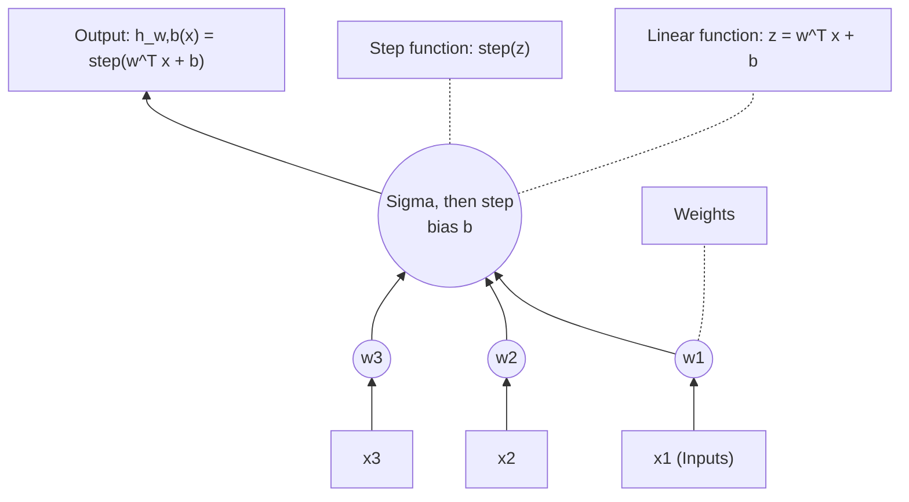
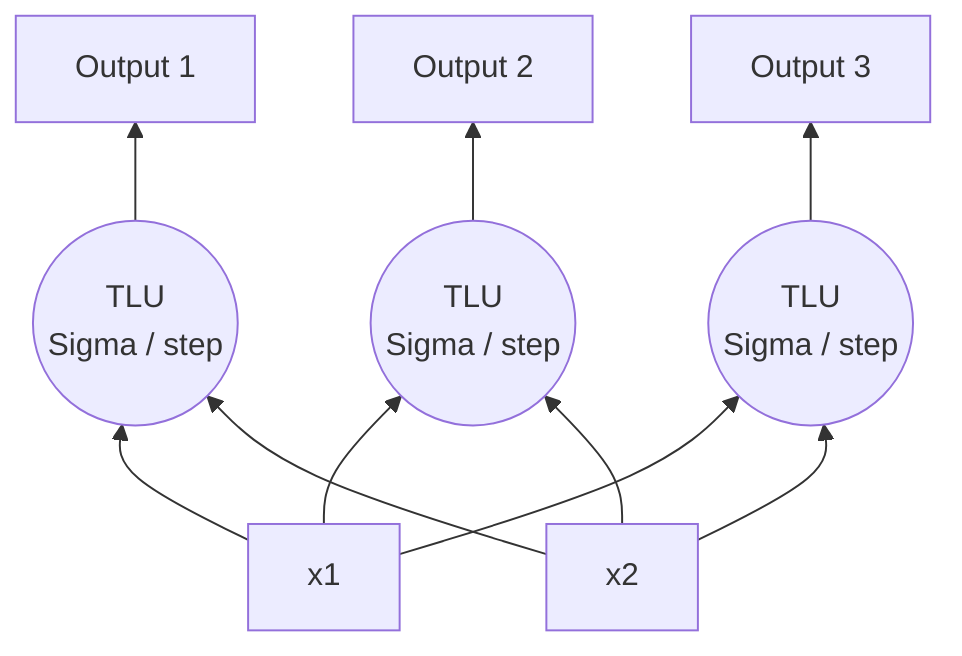
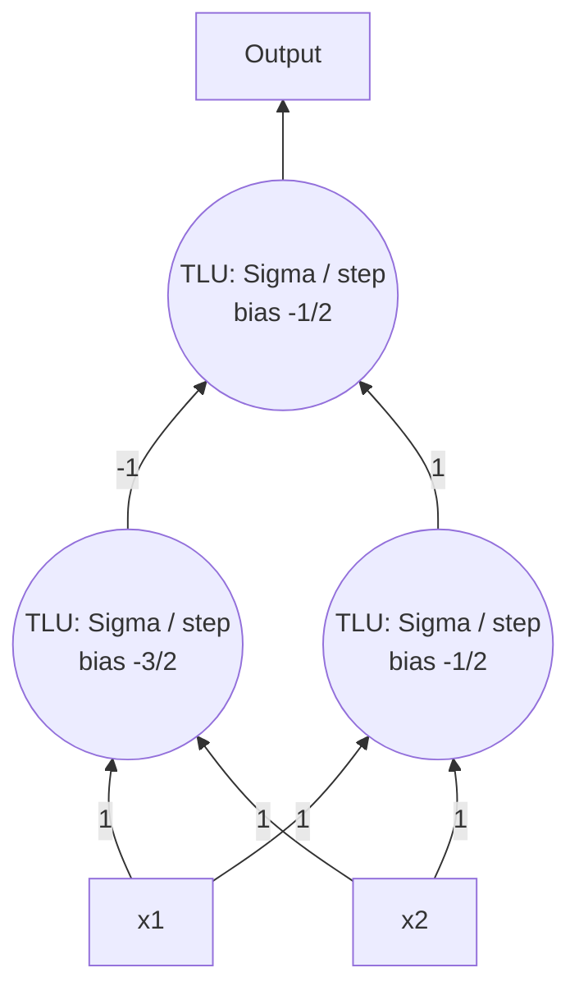
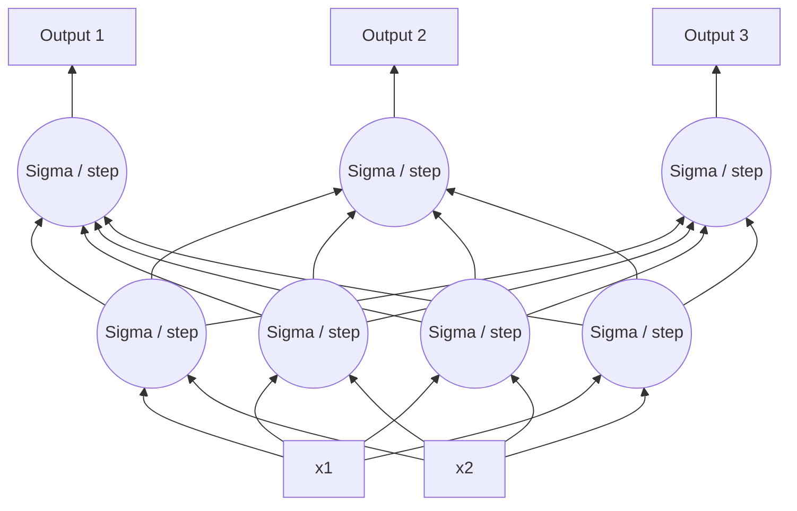
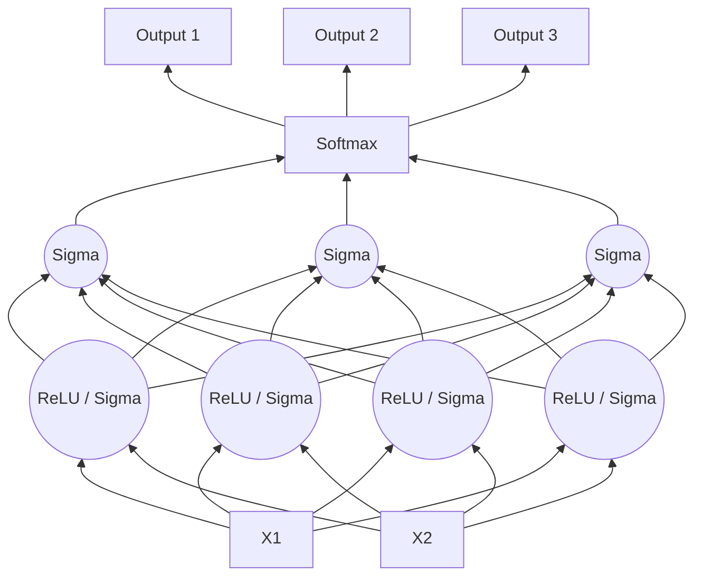

# CITS5017 Deep Learning — Topic 1: Introduction to Artificial Neural Networks

*Associate Professor Du Huynh (Unit Coordinator and Lecturer) — Semester 2, 2026 — The University of Western Australia*

---

## Slide 1 — CITS5017 Deep Learning / Topic 1: Introduction to Artificial Neural Networks

CITS5017 Deep Learning
Topic 1: Introduction to Artificial Neural Networks

Associate Professor Du Huynh
(Unit Coordinator and Lecturer)

Semester 2, 2026


> **Figure 1.** Title-slide branding. The UWA shield is quartered: two open books in the upper quarters carrying the mottos "VIT AM" / "EXC OLU" and "ERE PER" / "AR TES" (i.e. *vitam excolure* [?] / *per artes*), and a black swan on a gold field in the lower half. A banner beneath the shield reads "SEEK WISDOM". Below the crest, the wordmark reads "THE UNIVERSITY OF WESTERN AUSTRALIA".

---

## Slide 2 — Today

Chapters 10.

### Hands-on Machine Learning with Scikit-Learn, Keras & TensorFlow


> **Figure 2.** Photograph of the O'Reilly book cover. Text on the cover, top to bottom: publisher mark "O'REILLY®"; a corner flash reading "Third Edition"; title "Hands-On Machine Learning with Scikit-Learn, Keras & TensorFlow"; subtitle "Concepts, Tools, and Techniques to Build Intelligent Systems"; "powered by" followed by a Jupyter logo; author "Aurélien Géron". The cover illustration is a black-and-orange spotted salamander (fire salamander) walking across the lower two-thirds of the cover.

---

## Slide 3 — Chapter Ten

### Introduction to Artificial Neural Networks

Here are the main topics we will cover:

- Perceptrons and threshold logic unit (TLU)
- Training of a Perceptron and Hebb's rule
- Perceptrons and the XOR classification problem
- Multi-Layer Perceptrons (MLP) and backpropagation
- Commonly used activation functions
- Training a deep neural network (DNN) using the Sequential API
- Training a deep neural network (DNN) using the Functional API
- Fine-tuning neural network hyperparameters

---

## Slide 4 — The Perceptron

- The *Perceptron* is one of the simplest ANN architectures, invented in 1957 by Frank Rosenblatt.
- It is based on a slightly different artificial neuron called a *threshold logic unit* (TLU), where the inputs and output are numbers (instead of binary on/off values) and each input connection is associated with a **weight**. [highlighted red]
- The TLU computes a weighted sum of its inputs: $z = w_1x_1 + \cdots + w_nx_n + b = \mathbf{w}^T\mathbf{x} + b$. It then applies a *step function* to that sum and outputs the result: $h_{\mathbf{w},b}(\mathbf{x}) = \text{step}(z)$.



> **Figure 10-4.** Threshold Logic Unit (TLU) or sometimes Linear Threshold Unit (LTU).
> Diagram contents: three inputs labelled $x_1$, $x_2$, $x_3$ at the bottom (annotated "Inputs", green). Each input feeds a small circle labelled $w_1$, $w_2$, $w_3$ respectively (annotated "Weights", orange). All three weighted connections converge with arrows into a single blue neuron drawn as a circle split horizontally: the lower half contains a summation symbol $\Sigma$ (annotated "Linear function: $z=\mathbf{w}^\mathsf{T}\mathbf{x}+b$") and the upper half contains a step-function glyph (annotated "Step function: step($z$)"). A small circle labelled $b$ sits on the right of the neuron (the bias). A single arrow leaves the top of the neuron, annotated "Output: $h_{\mathbf{w},b}(\mathbf{x})=\text{step}(\mathbf{w}^\mathsf{T}\mathbf{x}+b)$".

---

## Slide 5 — The Perception (cont.)

### Step Functions

The most common step function used in Perceptrons is the Heaviside step function:

$$
\text{heaviside}(z) =
\begin{cases}
0 & \text{if } z < 0 \\
1 & \text{if } z \ge 0
\end{cases}
$$

Sometimes the sign function is used instead:

$$
\text{sign}(z) =
\begin{cases}
-1 & \text{if } z < 0 \\
0 & \text{if } z = 0 \\
+1 & \text{if } z > 0
\end{cases}
$$

---

## Slide 6 — The Perceptron (cont.)

A single TLU can be used for simple linear binary classification: It computes a linear combination of the inputs and if the result exceeds a threshold, it outputs the positive class or else outputs the negative class (just like a Logistic Regression classifier or a linear SVM).

A Perceptron is simply composed of one or more TLUs organised in a single layer, where

- every TLU is connected to every input. Such a layer is called a *fully connected layer*, or a *dense layer*;
- the inputs constitute the *input layer*; and
- since the layer of TLUs produces the final outputs, it is called the *output layer*.

---

## Slide 7 — Perceptron: An example



> **Figure 10-5.** A Perceptron with two input and three output neurons.
> Diagram contents: at the bottom, two inputs labelled $x_1$ and $x_2$, annotated "Inputs" (blue text) and enclosed by a dashed green bracket labelled "Input layer". Each input connects by an arrow to every one of three blue circular TLUs (each circle split horizontally with $\Sigma$ below and a step-function glyph above), so six connections in total, drawn crossing over each other. The leftmost neuron is annotated "TLU" (black label to its left). The three neurons are enclosed by a dashed blue bracket labelled "Output layer". Each neuron has a single upward arrow leaving it; collectively these are annotated "Outputs" (blue text) at the top.

---

## Slide 8 — Perceptron: Computing the outputs

The magic of linear algebra makes it possible to efficiently compute the outputs of a fully connected layer:

$$
h_{\mathbf{W},\mathbf{b}}(\mathbf{X}) = \phi(\mathbf{X}\mathbf{W} + \mathbf{b}^\top)
$$

where

- $\mathbf{X}$ represents the matrix of input features (one row per instance, one column per feature)
- $\mathbf{W}$ represents the unknown weight matrix which contains all the connection weights (one row per input feature and one column per neuron)
- $\mathbf{b}$ is the bias vector (one per neuron).
- $\phi$ is called the *activation function*

> **Figure (repeated, slide 8).** The same diagram as Figure 10-5 is inset at the top right: two inputs $x_1$, $x_2$ annotated "Inputs" inside a dashed green bracket labelled "Input layer"; three fully connected blue TLUs (each with $\Sigma$ and a step glyph) labelled "TLU" on the left and enclosed by a dashed blue bracket labelled "Output layer"; three upward arrows at the top annotated "Outputs".

---

## Slide 9 — How is a Perceptron trained?

The Perceptron training algorithm proposed by Frank Rosenblatt was largely inspired by *Hebb's rule* or *Hebbian learning* (name after Donald Hebb) which can be summarized as "cells that fire together, wire together".

More specifically, the Perceptron is fed one training instance at a time, and for each instance it makes its predictions. For every output neuron that produced a wrong prediction, it reinforces the connection weights from the inputs that would have contributed to the correct prediction.

---

## Slide 10 — How is a Perceptron trained? (cont.)

Perceptron learning rule (weight update):

$$
w_{i,j}^{(\text{next step})} = w_{i,j} + \eta\left(y_j - \hat{y}_j\right)x_i
$$

where

- $w_{i,j}$ is the connection weight between the $i^{\text{th}}$ input neuron and the $j^{\text{th}}$ output neuron.
- $x_i$ is the $i^{\text{th}}$ input value of the current training instance.
- $\hat{y}_j$ is the output of the $j^{\text{th}}$ output neuron for the current training instance.
- $y_j$ is the target output of the $j^{\text{th}}$ output neuron for the current training instance.
- $\eta$ is the learning rate.

---

## Slide 11 — How is a Perceptron trained? (cont.)

Printed (typeset) equation:

$$
w_{i,j}^{(\text{next step})} = w_{i,j} + \eta\left(y_j - \hat{y}_j\right)x_i
$$

**Handwritten annotations** (in red, purple, green and highlighted colours) follow.

Boxed in red:

$$
w_{i,j}^{(\text{next step})} = w_{i,j} - \eta\left(\hat{y}_j - y_j\right)x_i
$$

The **loss** [highlighted yellow] that we try to minimise is $\tfrac{1}{2}\left(\hat{y}_j - y_j\right)^2$ [highlighted yellow] where $\hat{y}_j = \sum\limits_{i=1}^{n} x_i\, w_{i,j}$ (assuming that $W \in \mathbb{R}^{n \times m}$)

Labelled *(error)* [green], and the derivative labelled *(error gradient w.r.t. $w_{ij}$)* [green]:

$$
\mathcal{L}_j = \frac{1}{2}\left(\hat{y}_j - y_j\right)^2
\quad \Rightarrow \quad
\frac{\partial \mathcal{L}_j}{\partial w_{i,j}} = \left(\hat{y}_j - y_j\right)\frac{\partial \hat{y}_j}{\partial w_{i,j}}
$$

Now

$$
\begin{aligned}
\frac{\partial \hat{y}_j}{\partial w_{i,j}}
&= \frac{\partial}{\partial w_{i,j}}\left(\sum_{i=1}^{n} x_i\, w_{i,j}\right) \\
&= \frac{\partial}{\partial w_{i,j}}\left(x_1 w_{1,j} + x_2 w_{2,j} + \cdots\; x_i w_{i,j} + \cdots\; x_n w_{n,j}\right) = x_i
\end{aligned}
$$

$$
\Rightarrow \quad \frac{\partial \mathcal{L}_j}{\partial w_{i,j}} = \left(\hat{y}_j - y_j\right)x_i
$$

[highlighted green; underbraced with the note "error gradient for $w_{ij}$"]

Boxed in red, with the underbrace note "negative error gradient scaled by the learning rate.":

$$
w_{i,j}^{(\text{next step})} = w_{i,j} - \eta\, \frac{\partial \mathcal{L}_j}{\partial w_{i,j}}
$$

> **Figure 11 (hand-drawn, top right).** A single-layer network sketched in red. Along the top row is a row of small circles representing output neurons; the $j^{\text{th}}$ one is marked and labelled $\hat{y}_j$ above it, with two unlabelled circles to its left, an ellipsis, and one further circle to its right. Along the bottom row are input nodes drawn as larger circles, labelled $x_1$, $x_2$, $x_3$, $\cdots$, $x_i$, $\cdots$, $x_n$. Straight edges fan from each input up to the $j^{\text{th}}$ output neuron, labelled (left to right) $w_{1,j}$, $w_{2,j}$, $w_{3,j}$, $w_{i,j}$, $w_{n,j}$.

---

## Slide 12 — Perceptron: Decision Boundary

The decision boundary of each output neuron is linear, so Perceptrons (just like Logistic Regression classifiers) are incapable of learning complex patterns.

However, if the training instances are linearly separable, Rosenblatt demonstrated that this algorithm would converge to a solution.[^1] This is called the *Perceptron convergence theorem*.

[^1]: Note that this solution is generally not unique.

---

## Slide 13 — Implementing Perceptron in Scikit-Learn

Scikit-Learn provides a `Perceptron` class that implements a single TLU network:

```python
import numpy as np
from sklearn.datasets import load_iris
from sklearn.linear_model import Perceptron
iris = load_iris()
X = iris.data[:, (2, 3)]                      # petal length, petal width
y = (iris.target == 0).astype(np.int)   # Iris Setosa?
per_clf = Perceptron(random_state=42)
per_clf.fit(X, y)
y_pred = per_clf.predict([[2, 0.5], [3, 1]]) # predicts True and False
```

> **Figure 13.** Scatter plot with a filled decision-region background. Chart type: 2-D scatter plot with two shaded half-planes separated by a solid black straight line. Horizontal axis: "Petal length", ticks at 0, 1, 2, 3, 4, 5. Vertical axis: "Petal width", ticks at 0.00, 0.25, 0.50, 0.75, 1.00, 1.25, 1.50, 1.75, 2.00. The region below/left of the boundary line is shaded pale yellow; the region above/right is shaded pale blue/lavender. The solid black decision boundary runs from roughly $(0, 1.8)$ at the left edge down to roughly $(3.05, 0)$ on the horizontal axis. Legend (lower right): a blue square marker for "Not Iris-Setosa" and an olive/yellow circle marker for "Iris-Setosa". Series 1 (blue squares, "Not Iris-Setosa") forms a broad upward-trending cloud in the blue region, spanning roughly petal length 3.0 to 5.0 and petal width 1.0 to 2.0, with the densest clustering around petal length 4.0–5.0 and petal width 1.2–1.9. Series 2 (olive circles, "Iris-Setosa") forms a tight cluster in the yellow region around petal length 1.0–2.0 and petal width 0.1–0.6. No individual data values are printed on the plot.
> Original caption: "Decision boundary output by the code above."

---

## Slide 14 — Implementing Perceptron in Scikit-Learn (cont.)

The Perceptron learning algorithm strongly resembles Stochastic Gradient Descent. In fact, Scikit-Learn's `Perceptron` class is equivalent to using an `SGDClassifier` with the following hyperparameters:

- `loss="perceptron"`,
- `learning_rate="constant"`,
- `eta0=1` (learning rate), and
- `penalty=None` (no regularization).

---

## Slide 15 — Comparing Perceptron with Logistic Regression Classifiers

Note that contrary to Logistic Regression classifiers, Perceptrons do not output a class probability; rather, they just make predictions based on a hard threshold.

This is one of the good reasons to prefer Logistic Regression over Perceptrons.

---

## Slide 16 — Weaknesses of Perceptrons

In their 1969 monograph titled "*Perceptrons*", **Marvin Minsky** and **Seymour Papert** [highlighted red] highlighted some serious weaknesses of Perceptrons, in particular, their inability of solving some trivial problems (e.g., the *Exclusive OR* (XOR) classification problem).

Of course this is true of any other linear classification model as well (such as **Logistic Regression classifiers** [highlighted red]), but researchers had expected much more from Perceptrons. As a result, many researchers dropped *connectionism* altogether.

> **Figure 10-6a.** XOR classification problem.
> Diagram contents: a 2-D plot with a horizontal axis labelled $x_1$ and a vertical axis labelled $x_2$. Tick labels: `0` at the origin on both axes (the origin shows `0` on the vertical axis and `0` below the horizontal axis), `1` on the vertical axis and `1` on the horizontal axis. Four instances are plotted at the corners of the unit square:
> - $(0,0)$: red/dark-red triangle
> - $(0,1)$: green square
> - $(1,0)$: green square
> - $(1,1)$: red/dark-red triangle
>
> Thin dashed lines join $(0,1)$ horizontally to $(1,1)$ and $(1,1)$ vertically down to $(1,0)$. Two parallel diagonal dashed lines of negative slope run across the plot, with the pale-green band between them containing the two green squares; the two red triangles lie outside the band on opposite sides. This illustrates that no single straight line can separate the green squares from the red triangles.

---

## Slide 17 — Weaknesses of Perceptrons (cont.)

However, it turns out that some of the limitations of Perceptrons can be eliminated by stacking multiple Perceptrons. The resulting ANN is called a *Multi-Layer Perceptron* (MLP).

In particular, an MLP can solve the XOR problem, as you can verify by computing the output of the MLP for each combination of inputs:

- with inputs (0, 0) or (1, 1) the network outputs 0;
- with inputs (0, 1) or (1, 0) it outputs 1.



> **Figure 10-6b.** An MLP that solves the XOR classification problem.
> Diagram contents: two inputs $x_1$ (left) and $x_2$ (right) at the bottom, in green. Each input passes through a small circle labelled `1` (the connection weight) and connects, with the connections crossing over, to both of two hidden TLUs (blue circles split horizontally with $\Sigma$ below and a step glyph above), labelled "TLU" on the left of the row. The left hidden TLU carries a small circle labelled $-\tfrac{3}{2}$ on its right (its bias); the right hidden TLU carries a small circle labelled $-\tfrac{1}{2}$. The two intermediate weight circles labelled `1` and `1` sit between the input row and the hidden row on the crossing connections. Each hidden TLU connects upward to a single output TLU (same split-circle style) whose bias circle is labelled $-\tfrac{1}{2}$; the connection from the left hidden unit is labelled $-1$ and the connection from the right hidden unit is labelled $1$. A single arrow leaves the top of the output TLU.

---

## Slide 18 — Multi-Layer Perceptron and Backpropagation

An MLP is composed of one (passthrough) *input layer*, one or more layers of TLUs, called *hidden layers*, and one final layer of TLUs called the *output layer*.



> **Figure 10-7.** Multi-Layer Perceptron.
> Diagram contents: bottom row, two green inputs labelled $X_1$ and $X_2$, enclosed by a dashed green bracket labelled "Input layer". Middle row, four blue TLU circles (each split horizontally, $\Sigma$ below, step glyph above), fully connected from both inputs (eight upward arrows crossing), enclosed by a dashed black bracket labelled "Hidden layer". Top row, three blue TLU circles of the same style, fully connected from all four hidden units (twelve upward arrows crossing), enclosed by a dashed blue bracket labelled "Output layer". Each output TLU has one upward arrow leaving it.

---

## Slide 19 — Multi-Layer Perceptron and Backpropagation (cont.)

We can describe the backpropagation training algorithm[^2] as Gradient Descent using reverse-mode autodiff.

For each training instance, the algorithm

- feeds it to the network and computes the output of every neuron in each layer (this is the *forward pass*),
- measures the network's output error (i.e., the difference between the desired output and the actual output of the network),
- goes through each layer in reverse order to measure the error contribution from each connection (this is the *reverse pass*) until the input layer is reached, and
- finally slightly tweaks the connection weights to reduce the error (this is the Gradient Descent step).

[^2]: "Learning Internal Representations by Error Propagation," D. Rumelhart, G. Hinton, R. Williams (1986). This algorithm was actually invented several times, starting with P. Werbos in 1974.

---

## Slide 20 — Multi-Layer Perceptron and Backpropagation (cont.)

### Activation functions

In order for the backpropagation training algorithm to work, Rumelhart et al made a key change to the MLP's architecture: they replaced the step function with the logistic function, $\sigma(z) = 1/(1 + \exp(-z))$, also called the *sigmoid* function. This was essential because the step function has no gradient to work with, while the logistic function has a well-defined nonzero derivative everywhere.

Such a function which defines the output of a neuron (or node) given an input or set of inputs is known as the *activation function*.

(The derivative is:

$$
\begin{aligned}
\sigma'(z) &= \frac{\exp(-z)}{\left(1+\exp(-z)\right)^2} = \frac{1+\exp(-z)-1}{\left(1+\exp(-z)\right)^2} \\
&= \frac{1}{1+\exp(-z)} - \frac{1}{\left(1+\exp(-z)\right)^2} \\
&= \sigma(z) - \sigma^2(z) = \sigma(z)\left(1 - \sigma(z)\right)
\end{aligned}
$$

)

---

## Slide 21 — Multi-Layer Perceptron and Backpropagation (cont.)

### Activation functions

Apart from the logistic function, two other popular activation functions are:

- The *hyperbolic tangent* function: $\tanh(z) = 2\sigma(2z) - 1$. This function has a similar S shape as the logistic function, is continuous and differentiable, but its values range from $-1$ to $+1$.
- The *rectified linear unit* function: $\text{ReLU}(z) = \max(0, z)$. This function is continuous but unfortunately not differentiable everywhere. However, in practice it works very well and has the advantage of being fast to compute. Most importantly, the fact that it does not have a maximum output value also helps reduce some issues during Gradient Descent.

---

## Slide 22 — Multi-Layer Perceptron and Backpropagation (cont.)

### Activation functions

> **Figure 10-8.** Activation functions and their derivatives.
> Two side-by-side line plots.
>
> **Left panel — title "Activation functions".** Horizontal axis unlabelled, ticks at $-4, -3, -2, -1, 0, 1, 2, 3, 4$ (plot extends to about $\pm 4.5$). Vertical axis unlabelled, ticks at $-1, 0, 1, 2$. Grid lines shown. Four series, per the legend:
> - **Heaviside** — solid red: flat at $0$ for $z<0$, a vertical jump at $z=0$, then flat at $1$ for $z\ge 0$.
> - **ReLU** — magenta dash-dot: flat at $0$ for $z<0$, then a straight line of slope 1 rising off the top of the axes past $2$ at about $z=2.4$.
> - **Sigmoid** — green dashed: smooth S-curve from $0$ at the left to $1$ at the right, passing through $0.5$ at $z=0$.
> - **Tanh** — thin blue solid: smooth S-curve from $-1$ at the left to $1$ at the right, passing through $0$ at $z=0$, steeper than the sigmoid.
>
> **Right panel — title "Derivatives".** Horizontal axis unlabelled, ticks at $-4, -3, -2, -1, 0, 1, 2, 3, 4$. Vertical axis ticks at $-0.2, 0.0, 0.2, 0.4, 0.6, 0.8, 1.0, 1.2$. Grid lines shown. Same four series (legend shared with the left panel):
> - Heaviside derivative — solid red: flat at $0.0$ everywhere, with a red cross/marker at $(0, 0.0)$ marking the undefined point.
> - ReLU derivative — magenta dash-dot: flat at $0.0$ for $z<0$, a vertical dash-dot segment at $z=0$ rising to $1.0$ (with a magenta cross marker at $(0, 1.0)$), then flat at $1.0$ for $z>0$.
> - Sigmoid derivative — green dashed: bell-shaped curve peaking at $0.25$ at $z=0$ and decaying towards $0$ at both ends.
> - Tanh derivative — thin blue solid: taller, narrower bell-shaped curve peaking at $1.0$ at $z=0$ and decaying towards $0$ at both ends.

---

## Slide 23 — Multi-Layer Perceptron and Backpropagation (cont.)

### Why do we need activation functions?

Consider two linear functions for your two layers $f(z) = 2z + 3$ and $g(z) = 5z - 1$. If you chain them together, you get $f(g(z)) = 2(5z - 1) + 3 = 10z + 1$, which is a linear function. If you don't have some nonlinearity between layers, then even a deep stack of layers is equivalent to a single layer, and you can't solve very complex problems with that.

---

## Slide 24 — Regression MLPs

MLPs can be used for regression tasks. For example, to predict the price of a house given many of its features, you need one output neuron. For multivariate regression, you need multiple neurons.

For regression, the output neurons usually do not need an activation function. Only when the output $z$ needs to be

- always positive, then use the ReLU or $\text{softplus}(z) = \log(1 + \exp(z))$ activation function;
- in a certain range of values, then use logistic or hyperbolic tangent and then scale the value to the required range.

---

## Slide 25 — Regression MLPs (cont.)

The `softplus` function is like the `ReLU` function except that it is smooth at the origin:

$$
\begin{aligned}
\text{ReLU}(z) &= \max(0, z) \\
\text{softplus}(z) &= \log(1 + \exp(z))
\end{aligned}
$$

> **Figure 25.** Line plot comparing two activation functions. Horizontal axis labelled $z$, ticks at $-4, -2, 0, 2, 4$ (plot range about $-5$ to $5$). Vertical axis unlabelled, ticks at $-1, 0, 1, 2, 3, 4, 5, 6$. Grid lines shown. Legend (upper left): red solid line = $\text{ReLU}(z)$; blue solid line = $\text{softplus}(z)$. The ReLU series is flat at $0$ for $z \le 0$ and then rises linearly with slope 1, reaching about $5$ at $z=5$. The softplus series is slightly above $0$ on the far left, curves smoothly upward through about $0.69$ at $z=0$, and asymptotically merges with the ReLU line for $z \gtrsim 3$, reaching about $5$ at $z=5$.

---

## Slide 26 — Regression MLPs (cont.)

### An example

```python
from sklearn.datasets import fetch_california_housing
from sklearn.metrics import mean_squared_error
from sklearn.model_selection import train_test_split
from sklearn.neural_network import MLPRegressor
from sklearn.pipeline import make_pipeline
from sklearn.preprocessing import StandardScaler

housing = fetch_california_housing()
X_train_full, X_test, y_train_full, y_test = train_test_split(
    housing.data, housing.target, random_state=42)
X_train, X_valid, y_train, y_valid = train_test_split(
    X_train_full, y_train_full, random_state=42)

# 3 hidden layers with 50 neurons per layer
mlp_reg = MLPRegressor(hidden_layer_sizes=[50, 50, 50], random_state=42)
pipeline = make_pipeline(StandardScaler(), mlp_reg)
pipeline.fit(X_train, y_train)
y_pred = pipeline.predict(X_valid)
rmse = mean_squared_error(y_valid, y_pred, squared=False)  # around 0.505
```

The median house prices (the $y$ values) have been normalised to the range $[0, 5]$, so the RMSE $0.505$ is equivalent to around 10% error.

---

## Slide 27 — Regression MLPs (cont.)

The loss function to use during training is typically the **mean squared error** or **mean absolute error** (the latter is more robust against outliers). Alternatively, the **Huber loss**, which is a combination of MSE and MAE, can also be used. [key terms in red]

### Typical regression MLP architecture:

| Hyperparameter | Typical value |
| --- | --- |
| # hidden layers | Depends on the problem, but typically 1 to 5 |
| # neurons per hidden layer | Depends on the problem, but typically 10 to 100 |
| # output neurons | 1 per prediction dimension |
| Hidden activation | ReLU |
| Output activation | None, or ReLU/softplus (if positive outputs) or sigmoid/tanh (if bounded outputs) |
| Loss function | MSE, or Huber if outliers |

---

## Slide 28 — Regression MLPs (cont.)

The *Huber* loss behaves like the *absolute error* loss when the input $z$ is large and behaves like the *squared error* loss when the input $z$ is small.

$$
\text{Huber}_\delta(z) =
\begin{cases}
\frac{1}{2}z^2 & \text{if } |z| \le \delta \\
\delta\left(|z| - \frac{1}{2}\delta\right) & \text{otherwise}
\end{cases}
$$

> **Figure 28.** Two side-by-side line plots.
>
> **Left panel — title "Absolute and squared errors".** Horizontal axis labelled $z$, ticks at $-4, -2, 0, 2, 4$. Vertical axis labelled "Loss_function(z)", ticks at $0, 2, 4, 6, 8, 10$. Grid lines shown. Legend (upper left): green dashed = "abs. error"; blue solid = "sq. error". The absolute-error series is a V shape with vertex at $(0,0)$, reaching about $4.3$ at $z = \pm 4.4$. The squared-error series is an upward parabola with vertex at $(0,0)$, rising steeply and leaving the top of the plot at about $z = \pm 3.2$ (value 10).
>
> **Right panel — title "$\text{Huber}_\delta(z)$".** Horizontal axis labelled $z$, ticks at $-4, -2, 0, 2, 4$. Vertical axis labelled "Loss_function(z)", ticks at $0, 2, 4, 6, 8, 10$. Grid lines shown. Legend (upper right): red solid = "$\delta = 1$"; blue dash-dot = "$\delta = 2$". The $\delta = 1$ curve is quadratic near the origin and becomes linear beyond $|z| = 1$, reaching about $4.0$ at $z = \pm 4.4$. The $\delta = 2$ curve is quadratic over a wider region near the origin and becomes linear (with steeper slope) beyond $|z| = 2$, reaching about $7.0$ at $z = \pm 4.4$.

---

## Slide 29 — Classification MLPs

MLPs can also be used for classification tasks.

- For **binary classification** problems, one single output neuron with a logistic activation function would be sufficient.
- For **multilabel classification** problems, you can have multiple output neurons, each with a logistic activation function.
- For **multiclass classification** problems (e.g., MNIST dataset), you can have multiple output neurons, with the **softmax** activation function. This will ensure that all the output values are probabilities and they sum to 1.
- For the loss function, since we are predicting probability distributions, the **cross-entropy loss** (also called the *log loss*) is generally a good choice:

$$
J(\boldsymbol{\theta}) = -\frac{1}{m}\sum_{i=1}^{m}\sum_{k=1}^{K} y_k^{(i)} \log\left(\hat{p}_k^{(i)}\right)
$$

where $K$ denotes the total number of classes (e.g., $K = 10$ for MNIST).

---

## Slide 30 — Classification MLPs (cont.)



> **Figure 10-9.** A modern MLP (including ReLU and softmax) for classification.
> Diagram contents: bottom row, two green inputs labelled $X_1$ and $X_2$, enclosed by a dashed green bracket labelled "Input layer". Middle row, four blue circles split horizontally with $\Sigma$ below and a ReLU (bent-line) glyph above; an arrow with the black label "ReLU" points at the ReLU glyph of the leftmost hidden unit. This row is fully connected from the two inputs (eight crossing arrows) and enclosed by a dashed black bracket labelled "Hidden layer". Top row, three blue circles containing only $\Sigma$, fully connected from the four hidden units (twelve crossing arrows), enclosed by a dashed blue bracket labelled "Output layer". Above the three output units sits a single wide peach/cream rectangle labelled "Softmax", with three upward arrows leaving its top.

---

## Slide 31 — Classification MLPs (cont.)

### Typical classification MLP architecture:

<table>
  <thead>
    <tr>
      <th>Hyperparameter</th>
      <th>Binary classification</th>
      <th>Multilabel binary classification</th>
      <th>Multiclass classification</th>
    </tr>
  </thead>
  <tbody>
    <tr>
      <td># hidden layers</td>
      <td colspan="3">Typically 1 to 5 layers, depending on the task</td>
    </tr>
    <tr>
      <td># output neurons</td>
      <td>1</td>
      <td>1 per binary label</td>
      <td>1 per class</td>
    </tr>
    <tr>
      <td>Output layer activation</td>
      <td>Sigmoid</td>
      <td>Sigmoid</td>
      <td>Softmax</td>
    </tr>
    <tr>
      <td>Loss function</td>
      <td>X-entropy</td>
      <td>X-entropy</td>
      <td>X-entropy</td>
    </tr>
  </tbody>
</table>

---

## Slide 32 — Implementing MLPs with Keras

Keras (`https://keras.io/`) is a high-level Deep Learning API that allows you to easily build, train, evaluate, and execute all sorts of neural networks.

It was developed by François Chollet and was released as an open source project in March 2015. It quickly gained popularity and, at present, is available in three popular open source Deep Learning libraries: TensorFlow, Microsoft Cognitive Toolkit (CNTK), and Theano. We will refer to this reference implementation as *multibackend Keras*. However, since version 2.4, Keras is TensorFlow-only.

---

## Slide 33 — Implementing MLPs with Keras (cont.)

After installation, check that you have the correct version of TensorFlow for the unit:

```python
import tensorflow as tf
from tensorflow import keras
tf.__version__
# output: '2.17.0'
keras.__version__
# output: '3.10.0'
```