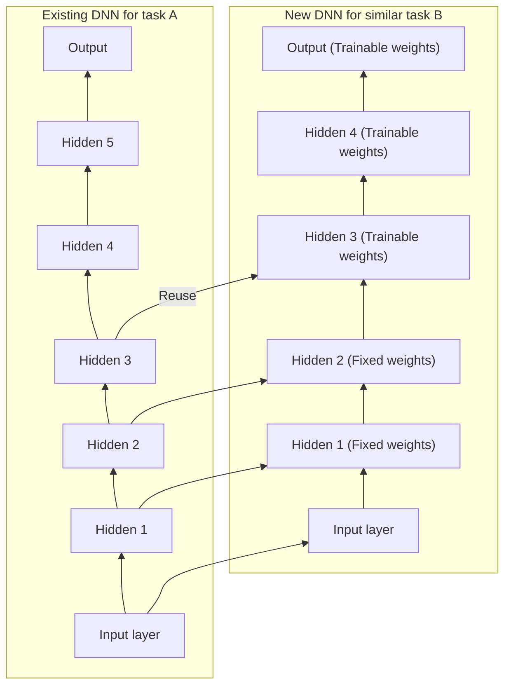
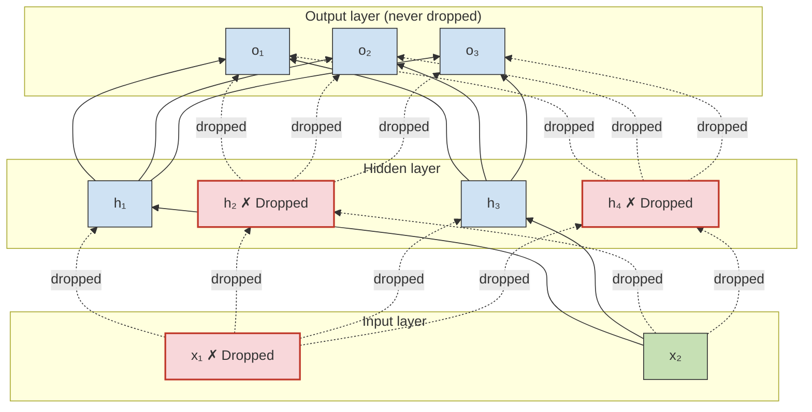

# CITS5017 Deep Learning

Lectures for Semester 2, 2025 — Topic 2: Training Deep Neural Networks — Associate Professor Du Huynh (Unit Coordinator and Lecturer) — UWA — 2025

---

## Slide 1 — CITS5017 Deep Learning

Lectures for Semester 2, 2025

Topic 2: Training Deep Neural Networks

Associate Professor Du Huynh
(Unit Coordinator and Lecturer)

UWA

2025

---

## Slide 2 — Today

Chapter 11.

### Hands-on Machine Learning with Scikit-Learn, Keras & TensorFlow


> **Figure 1.** Book cover, O'REILLY. Top-left corner shows the O'REILLY logo in red. A diagonal banner in the top-right corner reads "Third Edition". Title text: "Hands-On Machine Learning with Scikit-Learn, Keras & TensorFlow". Subtitle in orange: "Concepts, Tools, and Techniques to Build Intelligent Systems". Below that, small text "powered by" followed by a logo. The cover illustration is a black-and-yellow spotted salamander. Author name at the bottom: "Aurélien Géron".

---

## Slide 3 — Chapter Eleven

### Training Deep Neural Networks

Here are the main topics we will briefly cover:

- Vanishing/Exploding Gradients Problems
  - Glorot and He initialization
  - Nonsaturating activation functions
  - Batch normalization
  - Gradient clipping
- Faster Optimizers
  - Momentum optimization
  - Nesterov Accelerated Gradient
  - AdaGrad
  - RMSProp
  - Adam and its variants
- Learning rate scheduling
- Avoiding overfitting
  - $\ell_1$ and $\ell_2$ regularization
  - Dropout

---

## Slide 4 — Problems in training DNNs

Training a DNN isn't a walk in the park. Here are some of the problems you could run into:

- the tricky vanishing gradients or exploding gradients problems;
- insufficient training data or insufficient labelled data to train the large network;
- training may be extremely slow;
- risk of overfitting the training data for a model with millions of parameters especially if there are not enough training instances or if they are too noisy.

---

## Slide 5 — Vanishing/Exploding Gradients Problems

- The **vanishing gradients** problem occurs when gradients become smaller and smaller as the algorithm progresses down to the lower layers. As a result, the Gradient Descent update leaves the lower layers' connection weights virtually unchanged, and training never converges to a good solution or the convergence is extremely slow. In other cases, we have the opposite problem, i.e., gradients become larger and larger, leading to the **exploding gradients** problem.
- This vanishing gradients problem was found¹ to be the combination of the popular logistic sigmoid activation function and the weight initialization technique that was most popular at the time.

**Footnotes:**

1. Xavier Glorot and Yoshua Bengio, "Understanding the Difficulty of Training Deep Feedforward Neural Networks," *Proceedings of the 13th International Conference on Artificial Intelligence and Statistics* (2010): 249-256.

---

## Slide 6 — Vanishing/Exploding Gradients Problems (cont.)

- weight initialization techniques (usually drawn from $\mathcal{N}(0, 1)$); *[$\mathcal{N}(0,1)$ highlighted blue]*
- the variance of the outputs of each layer is much greater than the variance of its inputs;
- the logistic activation function has mean $0.5$ rather than $0$. Also, when inputs become large (negative or positive), the function saturates at $0$ or $1$, with a derivative extremely close to $0$. *[numerical values highlighted blue]*

> **Figure 11-1.** Line plot of the logistic activation function. Legend entry (blue solid line): $\sigma(z) = \dfrac{1}{1 + e^{-z}}$. Horizontal axis labelled $z$, ranging from about $-5$ to $5$ with ticks at $-4, -2, 0, 2, 4$. Vertical axis ranging from $-0.2$ to $1.2$ with ticks at $-0.2, 0.0, 0.2, 0.4, 0.6, 0.8, 1.0, 1.2$. A green dashed straight line passes through the origin with the slope of the sigmoid at $z=0$ (the linear approximation), rising off the top of the plot near $z \approx 1$ and leaving the bottom near $z \approx -2.7$. A black horizontal dashed line is drawn at $y = 1.0$. Solid black horizontal and vertical axis lines are drawn at $y = 0$ and $z = 0$. Three thick black arrows with text annotations: "Saturating" pointing to the flat left tail near $z \approx -4.5$, $y \approx 0$; "Linear" pointing to the central region of the curve near $z = 0$, $y = 0.5$; "Saturating" pointing to the flat right tail near $z \approx 4.5$, $y \approx 1$. Grid lines shown.

*Caption:* Figure 11-1. Logistic activation function saturation.

---

## Slide 7 — Vanishing/Exploding Gradients Problems (cont.)

### Xavier Initialization or Glorot Initialization

Glorot and Bengio² proposed a good compromise that has proven to work very well in practice: the connection weights between neurons must be initialized randomly as described below:

> **Glorot initialization (when using the logistic activation function)**
>
> - use the normal distribution with mean 0 and variance $\sigma^2 = \dfrac{1}{\text{fan}_{\text{avg}}}$, or
> - use a uniform distribution over the interval $[-r, +r]$ with $r = \sqrt{\dfrac{3}{\text{fan}_{\text{avg}}}}$

where $\text{fan}_{\text{in}}$ and $\text{fan}_{\text{out}}$ denote the numbers of input and output units of a layer and $\text{fan}_{\text{avg}} = (\text{fan}_{\text{in}} + \text{fan}_{\text{out}})/2$

**Footnotes:**

2. Xavier Glorot and Yoshua Bengio, "Understanding the Difficulty of Training Deep Feedforward Neural Networks", *Proceedings of the 13th International Conference on Artificial Intelligence and Statistics* (2010): 249-256.

---

## Slide 8 — Vanishing/Exploding Gradients Problems (cont.)

### He Initialization or Kaiming Initialization

He et al³ provide similar weight initialization strategies for the ReLU activation function and its variants (including ELU). For the activation function SELU (see later) with a normal distribution, Yann LeCun's initialization method is preferred.

| Initialization | Activation functions | $\sigma^2$ (Normal) |
|---|---|---|
| Glorot | None, tanh, sigmoid, softmax | $1/\text{fan}_{\text{avg}}$ |
| He | ReLU, Leaky ReLU, ELU, GELU, Swish, Mish | $2/\text{fan}_{\text{in}}$ |
| LeCun | SELU | $1/\text{fan}_{\text{in}}$ |

*Caption:* Table 11-1. Initialization parameters for each type of activation function.

**Footnotes:**

3. Kaiming He et al., "Delving Deep into Rectifiers: Surpassing Human-Level Performance on ImageNet Classification," *CVPR* 2015, 1026-1034.

---

## Slide 9 — Vanishing/Exploding Gradients Problems (cont.)

### Weight initialization examples in Keras

By default, Keras uses Glorot initialization with a uniform distribution. When you create a layer, you can choose your preferred weight initialization strategy by setting the `kernel_initializer` parameter.

Example 1: Use He's initialization strategy with the Normal distribution:

```python
import tensorflow as tf
tf.keras.layers.Dense(10, activation="relu", kernel_initializer="he_normal")
```

Example 2: Use the VarianceScaling initializer based on $\text{fan}_{\text{avg}}$:

```python
he_avg_init = tf.keras.initializers.VarianceScaling(scale=2., mode="fan_avg",
                                                    distribution="uniform")
dense = tf.keras.layers.Dense(50, activation="sigmoid",
                              kernel_initializer=he_avg_init)
```

---

## Slide 10 — Vanishing/Exploding Gradients Problems (cont.)

### Nonsaturating Activation Functions

The ReLU⁴ activation function is commonly used because it does not saturate for positive values. Unfortunately, like the logistic activation function, it suffers from a problem known as the *dying ReLUs*: during training, some neurons effectively "die," meaning they stop outputting anything other than 0. This happens when the input to ReLU is negative.

**Footnotes:**

4. Recall that the ReLU (rectified linear unit) activation function is defined as: $\text{ReLU}(z) = \max(0, z)$.

---

## Slide 11 — Vanishing/Exploding Gradients Problems (cont.)

### Nonsaturating Activation Functions

To overcome this problem, variants of ReLU have been proposed in the literature, including *leaky ReLU*, *RReLU*, *PReLU*, *ELU*, *SELU*, *GELU*, *SiLU* (or *Swish*), and *Mish*. *[variant names in red italic]*

**\* Leaky ReLU** is defined as $\text{LeakyReLU}_\alpha(z) = \max(\alpha z, z)$, where $\alpha$ is a small constant, e.g., $\alpha = 0.01$. Researchers found that a larger leak, e.g., $\alpha = 0.2$, tends to give better performance.

> **Figure 11-2.** Line plot of the Leaky ReLU activation function. Legend entry (blue solid line): $\text{LeakyReLU}(z) = \max(\alpha z, z)$. Horizontal axis labelled $z$, ranging from about $-5$ to $5$ with ticks at $-4, -2, 0, 2, 4$. Vertical axis ranging from $-1$ to above $3$ with ticks at $-1, 0, 1, 2, 3$. The curve is a straight line of slope 1 for $z \ge 0$ and a straight line of small positive slope for $z < 0$, reaching about $-0.5$ at $z = -5$. Solid black horizontal and vertical axis lines at $y = 0$ and $z = 0$. A thick black arrow annotated "Leak" points down-left toward the shallow negative-side segment near $z \approx -4.5$. Grid lines shown.

*Caption:* Figure 11-2. Leaky ReLU: like ReLU, but with a small slope for negative values.

---

## Slide 12 — Vanishing/Exploding Gradients Problems (cont.)

### Nonsaturating Activation Functions

**\* Leaky ReLU**

```python
# for tf-2.15 or older
leaky_relu = tf.keras.layers.LeakyReLU(alpha=0.2)  # default alpha=0.3
# for tf-2.16 onward
leaky_relu = tf.keras.layers.LeakyReLU(negative_slope=0.2)  # default negative_slope=0.3
dense = tf.keras.layers.Dense(50, activation=leaky_relu,
                              kernel_initializer="he_normal")

# can also use the leaky_relu function defined under the tf.keras.activations subpackage
dense = tf.keras.layers.Dense(50, activation=tf.keras.activations.leaky_relu, ...)
dense = tf.keras.layers.Dense(50, activation="leaky_relu", ...)
```

Can also use LeakyReLU as a separate layer:

```python
model = tf.keras.models.Sequential([
    # [...]  # more layers
    tf.keras.layers.Dense(50, kernel_initializer="he_normal"),  # no activation
    tf.keras.layers.LeakyReLU(negative_slope=0.2),  # activation in a separate layer
    # [...]  # more layers
])
```

From TensorFlow version 2.16 onward, the optional parameter `alpha` is replaced by `negative_slope`.

---

## Slide 13 — Vanishing/Exploding Gradients Problems (cont.)

### Nonsaturating Activation Functions

**\* Randomized leaky ReLU (or RReLU)** is the same as leaky ReLU except that $\alpha$ is picked randomly in a given range during training and is fixed to an average value during testing. There is currently no implementation of RReLU in Keras.

---

## Slide 14 — Vanishing/Exploding Gradients Problems (cont.)

### Nonsaturating Activation Functions

**\* Parametric leaky ReLU (or PReLU)** is the same as RReLU, except that $\alpha$ is learned during training together with the connection weights. PReLU was reported to strongly outperform ReLU on large image datasets, but on smaller datasets it runs the risk of overfitting the training set.

To use PReLU in your code, replace `tf.keras.layers.LeakyReLU` with `tf.keras.layers.PReLU`.

ReLU, leaky ReLU, RReLU, and PReLU all suffer from the fact they are not smooth functions (derivatives not continuous at $z = 0$). Some smooth variants of ReLU are: ELU, SELU, Swish, and Mish.

---

## Slide 15 — Vanishing/Exploding Gradients Problems (cont.)

### Nonsaturating Activation Functions

**\* Exponential linear unit (or ELU)**⁵ is defined as

$$
\text{ELU}_\alpha(z) = \begin{cases}
\alpha\big(\exp(z) - 1\big) & \text{if } z < 0 \\
z & \text{if } z \ge 0
\end{cases}
$$

#### Left column — figure

> **Figure (ELU).** Line plot titled $\text{ELU}_\alpha(z) = \alpha(e^{z} - 1)$ if $z < 0$, else $z$. Horizontal axis labelled $z$, ranging from about $-5$ to $5$ with ticks at $-4, -2, 0, 2, 4$. Vertical axis with ticks at $-2, -1, 0, 1, 2, 3$. Legend: blue solid line $\alpha = 1$; red dashed line $\alpha = 2$. Both curves coincide as the identity line for $z \ge 0$. For $z < 0$ the blue ($\alpha = 1$) curve decays smoothly to an asymptote at $-1$; the red ($\alpha = 2$) curve decays to an asymptote at $-2$. Black dotted horizontal asymptote lines are drawn at $y = -1$ and $y = -2$. Solid black horizontal and vertical axis lines at $y = 0$ and $z = 0$. Grid lines shown.

*Caption:* The ELU activation function for $\alpha = 1, 2$.

#### Right column — bullets

- It takes on negative values when $z < 0$, which helps alleviate the vanishing gradients problem.
- It has non-zero gradient for $z < 0$, which avoids dead neurons problem.
- When $\alpha = 1$, the function is smooth everywhere (including $z = 0$).

To use ELU, set `activation="elu"`, `activation=tf.keras.activations.elu`, or add a `tf.keras.layers.ELU` layer.

**Footnotes:**

5. Djork-Arné Clevert et al., "Fast and Accurate Deep Network Learning by Exponential Linear Units (ELUs)," *International Conference on Learning Representations*, 2016.

---

## Slide 16 — Vanishing/Exploding Gradients Problems (cont.)

### Nonsaturating Activation Functions

**\* Scaled ELU (or SELU)**⁶ – as the name suggests, is a scaled version of ELU, i.e., $\text{SELU}(z) = s\,\text{ELU}_{1.6733}(z)$, where $s = 1.0507$ is a fixed scale factor and $\alpha$ is fixed at $1.6733$. These $\alpha$ and $s$ values are chosen so that the mean and variance of the inputs are preserved between two consecutive layers if the following constraints are imposed:

1. The input features are standardized (i.e., having mean 0 and standard deviation 1);
2. Every hidden layer's weights are initialized using LeCun normal initialization;
3. No $\ell_1$ or $\ell_2$ regularization, max-norm, batch-norm, or dropout (see later) is used.

Because of these constraints, SELU did not gain a lot of traction.

**Footnotes:**

6. Günter Klambauer et al., "Self-Normalizing Neural Networks," *Proceedings of the 31st International Conference on Neural Information Processing Systems* (2017): 972-981.

---

## Slide 17 — Vanishing/Exploding Gradients Problems (cont.)

### Nonsaturating Activation Functions

Comparing ELU and SELU:

> **Figure 11-3.** Line plot comparing two activation functions. Horizontal axis labelled $z$, ranging from about $-5$ to $5$ with ticks at $-4, -2, 0, 2, 4$. Vertical axis with ticks at $-2, -1, 0, 1, 2, 3$. Legend: blue solid line $\text{ELU}_\alpha(z) = \alpha(e^{z} - 1)$ if $z < 0$, else $z$; red dashed line $\text{SELU}(z) = 1.05\,\text{ELU}_{1.67}(z)$. For $z \ge 0$ the SELU line is slightly steeper than the ELU identity line. For $z < 0$ the blue ELU curve flattens to an asymptote at $-1$ and the red SELU curve flattens to an asymptote at approximately $-1.76$. Black dotted horizontal asymptote lines drawn at those two levels. Solid black horizontal and vertical axis lines at $y = 0$ and $z = 0$. Grid lines shown.

*Caption:* Figure 11-3. ELU and SELU activation functions

To use SELU with Keras, set `activation="selu"` or use `activation=tf.keras.activations.selu`.

---

## Slide 18 — Vanishing/Exploding Gradients Problems (cont.)

### Nonsaturating Activation Functions

**\* Gaussian Error Linear Units (or GELU)** was introduced in 2016.⁷ This activation function is defined as: $\text{GELU}(z) = z\,\Phi(z)$, where $\Phi$ is the standard Gaussian cumulative distribution function (CDF).

- GELU resembles ReLU: it approaches 0 when $z$ is very negative and it approaches $z$ when $z$ is very positive.
- However, unlike all the previous activation functions, GELU is neither convex nor monotonic. This fairly complex shape may explain why it works so well, especially on complex tasks. In practice, it often outperforms those previous activation functions that we have seen before.
- The downside is: it is more computationally intense.
- It is approx. equal to $z\sigma(1.702z)$, where $\sigma$ is the sigmoid function, which is faster to compute.

**Footnotes:**

7. Dan Hendrycks and Kevin Gimpel, "Gaussian Error Linear Units (GELUs)", arXiv preprint arXiv:1606.08415 (2016).

---

## Slide 19 — Vanishing/Exploding Gradients Problems (cont.)

### Nonsaturating Activation Functions

**\* Swish**

- In the GELU paper, Hendrycks and Gimpel also introduced the *sigmoid linear unit (SiLU)* activation function, which is equal to $z\sigma(z)$ but it was outperformed by GELU.
- This was rediscovered by Ramachandran et al⁸ and the activation function was named *Swish*. Swish was shown in their paper to outperform every other function, including GELU.
- Ramachandran et al also generalized Swish by adding an extra hyperparameter: $\text{Swish}_\beta(z) = z\sigma(\beta z)$.
- GELU is approx. equal to the Swish function with $\beta = 1.702$.
- From tf-2.16 onward, the `swish` activation function has been renamed to `silu`.

**Footnotes:**

8. Prajit Ramachandran et al., "Searching for Activation Functions", arXiv preprint arXiv:1710.05941 (2017).

---

## Slide 20 — Vanishing/Exploding Gradients Problems (cont.)

### Nonsaturating Activation Functions

**\* Mish** was introduced in 2019 by Misra⁹. It is defined as

$$\text{Mish}(z) = z \tanh(\text{softplus}(z)),$$

where $\text{softplus}(z) = \log(1 + \exp(z))$.

- Same as GELU and Swish, Mish is a smooth, non-convex, and non-monotonic function.
- the author Misra ran many experiments and showed that Mish outperformed many activation functions, including Swish and GELU, by a tiny margin.

**Footnotes:**

9. Diganta Misra, "Mish: A Self Regularized Non-Monotonic Activation Function", arXiv preprint arXiv:1908.08681 (2019).

---

## Slide 21 — Vanishing/Exploding Gradients Problems (cont.)

### Nonsaturating Activation Functions

**Comparing GELU, Swish (= SiLU), and Mish**

> **Figure 11-4.** Line plot comparing four activation functions. Horizontal axis labelled $z$, ranging from $-4$ to $2$ with ticks at $-4, -3, -2, -1, 0, 1, 2$. Vertical axis ranging from $-1.0$ to $2.0$ with ticks at $-1.0, -0.5, 0.0, 0.5, 1.0, 1.5, 2.0$. Legend entries: blue solid line $\text{GELU}(z) = z\,\Phi(z)$; red dashed line $\text{Swish}(z) = \text{SiLU}(z) = z\,\sigma(z)$; red dotted line $\text{Swish}_{\beta = 0.6}(z) = z\,\sigma(0.6z)$; green dotted line $\text{Mish}(z) = z\tanh(\text{softplus}(z))$. All four curves rise together for $z > 0$ (GELU and Mish nearly coincide and are highest; Swish is slightly lower; $\text{Swish}_{\beta=0.6}$ is lowest, reaching about 1.5 at $z = 2$). All curves dip below zero for negative $z$: GELU reaches a minimum of about $-0.17$ near $z \approx -0.75$ then returns toward 0 as $z \to -4$; Swish and Mish reach minima of about $-0.28$ near $z \approx -1.3$; $\text{Swish}_{\beta=0.6}$ dips deepest to about $-0.45$ near $z \approx -1.5$ and is still about $-0.33$ at $z = -4$. Solid black horizontal and vertical axis lines at $y = 0$ and $z = 0$. Grid lines shown.

*Caption:* Figure 11-4. GELU, SiLU, parametrized Swish, and Mish activation functions

Keras supports GELU and SiLU: just use `activation="gelu"` or `activation="silu"`. However, it does not support Mish or the generalized Swish activation function yet.

---

## Slide 22 — Vanishing/Exploding Gradients Problems (cont.)

### Which activation function should you use for the hidden layers of your DNNs?

- In general, ReLU remains a good default for simple tasks. It is fast to compute and is supported in many libraries and many hardware accelerators provide ReLU-specific optimizations.
- For more complex tasks,
  - SiLU (Swish) is probably a better default; you can also try the parametrized Swish and tune the hyperparameter $\beta$.
  - Mish may give you slightly better results, but it requires a bit more compute.
  - If latency is a concern, then you may prefer a simpler activation function like leaky ReLU or PReLU.
- For very deep MLPs, try SELU but make sure the constraints listed on slide 16 are met.

---

## Slide 23 — Vanishing/Exploding Gradients Problems (cont.)

### Batch Normalization

Although using He initialization along with ELU (or any variant of ReLU) can mitigate the vanishing/exploding gradients problems at the beginning of training, it doesn't guarantee that they won't come back during training. To overcome these problems, the batch normalization¹⁰ algorithm was proposed:

- An extra operation is inserted before or after the activation function in each hidden layer to normalize the input to have mean = 0 and variance = 1.
- This normalization introduces two trainable parameters, $\gamma$ and $\beta$, that the training process must learn together with the connection weights.
- The mean and variance of each layer's outputs for entire training set are estimated using the moving average of the minibatches. They are used in the predictions on the testing set.

**Footnotes:**

10. Sergey Ioffe and Christian Szegedy, "Batch Normalization: Accelerating Deep Network Training by Reducing Internal Covariate Shift," *ICML* (2015): 448-456.

---

## Slide 24 — Vanishing/Exploding Gradients Problems (cont.)

### Batch Normalization (cont.)

Summary of the algorithm:

$$
\begin{aligned}
\mu_B &= \frac{1}{m_B}\sum_{i=1}^{m_B} \mathbf{x}^{(i)} \\
\sigma_B^2 &= \frac{1}{m_B}\sum_{i=1}^{m_B}\left(\mathbf{x}^{(i)} - \mu_B\right)^2 \\
\hat{\mathbf{x}}^{(i)} &= \frac{\mathbf{x}^{(i)} - \mu_B}{\sqrt{\sigma_B^2 + \epsilon}} \\
\mathbf{z}^{(i)} &= \gamma \otimes \hat{\mathbf{x}}^{(i)} + \beta
\end{aligned}
$$

where $\mu_B$ and $\sigma_B^2$ are the mean and variance vectors computed from the minibatch $B$; $\hat{\mathbf{x}}^{(i)}$ is a zero-centred and normalized input vector used internally in the BN layer; $\gamma$ and $\beta$ are the trainable scale and shift vectors (one parameter per input feature); and $\otimes$ represents element-wise multiplication.

---

## Slide 25 — Vanishing/Exploding Gradients Problems (cont.)

### Batch Normalization (cont.)

Ioffe and Szegedy demonstrated many advantages of Batch Normalization (BN) in their paper:

- Huge improvement in their ImageNet classification results;
- Vanishing gradients problem was so strongly reduced that they could use saturating activation functions (e.g., tanh);
- Their network could be trained with much larger learning rates;
- BN also acts like a regularizer, reducing the need for other regularization techniques (such as dropout);
- BN helps to remove the need for normalizing the input data (e.g., using `StandardScaler`);

There is a runtime penalty though, due to the extra computations required at each layer; however, this is usually counterbalanced by the fact that convergence is much faster with BN, so it will take fewer epochs to reach the same performance.

The extra computation overhead above can also be avoided by fusing the BN layer with the previous layer after training.

---

## Slide 26 — Vanishing/Exploding Gradients Problems (cont.)

### Implementing Batch Normalization with Keras

```python
model = keras.models.Sequential([
    tf.keras.layers.InputLayer(shape=[28, 28]),
    tf.keras.layers.Flatten(),
    tf.keras.layers.BatchNormalization(),
    tf.keras.layers.Dense(300, activation="relu",
                          kernel_initializer="he_normal"),
    tf.keras.layers.BatchNormalization(),
    tf.keras.layers.Dense(100, activation="relu",
                          kernel_initializer="he_normal"),
    tf.keras.layers.BatchNormalization(),
    tf.keras.layers.Dense(10, activation="softmax")
])
```

In this example, BN is applied after the `Flatten` layer and after each of the two hidden layers.

---

## Slide 27 — Vanishing/Exploding Gradients Problems (cont.)

### Implementing Batch Normalization with Keras

```python
>>> model.summary()
```

`Model: "sequential"`

| Layer (type) | Output Shape | Param # |
|---|---|---|
| flatten (Flatten) | (None, 784) | 0 |
| batch_normalization (BatchNormalization) | (None, 784) | 3,136 |
| dense (Dense) | (None, 300) | 235,500 |
| batch_normalization_1 (BatchNormalization) | (None, 300) | 1,200 |
| dense_1 (Dense) | (None, 100) | 30,100 |
| batch_normalization_2 (BatchNormalization) | (None, 100) | 400 |
| dense_2 (Dense) | (None, 10) | 1,010 |

`Total params: 271,346 (1.04 MB)`

`Trainable params: 268,978 (1.03 MB)`

`Non-trainable params: 2,368 (9.25 KB)`

> **Figure (screenshot).** The above is a screenshot of a Keras `model.summary()` output. Layer type names (`Flatten`, `BatchNormalization`, `Dense`) appear in blue inside parentheses; shape values `None` and the numeric parameter counts appear in blue/green colouring. The table is drawn with rectangular cell borders and three columns headed "Layer (type)", "Output Shape", and "Param #".

---

## Slide 28 — Vanishing/Exploding Gradients Problems (cont.)

### Batch Normalization (cont.)

The authors of the BN paper argued in favour of adding the BN layers before the activation functions, rather than after (as we just did on slide 26). To do so, you need to set the Activation function as a layer and exclude the bias parameter from the previous layer:

```python
model = tf.keras.Sequential([
    tf.keras.layers.InputLayer(shape=[28, 28]),
    tf.keras.layers.Flatten(),
    tf.keras.layers.Dense(300, kernel_initializer="he_normal",
                          use_bias=False),
    tf.keras.layers.BatchNormalization(),
    tf.keras.layers.Activation("relu"),
    tf.keras.layers.Dense(100, kernel_initializer="he_normal",
                          use_bias=False),
    tf.keras.layers.BatchNormalization(),
    tf.keras.layers.Activation("relu"),
    tf.keras.layers.Dense(10, activation="softmax")
])
```

---

## Slide 29 — Vanishing/Exploding Gradients Problems (cont.)

### Gradient Clipping

- Another popular technique to lessen the exploding gradients problem is to simply clip the gradients during backpropagation so that they never exceed some threshold (this is mostly useful for recurrent neural networks (RNNs) as BN is tricky to use in RNNs. This is called *Gradient Clipping*¹¹.
- For example,

```python
  optimizer = tf.keras.optimizers.SGD(clipvalue=1.0)
  model.compile(loss="mse", optimizer=optimizer)
```

  will clip every component of the gradient vector to a value between $-1.0$ and $1.0$. An alternative is to use `clipnorm=1.0` if you want to retain the gradient vector orientation.

**Footnotes:**

11. Razvan Pascanu et al., "On the Difficulty of Training Recurrent Neural Networks," *ICML* (2013): 1310-1318.

---

## Slide 30 — Transfer Learning with Keras

#### Left column — bullets

- If you find an existing neural network that accomplishes a similar task to the one you are trying to tackle, then you can reuse most of its layers, except for the top ones. This technique is called *transfer learning*.
- The output layer of the original model should usually be replaced because it is most likely not useful at all for the new task, and probably will not have the right number of outputs.
- The more similar the tasks are, the more layers you will want to reuse (starting with the lower layers). For very similar tasks, try to keep all the hidden layers and just replace the output layer.

#### Right column — figure



> **Figure 11-5.** Two vertical stacks of labelled boxes side by side. Left stack, captioned "Existing DNN for task A" (bold), from bottom to top: "Input layer" (green), "Hidden 1", "Hidden 2", "Hidden 3", "Hidden 4", "Hidden 5", "Output" (all blue), with an upward arrow leaving the top of "Output". Right stack, captioned "New DNN for similar task B" (bold), from bottom to top: "Input layer" (green), "Hidden 1", "Hidden 2", "Hidden 3", "Hidden 4", "Output" (white boxes), with an upward arrow leaving the top. Horizontal arrows run from the left stack to the right stack at the Input layer, Hidden 1, and Hidden 2 levels, and a labelled arrow marked "Reuse" runs from Hidden 3 of task A to Hidden 3 of task B. A dashed rectangle encloses Hidden 1 and Hidden 2 of the new DNN. On the right-hand margin are two padlock icons: an open orange padlock labelled "Trainable weights" aligned with the upper layers (Hidden 3, Hidden 4, Output), and a closed orange padlock labelled "Fixed weights" aligned with the dashed-box layers (Hidden 1, Hidden 2).

*Caption:* Figure 11-5. Reusing pretrained layers.

---

## Slide 31 — Transfer Learning with Keras (cont.)

Suppose that someone has trained `mode_A` for 8 classes (except sandal and shirt) for the Fashion MNIST dataset and your task is to train `model_B` for the T-shirt and pullover classes. You only have 200 labelled images and you get 91.85% test accuracy. You can improve the test accuracy of your `model_B` using transfer learning:

```python
# assuming the trained model_A is saved to "my_model_A.keras"
model_A = tf.keras.models.load_model("my_model_A.keras")
model_B_on_A = tf.keras.Sequential(model_A.layers[:-1])
model_B_on_A.add(tf.keras.layers.Dense(1, activation="sigmoid"))

# freeze the reused layers for the first epochs
for layer in model_B_on_A.layers[:-1]:
    layer.trainable = False
optimizer = tf.keras.optimizers.SGD(learning_rate=0.001)
model_B_on_A.compile(loss="binary_crossentropy", optimizer=optimizer, metrics=["accuracy"])
# for example, train the model for 4 epochs
history = model_B_on_A.fit(X_train_B, y_train_B, epochs=4, validation_data=(X_valid_B, y_valid_B))

# unfreeze the layers and train for 16 epochs. Note that the model needs to be recompiled
for layer in model_B_on_A.layers[:-1]:
    layer.trainable = True
optimizer = tf.keras.optimizers.SGD(learning_rate=0.001)
model_B_on_A.compile(loss="binary_crossentropy", optimizer=optimizer, metrics=["accuracy"])
history = model_B_on_A.fit(X_train_B, y_train_B, epochs=16, validation_data=(X_valid_B, y_valid_B))
```

---

## Slide 32 — Transfer Learning with Keras (cont.)

Now, evaluate the test accuracy using `model_B_on_A`:

```python
>>> model_B_on_A.evaluate(X_test_B, y_test_B)
[0.2546142041683197, 0.9384999871253967]
```

This is an improvement of 2% on the test accuracy.

- `model_B`: test accuracy = 91.85%; error rate = 8.15%.
- `model_B_on_A`: test accuracy = 93.85%; error rate = 6.15%
- In terms of reduction of the error rate, it is $(8.15 - 6.15)/8.15\,\% = 2/8.15\,\%$, which is almost 25%!

It turned out that the above results came from many trials of configuration (like setting the random seed to different values) of the author. In general, transfer learning does not work well with small dense networks. However, it works well with deep convolution neural networks.


# Faster Optimizers

*(Slide 33 / 68)*

Huge speed boost comes from using a faster optimizer than the regular Gradient Descent optimizer. We will look at a few of the most popular algorithms:

- Momentum
- Nesterov accelerated gradient
- AdaGrad
- RMSProp
- Adam and its variants

---

## Momentum

*(Slide 34 / 68)*

Recall that Gradient Descent simply updates the weights $\theta$ as follows:

$$\theta \leftarrow \theta - \eta \nabla_\theta J(\theta)$$

(where $J$ corresponds to the error or loss that we try to minimize). It does not care about what the earlier gradients were. If the local gradient is tiny, it goes very slowly.

In momentum optimization, a momentum vector $\mathbf{m}$ is used to keep track of gradients in the previous iterations. The updates of the weights involve using only $\mathbf{m}$, which contains information about the past momentum and the current error gradient. That is, the gradient is used as an **acceleration** term, rather than a **speed** term of the update. The algorithm can also help roll past local optima. It introduces a new hyperparameter $\beta < 1$ (usually set to $0.9$).

The update equations are:

$$\mathbf{m} \leftarrow \beta \mathbf{m} - \eta \nabla_\theta J(\theta)$$

$$\theta \leftarrow \theta + \mathbf{m}$$

Note that past momentum vector $\mathbf{m}$ exponentially decays over iterations.

### Momentum optimization (cont.)

*(Slide 35 / 68)*

To use momentum optimization in your code, set the `momentum` hyperparameter to an appropriate value, e.g.,

```python
# standard SGD optimizer
optimizer = tf.keras.optimizers.SGD(learning_rate=0.001)

# Momentum optimizer
optimizer = tf.keras.optimizers.SGD(learning_rate=0.001, momentum=0.9)
```

A drawback of momentum optimization is that it adds yet another hyperparameter to tune. However, the momentum value of $0.9$ usually works well in practice and almost always goes faster than regular gradient descent.

---

## Nesterov Accelerated Gradient (NAG)

*(Slide 36 / 68)*

Also known as **Nesterov momentum optimization**, this optimizer was proposed by Nesterov[^12]. It is a small variant of the momentum optimizer which measures the gradient of the loss function **not** at the local position $\theta$ but slightly ahead in the direction of the momentum, at $\theta + \beta \mathbf{m}$.

$$\mathbf{m} \leftarrow \beta \mathbf{m} - \eta \nabla_\theta J(\theta + \beta \mathbf{m})$$

$$\theta \leftarrow \theta + \mathbf{m}$$

This small tweak works because in general the momentum vector will be pointing in the right direction (i.e., toward the optimum), so the update ends up slightly closer to the optimum.

[^12]: Yurii Nesterov, "A Method for Unconstrained Convex Minimization Problem with the Rate of Convergence $O(1/k^2)$," *Doklady AN USSR* 269 (1983): 543-547.

### Nesterov Accelerated Gradient (NAG) (cont.)

*(Slide 37 / 68)*

> **Figure 11-7. Momentum optimization versus Nesterov momentum optimization.**
>
> A 2D contour plot of the cost surface, with $\theta_1$ on the horizontal axis and $\theta_2$ on the vertical axis. A legend in the top-right corner is labelled **"Cost"** and shows a graded colour bar (light/white = low cost at the centre, darker orange = higher cost towards the outside). The contours form an irregular blob, with nested dashed contour rings converging on a small white region (the optimum) on the right-hand side of the blob.
>
> From a **"Starting point"** (a small dot on the left inside the blob):
> - A short blue arrow labelled $-\eta\nabla_1$ points down-right from the starting point (the current gradient step).
> - A long black arrow labelled $\beta\mathbf{m}$ points right from the starting point to an intermediate position (the momentum step), landing near the optimum region.
> - From the tip of the momentum arrow, a **dashed blue** arrow labelled $-\eta\nabla_1$ points up-right to a blue dot labelled **"Regular momentum update"** — this is the gradient measured at the *original* position $\theta$, which overshoots past the optimum.
> - Also from the tip of the momentum arrow, a **solid green** arrow labelled $-\eta\nabla_2$ points down-right to a green dot labelled **"Nesterov update"** — this is the gradient measured *ahead* at $\theta + \beta\mathbf{m}$, which lands inside the small white (lowest-cost) contour.
>
> Key relationship shown: the Nesterov update ends up closer to the optimum than the regular momentum update, because $\nabla_2$ is evaluated at the look-ahead point rather than at the starting point.

To use NAG, just add the optional parameter `nesterov` and set it to `True` (the default value is `False`).

```python
optimizer = tf.keras.optimizers.SGD(learning_rate=0.001,
                                    momentum=0.9, nesterov=True)
```

---

## AdaGrad

*(Slide 38 / 68)*

Consider the elongated bowl problem again: gradient descent starts by quickly going down the steepest slope, which does not point straight toward the global optimum, then it very slowly goes down to the bottom of the valley. The AdaGrad algorithm[^13] corrects the gradient vector to point a bit more toward the global minimum by scaling it down along the steepest dimensions:

$$\mathbf{s} \leftarrow \mathbf{s} + \nabla_\theta J(\theta) \otimes \nabla_\theta J(\theta)$$

$$\theta \leftarrow \theta - \eta \nabla_\theta J(\theta) \oslash \sqrt{\mathbf{s} + \epsilon}$$

where $\mathbf{s}$ is a vector that accumulates the magnitudes of the error gradients; $\otimes$ and $\oslash$, respectively, denote element-wise multiplication and element-wise division; and $\epsilon$ is a small number (usually $10^{-10}$) used to avoid division by zero.

[^13]: John Duchi et al., "Adaptive Subgradient Methods for Online Learning and Stochastic Optimization", *Journal of Machine Learning Research* 12 (2011): 2121–2159.

### AdaGrad (cont.)

*(Slide 39 / 68)*

> **Figure 11-8. AdaGrad versus gradient descent.**
>
> A 2D contour plot of an elongated (elliptical) cost bowl. The vertical axis is $\theta_2$, annotated **"(Steep dimension)"**; the horizontal axis is $\theta_1$, annotated **"(Flatter dimension)"**. A legend in the top-right is labelled **"Cost"** with a graded bar from white (low) to orange (high). The ellipses are nested, with the innermost white ellipse (the global optimum) at the centre-right of the plot.
>
> Two trajectories start from the same point near the top of the ellipse (upper-left of centre):
> - A **red/pink** chain of dots labelled **"AdaGrad"** descends and then heads almost directly toward the centre (the optimum), i.e., it corrects its direction early.
> - A **blue** chain of dots labelled **"Gradient descent"** first plunges steeply down the $\theta_2$ (steep) direction, then makes slow horizontal progress along the flatter $\theta_1$ direction toward the optimum.
>
> Key relationship shown: AdaGrad scales down the gradient along the steep dimension, so its path points more directly at the global optimum than plain gradient descent.

- We can see that if the loss function is steep along the $i^{\text{th}}$ direction then $s_i$ will get larger and larger at each iteration.
- This algorithm has the effect of decaying the learning rate, but it does so faster for steep dimensions than for dimensions with gentler slopes. This is called an *adaptive learning rate*. One additional benefit is that it requires much less tuning of the learning rate hyperparameter $\eta$.

```python
optimizer = tf.keras.optimizers.SGD(learning_rate=0.001,
                                    momentum=0.9, nesterov=True)
```

### AdaGrad (cont.)

*(Slide 40 / 68)*

Keras has an AdaGrad optimizer:

```python
optimizer = tf.keras.optimizers.Adagrad(learning_rate=0.001)
```

A shortcoming of this algorithm is it frequently performs well for simple quadratic problems, but it often stops too early when training neural networks: the learning rate gets scaled down so much that the algorithm ends up stopping entirely before reaching the global optimum.

So even though Keras has an AdaGrad optimizer, you should **not** use it to train deep neural networks (it may be efficient for simpler tasks such as linear regression, though). Still, understanding AdaGrad is helpful to comprehend the other adaptive learning rate optimizers.

---

## RMSProp

*(Slide 41 / 68)*

The problem of slowing down too fast in AdaGrad is overcome in RMSProp[^14]. In this algorithm, $\mathbf{s}$ accumulates the error gradient magnitudes from the **most recent** iterations:

$$\mathbf{s} \leftarrow \rho\,\mathbf{s} + (1 - \rho)\nabla_\theta J(\theta) \otimes \nabla_\theta J(\theta)$$

$$\theta \leftarrow \theta - \eta \nabla_\theta J(\theta) \oslash \sqrt{\mathbf{s} + \epsilon}$$

where the decay rate $\rho$ is typically set to $0.9$. This is another hyperparameter, but $\rho = 0.9$ has been shown to work well, so you may not need to tune it at all.

[^14]: created by Tijmen Tieleman and Geoffrey Hinton in 2012.

### RMSProp (cont.)

*(Slide 42 / 68)*

Keras has an RMSprop optimizer:

```python
optimizer = tf.keras.optimizers.RMSprop(learning_rate=0.001, rho=0.9)
```

Except on very simple problems, this optimizer almost always performs much better than AdaGrad. In fact, it was the preferred optimization algorithm of many researchers until Adam optimization came around.

---

## Adam

*(Slide 43 / 68)*

Adam (`https://goo.gl/Un8Axa`)[^15], which stands for **adaptive moment estimation**, combines the ideas of momentum optimization and RMSProp. It estimates the mean and variance of the error gradients to keep track of the exponentially decaying average of past squared gradients.

$$
\begin{aligned}
&1.\quad \mathbf{m} \leftarrow \beta_1 \mathbf{m} + (1 - \beta_1)\nabla_\theta J(\theta) \\[4pt]
&2.\quad \mathbf{s} \leftarrow \beta_2 \mathbf{s} + (1 - \beta_2)\nabla_\theta J(\theta) \otimes \nabla_\theta J(\theta) \\[4pt]
&3.\quad \hat{\mathbf{m}} \leftarrow \mathbf{m} / (1 - \beta_1^{\,t}) \\[4pt]
&4.\quad \hat{\mathbf{s}} \leftarrow \mathbf{s} / (1 - \beta_2^{\,t}) \\[4pt]
&5.\quad \theta \leftarrow \theta - \eta\, \hat{\mathbf{m}} \oslash \sqrt{\hat{\mathbf{s}} + \epsilon}
\end{aligned}
$$

where steps 3 and 4 are normalization to help increase the magnitude $\mathbf{m}$ and $\mathbf{s}$ as both vectors are initialized at around zero (so may be a bit small); $t$ is the iteration number.

[^15]: "Adam: A Method for Stochastic Optimization," D. Kingma, J. Ba (2014).

### Adam (cont.)

*(Slide 44 / 68)*

Notice that the Adam optimizer has close similarity to both momentum optimization and RMSProp: $\beta_1$ corresponds to $\beta$ in momentum optimization, and $\beta_2$ corresponds to $\rho$ in RMSProp.

Here is how to create an Adam optimizer using Keras:

```python
optimizer = tf.keras.optimizers.Adam(learning_rate=0.001,
                                     beta_1=0.9, beta_2=0.999)
```

- The momentum decay hyperparameter $\beta_1$ is typically initialized to $0.9$, while the scaling decay hyperparameter $\beta_2$ is often initialized to $0.999$.
- Since Adam is an adaptive learning rate algorithm, like AdaGrad and RMSProp, it requires less tuning of the learning rate hyperparameter $\eta$. You can often use the default value $\eta = 0.001$, making Adam even easier to use than gradient descent.

---

## Variants of Adam: AdaMax, Nadam, and AdamW

*(Slide 45 / 68)*

**\* AdaMax**[^16] is the same as Adam except that Step 2 of the algorithm (Slide 43) is replaced by

$$\mathbf{s} \leftarrow \max\!\big(\beta_2 \mathbf{s},\ \text{abs}(\nabla_\theta J(\theta))\big).$$

Its performance seems to depend on the dataset and, in general, Adam performs better.

**\* Nadam**[^17] combines Adam optimization with the Nesterov trick. The author Dozat found that Nadam generally outperforms Adam but is sometimes outperformed by RMSProp.

**\* AdamW**[^18] integrates into Adam a regularization technique called **weight decay**, which reduces the size of the model's weights at each training iteration by multiplying them by a decay factor such as $0.99$.

[^16]: from the same Adam paper.
[^17]: Timothy Dozat, "Incorporating Nesterov Momentum into Adam" (2016).
[^18]: Ashia C. Wilson et al., "The Marginal Value of Adaptive Gradient Methods in Machine Learning", *Advances in NIPS* 30 (2017): 4148-4158.

### Variants of Adam: AdaMax, Nadam, and AdamW (cont.)

*(Slide 46 / 68)*

Examples:

To use **AdaMax**:

```python
optimizer = tf.keras.optimizers.Adamax(learning_rate=0.001,
                                       beta_1=0.9, beta_2=0.999)
```

To use **Nadam**:

```python
optimizer = tf.keras.optimizers.Nadam(learning_rate=0.001,
                                      beta_1=0.9, beta_2=0.999)
```

To use **AdamW**:

```python
optimizer = tf.optimizers.AdamW(weight_decay=1e-5, learning_rate=0.001,
                                beta_1=0.9, beta_2=0.999)
```

You may need to also fine tune the `weight_decay` parameter.

---

## Faster Optimizers — Summary

*(Slide 47 / 68)*

| Class | Convergence speed | Convergence quality |
|---|---|---|
| `SGD` | `*` | `***` |
| `SGD(momentum=...)` | `**` | `***` |
| `SGD(momentum=..., nesterov=True)` | `**` | `***` |
| `AdaGrad` | `***` | `*` (stops too early) |
| `RMSprop` | `***` | `**` or `***` |
| `Adam` | `***` | `**` or `***` |
| `AdaMax` | `***` | `**` or `***` |
| `Nadam` | `***` | `**` or `***` |
| `AdamW` | `***` | `**` or `***` |

*Table 11-2. Optimizer comparison.*

---

# Learning Rate Scheduling

*(Slide 48 / 68)*

Finding a good learning rate is very important. If you set it too high, training may diverge; if you set it too low, training will eventually converge to the optimum, but it will take a very long time.

> **Figure 11-9. Learning curves for various learning rates $\eta$.**
>
> A line chart with **Loss** on the vertical axis and **Epoch** on the horizontal axis. Four curves start from the same high loss value on the left:
> - **Red curve**, labelled *"$\eta$ way too high: diverges"* — dips slightly then sweeps sharply upward off the top of the chart.
> - **Orange curve**, labelled *"$\eta$ too small: slow"* — decreases very gradually, ending at the highest final loss of the three convergent curves on the right.
> - **Purple curve**, labelled *"$\eta$ too high: suboptimal"* — drops very steeply at first, then flattens out early at a loss level above the optimum (plateaus).
> - **Green curve**, labelled *"$\eta$ just right"* — drops quickly and continues descending smoothly to the lowest final loss.
>
> A **green dashed** curve tracks slightly below the solid green curve. A vertical black arrow points up at the elbow of the purple curve, with the caption beneath the horizontal axis: **"Start with a high learning rate then reduce it: perfect!"**
>
> Key relationship shown: the ideal strategy is a high initial learning rate followed by reduction, which beats any single constant learning rate.

---

*(Slide 49 / 68)*

If you start with a large learning rate and then reduce it once training stops making fast progress, you can reach a good solution faster than with the optimal constant learning rate.

There are many different strategies to reduce the learning rate during training. It can also be beneficial to start with a low learning rate, increase it, then drop it again. These strategies are called **learning schedules**.

---

## Power scheduling

*(Slide 50 / 68)*

Some commonly used learning schedules are listed below.

**Power scheduling**: Setting the learning rate as a function of the step number $t$, as follows:

$$\eta(t) = \frac{\eta_0}{(1 + rt/s)^c}$$

where $\eta_0$ is the initial learning rate, the power $c$ (typically set to $1$), $r$ is the decay rate, and $s$ is the number of decay steps.

So, after $s$ steps (i.e., when $t = s$), the learning rate is down to $\eta_0/(1 + r)$. After another $s$ steps (i.e., when $t = 2s$), it is down to $\eta_0/(1 + 2r)$, and so on.

> **Chart: Power Scheduling: $\eta(t) = \eta_0/(1 + t/s)^c$ with $\eta_0 = 0.01$, $c = 1$**
>
> Horizontal axis: **step ($t$)**, from $0$ to $50$. Vertical axis: **learning rate ($\eta$)**, from about $0.002$ to $0.010$.
>
> Two marker-dotted decay curves both begin at $\eta = 0.010$ at $t = 0$:
> - **Blue curve**, legend *"decay = 0.1 ($s = 10$)"* — decays faster; passes through $\eta = 0.005$ at $t = 10$ and $\eta \approx 0.00333$ at $t = 20$; ends near $0.0017$ at $t = 50$.
> - **Red curve**, legend *"decay = 0.05 ($s = 20$)"* — decays more slowly; passes through $\eta = 0.005$ at $t = 20$ and $\eta \approx 0.00333$ at $t = 40$; ends near $0.0029$ at $t = 50$.
>
> Two horizontal dashed reference lines are drawn and labelled at $0.005$ and $0.00333$, marking the $\eta_0/(1+r)$ and $\eta_0/(1+2r)$ levels.

### Implementing power scheduling in Keras

*(Slide 51 / 68)*

```python
# initial_learning_rate / (1 + decay_rate * step / decay_step)

lr_schedule = tf.keras.optimizers.schedules.InverseTimeDecay(
    initial_learning_rate=0.01,
    decay_steps=10_000,
    decay_rate=1.0,
    staircase=False
)
optimizer = tf.keras.optimizers.SGD(learning_rate=lr_schedule)
```

> **Chart: Power Scheduling**
>
> Horizontal axis: **Step**, from $0$ to about $100{,}000$ (ticks at 0, 20000, 40000, 60000, 80000). Vertical axis: **Learning Rate**, from $0.000$ to $0.010$.
>
> - **Blue curve**, legend *"staircase=False"* — a smooth inverse-time decay starting at $0.010$ and falling steeply to about $0.005$ by step $10{,}000$, then flattening gradually toward roughly $0.001$ near step $100{,}000$.
> - **Orange curve**, legend *"staircase=True"* — a step function that holds $0.010$ until step $10{,}000$, then drops to $0.005$, holds until $20{,}000$, then $\approx 0.0033$, then $\approx 0.0025$, $\approx 0.002$, and so on, with each flat segment $10{,}000$ steps wide. The staircase tracks the smooth curve, coinciding with it more closely as the step number grows.

---

## Exponential scheduling

*(Slide 52 / 68)*

**Exponential scheduling**: Setting the learning rate to:

$$\eta(t) = \eta_0 r^{\,t/s}.$$

makes the learning rate gradually drop by a factor of $r$ every $s$ steps. The hyperparameters $r$ and $s$ are referred to as the *decay rate* and *decay steps*.

So if $r = 0.1$ and $s = 15$, then

- after 15 steps, $\eta(15) = 0.1\,\eta_0$;
- after 30 steps, $\eta(30) = 0.1\,\eta(15) = 0.01\,\eta_0$ and so on.

> **Chart: Exponential Scheduling: $\eta(t) = \eta_0\, r^{\,t/s}$ with $\eta_0 = 0.1$ and $s = 10$**
>
> Horizontal axis: **step ($t$)**, from $0$ to $50$. Vertical axis: **learning rate ($\eta$)**, from $0.00$ to $0.10$.
>
> Two marker-dotted curves both start at $\eta = 0.10$ at $t = 0$:
> - **Blue curve**, legend *"$r = 0.5$"* — decays to $\eta = 0.05$ at $t = 10$ (marked by blue dashed guide lines running horizontally to $0.05$ and vertically down to $t = 10$), then continues down to roughly $0.003$ by $t = 50$.
> - **Red curve**, legend *"$r = 0.2$"* — decays faster, reaching $\eta = 0.02$ at $t = 10$ (marked by red dotted guide lines), and is essentially flat near $0$ from about $t = 30$ onward.
>
> Caption: *Two example exponential scheduling functions.*

### Implementing exponential scheduling in Keras

*(Slide 53 / 68)*

$$\eta(t) = \eta_0\, r^{\,t/s}$$

```python
# initial_learning_rate * decay_rate ** (step / decay_steps)
lr_schedule = tf.keras.optimizers.schedules.ExponentialDecay(
    initial_learning_rate=0.01,
    decay_steps=20_000,
    decay_rate=0.1,
    staircase=False
)
optimizer = tf.keras.optimizers.SGD(learning_rate=lr_schedule)
```

> **Chart: Exponential Scheduling**
>
> Horizontal axis: **Step**, from $0$ to about $100{,}000$. Vertical axis: **Learning Rate**, from $0.000$ to $0.010$.
>
> - **Blue curve**, legend *"staircase=False"* — a smooth exponential decay from $0.010$ at step $0$, passing through $0.001$ at step $20{,}000$, and essentially indistinguishable from $0$ beyond about step $40{,}000$.
> - **Orange curve**, legend *"staircase=True"* — a step function holding $0.010$ until step $20{,}000$, dropping to $0.001$ and holding until step $40{,}000$, then dropping to $0.0001$ (visually on the axis) and remaining flat thereafter.

---

*(Slide 54 / 68)*

You can implement your own exponential scheduler (in fact, any learning scheduler):

```python
def exponential_decay(lr0, s):
    def exp_decay_fn(epoch):
        return lr0 * 0.1**(epoch / s)
    return exp_decay_fn

my_exp_decay_fn = exponential_decay(lr0=0.01, s=20)
lr_scheduler = tf.keras.callbacks.LearningRateScheduler(my_exp_decay_fn)
history = model.fit(X_train, y_train, ..., callbacks=[lr_scheduler])
```

Note that, by default, callback functions are run at the end of each **epoch**, not at each gradient descent update step. An optimizer is still needed.

Another way to implement your own scheduler is to subclass the `tf.keras.optimizers.schedules.LearningRateSchedule` base class.

---

## Piecewise constant scheduling

*(Slide 55 / 68)*

For this learning rate scheduling function, we use a constant learning rate for a number of iterations (e.g., $\eta_0 = 0.1$ for $5$ iterations), then a smaller learning rate for another number of iterations (e.g., $\eta_1 = 0.001$ for the next $50$ iterations), and so on. Although this solution can work very well, it requires fiddling around to figure out the right sequence of learning rates and how long to use each of them.

> **Chart: Piecewise Constant Scheduling**
>
> Horizontal axis: **iteration ($t$)**, from $0$ to $50$. Vertical axis: **learning rate ($\eta$)**, from about $0.02$ to $0.10$.
>
> A single blue marker-dotted step curve: $\eta = 0.10$ for iterations $0$–$5$; a near-vertical drop to $\eta = 0.04$, held for iterations $\approx 5$–$20$; a drop to $\eta = 0.02$, held for iterations $\approx 20$–$30$; a final drop to $\eta \approx 0.01$, held flat from iteration $\approx 30$ to $50$.
>
> Caption: *A example of piecewise constant scheduling.*

### Implementing piecewise constant scheduling in Keras

*(Slide 56 / 68)*

```python
# An example:
lr_schedule = tf.keras.optimizers.schedules.PiecewiseConstantDecay(
    boundaries=[50_000, 80_000],
    values=[0.01, 0.005, 0.001]
)
optimizer = tf.keras.optimizers.SGD(learning_rate=lr_schedule)
```

> **Chart: Piecewise Constant Scheduling**
>
> Horizontal axis: **Step**, from $0$ to about $100{,}000$. Vertical axis: **Learning Rate**, from $0.000$ to $0.010$.
>
> A single blue step curve: $\eta = 0.010$ from step $0$ to step $50{,}000$; a vertical drop to $\eta = 0.005$, held from $50{,}000$ to $80{,}000$; a vertical drop to $\eta = 0.001$, held flat from $80{,}000$ to the right edge of the plot. The step boundaries correspond exactly to `boundaries=[50_000, 80_000]` and the plateau heights to `values=[0.01, 0.005, 0.001]`.

---

## Performance scheduling

*(Slide 57 / 68)*

Measure the validation error every $N$ steps (just like for early stopping), and reduce the learning rate by a factor of $\lambda$ when the error stops dropping.

To implement performance scheduling, use the `ReduceLROnPlateau` callback:

```python
lr_scheduler = tf.keras.callbacks.ReduceLROnPlateau(factor=0.5,
                                                    patience=5)
history = model.fit(X_train, y_train, [...], callbacks=[lr_scheduler])
```

The `lr_scheduler` above will reduce the learning rate by $0.5$ whenever the best validation loss does not improve for $5$ consecutive epochs.

### Performance scheduling (cont.)

*(Slide 58 / 68)*

After training is complete, the learning rate versus the validation loss can be visualized using `history.history["learning_rate"]` and `history.history["val_loss"]`.

> **Chart: Reduce LR on Plateau**
>
> A dual-axis line chart. Horizontal axis: **Epoch**, from $0$ to about $24$. Left vertical axis (blue): **Learning Rate**, from $0.005$ to $0.010$. Right vertical axis (red): **Validation Loss**, from about $0.35$ to $0.48$.
>
> - **Blue curve with circular markers** (learning rate): flat at $0.010$ from epoch $0$ through epoch $\approx 16$, then a near-vertical drop at epoch $\approx 17$ to $0.005$, where it stays flat for the remaining epochs.
> - **Red curve with triangular markers** (validation loss): starts near $0.48$ at epoch $0$, falls steeply to about $0.39$ by epoch $5$, continues down to a minimum of roughly $0.377$ around epochs $10$–$12$, then *rises* slightly to about $0.385$ by epoch $16$ (the plateau/degradation that triggers the LR reduction), then drops sharply to about $0.355$ at epoch $17$ and stays roughly flat (small fluctuations) through epoch $24$.
>
> Key relationship shown: the learning rate is halved once the validation loss stops improving for 5 consecutive epochs, after which the validation loss immediately drops to a new lower plateau.
>
> Caption: *(from the training of an MLP classifier on the Fashion MNIST dataset)*

---

## 1Cycle scheduling

*(Slide 59 / 68)*

**1Cycle scheduling**[^19] — Contrary to the other approaches, 1Cycle starts by increasing $\eta_0$, growing linearly up to $\eta_1$ halfway through training, then it decreases the learning rate linearly down to $\eta_0$ again during the second half of training, finishing the last few epochs by dropping the learning rate down by several orders of magnitude (still linearly). The author reported that good validation accuracy was achieved with fewer training epochs on the CIFAR10 image dataset.

[^19]: Leslie N. Smith, "A Disciplined Approach to Neural Network Hyper-Parameters: Part 1 – Learning Rate, Batch Size, Momentum, and Weight Decay," arXiv preprint arXiv:1803.09820 (2018).

---

# Avoiding Overfitting

## $\ell_1$ and $\ell_2$ Regularization

*(Slide 60 / 68)*

Just like you did for simple linear models, you can use $\ell_1$ and $\ell_2$ regularization to constrain a neural network's connection weights.

**Example:** To apply $\ell_2$ regularization to a Keras layer's connection weights, using a regularization factor of $0.01$:

```python
layer = tf.keras.layers.Dense(100, activation="elu",
                              kernel_initializer="he_normal",
                              kernel_regularizer=tf.keras.regularizers.l2(0.01))
```

At each step during training, the regularization function computes the regularization loss, which is then added to the final loss.

- For the $\ell_1$ regularization, use `tf.keras.regularizers.l2(...)`.
- For both $\ell_1$ and $\ell_2$ regularization together, use `tf.keras.regularizers.l1_l2(...)`.

### $\ell_1$ and $\ell_2$ Regularization (cont.)

*(Slide 61 / 68)*

If you want the same regularization for every `Dense` layer, you can use Python's `functools.partial()` function:

```python
from functools import partial

RegularizedDense = partial(tf.keras.layers.Dense,
                           activation="relu",
                           kernel_initializer="he_normal",
                           kernel_regularizer=tf.keras.regularizers.l2(0.01))

model = tf.keras.Sequential([
    tf.keras.layers.InputLayer(shape=[28, 28]),
    tf.keras.layers.Flatten(),                  # layer 0
    RegularizedDense(100),                      # layer 1
    RegularizedDense(100),                      # layer 2
    RegularizedDense(10, activation="softmax")  # layer 3
])
```

In the code, all the last three layers use the $\ell_2$ regularization and are initialized using He's initialization. `model.layers[1:3]` use ReLU, but `model.layers[3]` uses softmax.

---

## Dropout

*(Slide 62 / 68)*

Dropout is one of the most popular regularization techniques for DNNs.[^20] It has proven to be highly successful: even the state-of-the-art neural networks got a 1% to 2% accuracy boost simply by adding dropout. This may not sound like a lot, but when a model already has 95% accuracy, getting a 2% accuracy boost means dropping the error rate by almost 40% (going from 5% error to roughly 3%).

[^20]: "Improving neural networks by preventing co-adaptation of feature detectors," G. Hinton et al. (2012).

### Dropout (cont.)

*(Slide 63 / 68)*

It is a fairly simple algorithm:

- At each training step, every neuron (including the input neurons but excluding the output neurons) has a probability $p$ of being **temporarily** "dropped out," meaning it will be entirely ignored during this training step; however, it may be active during the next step.
- The hyperparameter $p$ is called the *dropout rate*, and it is typically set between $10\%$ and $50\%$.
- After training, neurons don't get dropped anymore. That is, at testing, you simply use the connection weights that have been learned from the training process.

**Figure 11-10. Dropout regularization**



> **Original figure detail:** A three-layer network drawn bottom-to-top. The bottom (green) row is the two input neurons $x_1$ and $x_2$, each with an upward arrow entering it from below. The middle (blue) row holds four hidden neurons. The top (blue) row holds three output neurons, each with an upward arrow leaving it. Neurons that are dropped for the current training step are struck through with a large **red X**; in the figure these are the left input neuron and two of the four hidden neurons, with the label **"Dropped"** pointing at the rightmost crossed hidden neuron. All connections leading into or out of a crossed-out neuron are drawn as **dashed** lines (i.e., inactive for this step), while connections between surviving neurons are drawn as **solid** arrows. Output neurons are never crossed out.

### Dropout (cont.)

*(Slide 64 / 68)*

**Example:** The code below applies dropout regularization before every `Dense` layer, using a dropout rate of $0.2$:

```python
model = tf.keras.models.Sequential([
    tf.keras.layers.InputLayer(shape=[28, 28]),
    tf.keras.layers.Flatten(),
    tf.keras.layers.Dropout(rate=0.2),
    tf.keras.layers.Dense(100, activation="relu", kernel_initializer="he_normal"),
    tf.keras.layers.Dropout(rate=0.2),
    tf.keras.layers.Dense(100, activation="relu", kernel_initializer="he_normal"),
    tf.keras.layers.Dropout(rate=0.2),
    tf.keras.layers.Dense(10, activation="softmax")
])
```

Since dropout is only active during training, comparing the training loss and the validation loss can be misleading. In particular, a model may be overfitting the training set and yet have similar training and validation losses. So, make sure to evaluate the training loss **without** dropout (e.g., after training).

---

# Summary and Practical Guidelines

*(Slide 65 / 68)*

The configuration below works fine in most cases; however, do not consider them as hard rules!

| Hyperparameter | Default value |
|---|---|
| Kernel initializer | He initialization |
| Activation function | ReLU if shallow; Swish if deep |
| Normalization | None if shallow; batch norm if deep |
| Regularization | Early stopping; weight decay if needed |
| Optimizer | Nesterov accelerated gradients or AdamW |
| Learning rate schedule | Performance scheduling or 1cycle |

*Table 11-3. Default DNN configuration.*

## Summary and Practical Guidelines (cont.)

*(Slide 66 / 68)*

If the network is a simple stack of dense layers, then it can **self-normalize**, and you should use the configuration in the table below instead.

| Hyperparameter | Default value |
|---|---|
| Kernel initializer | LeCun initialization |
| Activation function | SELU |
| Normalization | None (self-normalization) |
| Regularization | Alpha dropout if needed (not covered in CITS5017) |
| Optimizer | Nesterov accelerated gradients |
| Learning rate schedule | Performance scheduling or 1cycle |

*Table 11-4. DNN configuration for a self-normalizing net.*

---

# Summary

*(Slide 67 / 68)*

- Understand the vanishing and exploding gradients problems
- Understand the importance of properly initializing connection weights
- Know a few unsaturating activation functions
- Understand when to use batch normalization and how it works
- Know a few fast optimizers and their associated hyperparameters
- Understand learning rate scheduling
- Understand $\ell_1$ and $\ell_2$ regularization
- Understand the concept of dropout

