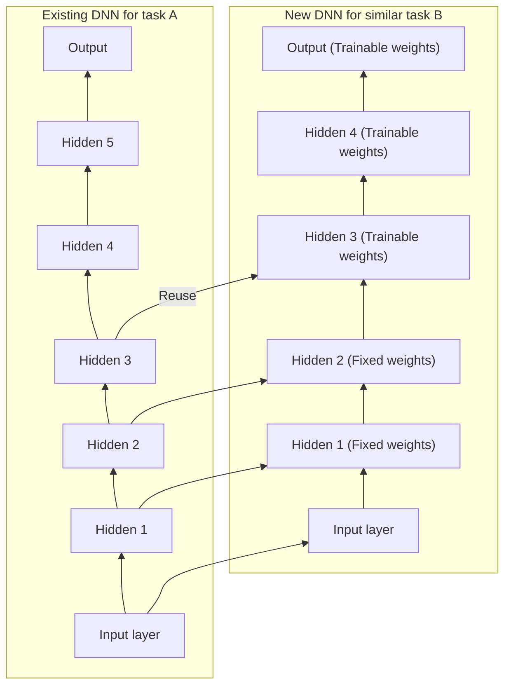

# CITS5017 Deep Learning

Lectures for Semester 2, 2025 — Topic 2: Training Deep Neural Networks — Associate Professor Du Huynh (Unit Coordinator and Lecturer) — UWA — 2025

---

## Slide 1 — CITS5017 Deep Learning

Lectures for Semester 2, 2025

Topic 2: Training Deep Neural Networks

Associate Professor Du Huynh
(Unit Coordinator and Lecturer)

UWA

2025

---

## Slide 2 — Today

Chapter 11.

### Hands-on Machine Learning with Scikit-Learn, Keras & TensorFlow


> **Figure 1.** Book cover, O'REILLY. Top-left corner shows the O'REILLY logo in red. A diagonal banner in the top-right corner reads "Third Edition". Title text: "Hands-On Machine Learning with Scikit-Learn, Keras & TensorFlow". Subtitle in orange: "Concepts, Tools, and Techniques to Build Intelligent Systems". Below that, small text "powered by" followed by a logo. The cover illustration is a black-and-yellow spotted salamander. Author name at the bottom: "Aurélien Géron".

---

## Slide 3 — Chapter Eleven

### Training Deep Neural Networks

Here are the main topics we will briefly cover:

- Vanishing/Exploding Gradients Problems
  - Glorot and He initialization
  - Nonsaturating activation functions
  - Batch normalization
  - Gradient clipping
- Faster Optimizers
  - Momentum optimization
  - Nesterov Accelerated Gradient
  - AdaGrad
  - RMSProp
  - Adam and its variants
- Learning rate scheduling
- Avoiding overfitting
  - $\ell_1$ and $\ell_2$ regularization
  - Dropout

---

## Slide 4 — Problems in training DNNs

Training a DNN isn't a walk in the park. Here are some of the problems you could run into:

- the tricky vanishing gradients or exploding gradients problems;
- insufficient training data or insufficient labelled data to train the large network;
- training may be extremely slow;
- risk of overfitting the training data for a model with millions of parameters especially if there are not enough training instances or if they are too noisy.

---

## Slide 5 — Vanishing/Exploding Gradients Problems

- The **vanishing gradients** problem occurs when gradients become smaller and smaller as the algorithm progresses down to the lower layers. As a result, the Gradient Descent update leaves the lower layers' connection weights virtually unchanged, and training never converges to a good solution or the convergence is extremely slow. In other cases, we have the opposite problem, i.e., gradients become larger and larger, leading to the **exploding gradients** problem.
- This vanishing gradients problem was found¹ to be the combination of the popular logistic sigmoid activation function and the weight initialization technique that was most popular at the time.

**Footnotes:**

1. Xavier Glorot and Yoshua Bengio, "Understanding the Difficulty of Training Deep Feedforward Neural Networks," *Proceedings of the 13th International Conference on Artificial Intelligence and Statistics* (2010): 249-256.

---

## Slide 6 — Vanishing/Exploding Gradients Problems (cont.)

- weight initialization techniques (usually drawn from $\mathcal{N}(0, 1)$); *[$\mathcal{N}(0,1)$ highlighted blue]*
- the variance of the outputs of each layer is much greater than the variance of its inputs;
- the logistic activation function has mean $0.5$ rather than $0$. Also, when inputs become large (negative or positive), the function saturates at $0$ or $1$, with a derivative extremely close to $0$. *[numerical values highlighted blue]*

> **Figure 11-1.** Line plot of the logistic activation function. Legend entry (blue solid line): $\sigma(z) = \dfrac{1}{1 + e^{-z}}$. Horizontal axis labelled $z$, ranging from about $-5$ to $5$ with ticks at $-4, -2, 0, 2, 4$. Vertical axis ranging from $-0.2$ to $1.2$ with ticks at $-0.2, 0.0, 0.2, 0.4, 0.6, 0.8, 1.0, 1.2$. A green dashed straight line passes through the origin with the slope of the sigmoid at $z=0$ (the linear approximation), rising off the top of the plot near $z \approx 1$ and leaving the bottom near $z \approx -2.7$. A black horizontal dashed line is drawn at $y = 1.0$. Solid black horizontal and vertical axis lines are drawn at $y = 0$ and $z = 0$. Three thick black arrows with text annotations: "Saturating" pointing to the flat left tail near $z \approx -4.5$, $y \approx 0$; "Linear" pointing to the central region of the curve near $z = 0$, $y = 0.5$; "Saturating" pointing to the flat right tail near $z \approx 4.5$, $y \approx 1$. Grid lines shown.

*Caption:* Figure 11-1. Logistic activation function saturation.

---

## Slide 7 — Vanishing/Exploding Gradients Problems (cont.)

### Xavier Initialization or Glorot Initialization

Glorot and Bengio² proposed a good compromise that has proven to work very well in practice: the connection weights between neurons must be initialized randomly as described below:

> **Glorot initialization (when using the logistic activation function)**
>
> - use the normal distribution with mean 0 and variance $\sigma^2 = \dfrac{1}{\text{fan}_{\text{avg}}}$, or
> - use a uniform distribution over the interval $[-r, +r]$ with $r = \sqrt{\dfrac{3}{\text{fan}_{\text{avg}}}}$

where $\text{fan}_{\text{in}}$ and $\text{fan}_{\text{out}}$ denote the numbers of input and output units of a layer and $\text{fan}_{\text{avg}} = (\text{fan}_{\text{in}} + \text{fan}_{\text{out}})/2$

**Footnotes:**

2. Xavier Glorot and Yoshua Bengio, "Understanding the Difficulty of Training Deep Feedforward Neural Networks", *Proceedings of the 13th International Conference on Artificial Intelligence and Statistics* (2010): 249-256.

---

## Slide 8 — Vanishing/Exploding Gradients Problems (cont.)

### He Initialization or Kaiming Initialization

He et al³ provide similar weight initialization strategies for the ReLU activation function and its variants (including ELU). For the activation function SELU (see later) with a normal distribution, Yann LeCun's initialization method is preferred.

| Initialization | Activation functions | $\sigma^2$ (Normal) |
|---|---|---|
| Glorot | None, tanh, sigmoid, softmax | $1/\text{fan}_{\text{avg}}$ |
| He | ReLU, Leaky ReLU, ELU, GELU, Swish, Mish | $2/\text{fan}_{\text{in}}$ |
| LeCun | SELU | $1/\text{fan}_{\text{in}}$ |

*Caption:* Table 11-1. Initialization parameters for each type of activation function.

**Footnotes:**

3. Kaiming He et al., "Delving Deep into Rectifiers: Surpassing Human-Level Performance on ImageNet Classification," *CVPR* 2015, 1026-1034.

---

## Slide 9 — Vanishing/Exploding Gradients Problems (cont.)

### Weight initialization examples in Keras

By default, Keras uses Glorot initialization with a uniform distribution. When you create a layer, you can choose your preferred weight initialization strategy by setting the `kernel_initializer` parameter.

Example 1: Use He's initialization strategy with the Normal distribution:

```python
import tensorflow as tf
tf.keras.layers.Dense(10, activation="relu", kernel_initializer="he_normal")
```

Example 2: Use the VarianceScaling initializer based on $\text{fan}_{\text{avg}}$:

```python
he_avg_init = tf.keras.initializers.VarianceScaling(scale=2., mode="fan_avg",
                                                    distribution="uniform")
dense = tf.keras.layers.Dense(50, activation="sigmoid",
                              kernel_initializer=he_avg_init)
```

---

## Slide 10 — Vanishing/Exploding Gradients Problems (cont.)

### Nonsaturating Activation Functions

The ReLU⁴ activation function is commonly used because it does not saturate for positive values. Unfortunately, like the logistic activation function, it suffers from a problem known as the *dying ReLUs*: during training, some neurons effectively "die," meaning they stop outputting anything other than 0. This happens when the input to ReLU is negative.

**Footnotes:**

4. Recall that the ReLU (rectified linear unit) activation function is defined as: $\text{ReLU}(z) = \max(0, z)$.

---

## Slide 11 — Vanishing/Exploding Gradients Problems (cont.)

### Nonsaturating Activation Functions

To overcome this problem, variants of ReLU have been proposed in the literature, including *leaky ReLU*, *RReLU*, *PReLU*, *ELU*, *SELU*, *GELU*, *SiLU* (or *Swish*), and *Mish*. *[variant names in red italic]*

**\* Leaky ReLU** is defined as $\text{LeakyReLU}_\alpha(z) = \max(\alpha z, z)$, where $\alpha$ is a small constant, e.g., $\alpha = 0.01$. Researchers found that a larger leak, e.g., $\alpha = 0.2$, tends to give better performance.

> **Figure 11-2.** Line plot of the Leaky ReLU activation function. Legend entry (blue solid line): $\text{LeakyReLU}(z) = \max(\alpha z, z)$. Horizontal axis labelled $z$, ranging from about $-5$ to $5$ with ticks at $-4, -2, 0, 2, 4$. Vertical axis ranging from $-1$ to above $3$ with ticks at $-1, 0, 1, 2, 3$. The curve is a straight line of slope 1 for $z \ge 0$ and a straight line of small positive slope for $z < 0$, reaching about $-0.5$ at $z = -5$. Solid black horizontal and vertical axis lines at $y = 0$ and $z = 0$. A thick black arrow annotated "Leak" points down-left toward the shallow negative-side segment near $z \approx -4.5$. Grid lines shown.

*Caption:* Figure 11-2. Leaky ReLU: like ReLU, but with a small slope for negative values.

---

## Slide 12 — Vanishing/Exploding Gradients Problems (cont.)

### Nonsaturating Activation Functions

**\* Leaky ReLU**

```python
# for tf-2.15 or older
leaky_relu = tf.keras.layers.LeakyReLU(alpha=0.2)  # default alpha=0.3
# for tf-2.16 onward
leaky_relu = tf.keras.layers.LeakyReLU(negative_slope=0.2)  # default negative_slope=0.3
dense = tf.keras.layers.Dense(50, activation=leaky_relu,
                              kernel_initializer="he_normal")

# can also use the leaky_relu function defined under the tf.keras.activations subpackage
dense = tf.keras.layers.Dense(50, activation=tf.keras.activations.leaky_relu, ...)
dense = tf.keras.layers.Dense(50, activation="leaky_relu", ...)
```

Can also use LeakyReLU as a separate layer:

```python
model = tf.keras.models.Sequential([
    # [...]  # more layers
    tf.keras.layers.Dense(50, kernel_initializer="he_normal"),  # no activation
    tf.keras.layers.LeakyReLU(negative_slope=0.2),  # activation in a separate layer
    # [...]  # more layers
])
```

From TensorFlow version 2.16 onward, the optional parameter `alpha` is replaced by `negative_slope`.

---

## Slide 13 — Vanishing/Exploding Gradients Problems (cont.)

### Nonsaturating Activation Functions

**\* Randomized leaky ReLU (or RReLU)** is the same as leaky ReLU except that $\alpha$ is picked randomly in a given range during training and is fixed to an average value during testing. There is currently no implementation of RReLU in Keras.

---

## Slide 14 — Vanishing/Exploding Gradients Problems (cont.)

### Nonsaturating Activation Functions

**\* Parametric leaky ReLU (or PReLU)** is the same as RReLU, except that $\alpha$ is learned during training together with the connection weights. PReLU was reported to strongly outperform ReLU on large image datasets, but on smaller datasets it runs the risk of overfitting the training set.

To use PReLU in your code, replace `tf.keras.layers.LeakyReLU` with `tf.keras.layers.PReLU`.

ReLU, leaky ReLU, RReLU, and PReLU all suffer from the fact they are not smooth functions (derivatives not continuous at $z = 0$). Some smooth variants of ReLU are: ELU, SELU, Swish, and Mish.

---

## Slide 15 — Vanishing/Exploding Gradients Problems (cont.)

### Nonsaturating Activation Functions

**\* Exponential linear unit (or ELU)**⁵ is defined as

$$
\text{ELU}_\alpha(z) = \begin{cases}
\alpha\big(\exp(z) - 1\big) & \text{if } z < 0 \\
z & \text{if } z \ge 0
\end{cases}
$$

#### Left column — figure

> **Figure (ELU).** Line plot titled $\text{ELU}_\alpha(z) = \alpha(e^{z} - 1)$ if $z < 0$, else $z$. Horizontal axis labelled $z$, ranging from about $-5$ to $5$ with ticks at $-4, -2, 0, 2, 4$. Vertical axis with ticks at $-2, -1, 0, 1, 2, 3$. Legend: blue solid line $\alpha = 1$; red dashed line $\alpha = 2$. Both curves coincide as the identity line for $z \ge 0$. For $z < 0$ the blue ($\alpha = 1$) curve decays smoothly to an asymptote at $-1$; the red ($\alpha = 2$) curve decays to an asymptote at $-2$. Black dotted horizontal asymptote lines are drawn at $y = -1$ and $y = -2$. Solid black horizontal and vertical axis lines at $y = 0$ and $z = 0$. Grid lines shown.

*Caption:* The ELU activation function for $\alpha = 1, 2$.

#### Right column — bullets

- It takes on negative values when $z < 0$, which helps alleviate the vanishing gradients problem.
- It has non-zero gradient for $z < 0$, which avoids dead neurons problem.
- When $\alpha = 1$, the function is smooth everywhere (including $z = 0$).

To use ELU, set `activation="elu"`, `activation=tf.keras.activations.elu`, or add a `tf.keras.layers.ELU` layer.

**Footnotes:**

5. Djork-Arné Clevert et al., "Fast and Accurate Deep Network Learning by Exponential Linear Units (ELUs)," *International Conference on Learning Representations*, 2016.

---

## Slide 16 — Vanishing/Exploding Gradients Problems (cont.)

### Nonsaturating Activation Functions

**\* Scaled ELU (or SELU)**⁶ – as the name suggests, is a scaled version of ELU, i.e., $\text{SELU}(z) = s\,\text{ELU}_{1.6733}(z)$, where $s = 1.0507$ is a fixed scale factor and $\alpha$ is fixed at $1.6733$. These $\alpha$ and $s$ values are chosen so that the mean and variance of the inputs are preserved between two consecutive layers if the following constraints are imposed:

1. The input features are standardized (i.e., having mean 0 and standard deviation 1);
2. Every hidden layer's weights are initialized using LeCun normal initialization;
3. No $\ell_1$ or $\ell_2$ regularization, max-norm, batch-norm, or dropout (see later) is used.

Because of these constraints, SELU did not gain a lot of traction.

**Footnotes:**

6. Günter Klambauer et al., "Self-Normalizing Neural Networks," *Proceedings of the 31st International Conference on Neural Information Processing Systems* (2017): 972-981.

---

## Slide 17 — Vanishing/Exploding Gradients Problems (cont.)

### Nonsaturating Activation Functions

Comparing ELU and SELU:

> **Figure 11-3.** Line plot comparing two activation functions. Horizontal axis labelled $z$, ranging from about $-5$ to $5$ with ticks at $-4, -2, 0, 2, 4$. Vertical axis with ticks at $-2, -1, 0, 1, 2, 3$. Legend: blue solid line $\text{ELU}_\alpha(z) = \alpha(e^{z} - 1)$ if $z < 0$, else $z$; red dashed line $\text{SELU}(z) = 1.05\,\text{ELU}_{1.67}(z)$. For $z \ge 0$ the SELU line is slightly steeper than the ELU identity line. For $z < 0$ the blue ELU curve flattens to an asymptote at $-1$ and the red SELU curve flattens to an asymptote at approximately $-1.76$. Black dotted horizontal asymptote lines drawn at those two levels. Solid black horizontal and vertical axis lines at $y = 0$ and $z = 0$. Grid lines shown.

*Caption:* Figure 11-3. ELU and SELU activation functions

To use SELU with Keras, set `activation="selu"` or use `activation=tf.keras.activations.selu`.

---

## Slide 18 — Vanishing/Exploding Gradients Problems (cont.)

### Nonsaturating Activation Functions

**\* Gaussian Error Linear Units (or GELU)** was introduced in 2016.⁷ This activation function is defined as: $\text{GELU}(z) = z\,\Phi(z)$, where $\Phi$ is the standard Gaussian cumulative distribution function (CDF).

- GELU resembles ReLU: it approaches 0 when $z$ is very negative and it approaches $z$ when $z$ is very positive.
- However, unlike all the previous activation functions, GELU is neither convex nor monotonic. This fairly complex shape may explain why it works so well, especially on complex tasks. In practice, it often outperforms those previous activation functions that we have seen before.
- The downside is: it is more computationally intense.
- It is approx. equal to $z\sigma(1.702z)$, where $\sigma$ is the sigmoid function, which is faster to compute.

**Footnotes:**

7. Dan Hendrycks and Kevin Gimpel, "Gaussian Error Linear Units (GELUs)", arXiv preprint arXiv:1606.08415 (2016).

---

## Slide 19 — Vanishing/Exploding Gradients Problems (cont.)

### Nonsaturating Activation Functions

**\* Swish**

- In the GELU paper, Hendrycks and Gimpel also introduced the *sigmoid linear unit (SiLU)* activation function, which is equal to $z\sigma(z)$ but it was outperformed by GELU.
- This was rediscovered by Ramachandran et al⁸ and the activation function was named *Swish*. Swish was shown in their paper to outperform every other function, including GELU.
- Ramachandran et al also generalized Swish by adding an extra hyperparameter: $\text{Swish}_\beta(z) = z\sigma(\beta z)$.
- GELU is approx. equal to the Swish function with $\beta = 1.702$.
- From tf-2.16 onward, the `swish` activation function has been renamed to `silu`.

**Footnotes:**

8. Prajit Ramachandran et al., "Searching for Activation Functions", arXiv preprint arXiv:1710.05941 (2017).

---

## Slide 20 — Vanishing/Exploding Gradients Problems (cont.)

### Nonsaturating Activation Functions

**\* Mish** was introduced in 2019 by Misra⁹. It is defined as

$$\text{Mish}(z) = z \tanh(\text{softplus}(z)),$$

where $\text{softplus}(z) = \log(1 + \exp(z))$.

- Same as GELU and Swish, Mish is a smooth, non-convex, and non-monotonic function.
- the author Misra ran many experiments and showed that Mish outperformed many activation functions, including Swish and GELU, by a tiny margin.

**Footnotes:**

9. Diganta Misra, "Mish: A Self Regularized Non-Monotonic Activation Function", arXiv preprint arXiv:1908.08681 (2019).

---

## Slide 21 — Vanishing/Exploding Gradients Problems (cont.)

### Nonsaturating Activation Functions

**Comparing GELU, Swish (= SiLU), and Mish**

> **Figure 11-4.** Line plot comparing four activation functions. Horizontal axis labelled $z$, ranging from $-4$ to $2$ with ticks at $-4, -3, -2, -1, 0, 1, 2$. Vertical axis ranging from $-1.0$ to $2.0$ with ticks at $-1.0, -0.5, 0.0, 0.5, 1.0, 1.5, 2.0$. Legend entries: blue solid line $\text{GELU}(z) = z\,\Phi(z)$; red dashed line $\text{Swish}(z) = \text{SiLU}(z) = z\,\sigma(z)$; red dotted line $\text{Swish}_{\beta = 0.6}(z) = z\,\sigma(0.6z)$; green dotted line $\text{Mish}(z) = z\tanh(\text{softplus}(z))$. All four curves rise together for $z > 0$ (GELU and Mish nearly coincide and are highest; Swish is slightly lower; $\text{Swish}_{\beta=0.6}$ is lowest, reaching about 1.5 at $z = 2$). All curves dip below zero for negative $z$: GELU reaches a minimum of about $-0.17$ near $z \approx -0.75$ then returns toward 0 as $z \to -4$; Swish and Mish reach minima of about $-0.28$ near $z \approx -1.3$; $\text{Swish}_{\beta=0.6}$ dips deepest to about $-0.45$ near $z \approx -1.5$ and is still about $-0.33$ at $z = -4$. Solid black horizontal and vertical axis lines at $y = 0$ and $z = 0$. Grid lines shown.

*Caption:* Figure 11-4. GELU, SiLU, parametrized Swish, and Mish activation functions

Keras supports GELU and SiLU: just use `activation="gelu"` or `activation="silu"`. However, it does not support Mish or the generalized Swish activation function yet.

---

## Slide 22 — Vanishing/Exploding Gradients Problems (cont.)

### Which activation function should you use for the hidden layers of your DNNs?

- In general, ReLU remains a good default for simple tasks. It is fast to compute and is supported in many libraries and many hardware accelerators provide ReLU-specific optimizations.
- For more complex tasks,
  - SiLU (Swish) is probably a better default; you can also try the parametrized Swish and tune the hyperparameter $\beta$.
  - Mish may give you slightly better results, but it requires a bit more compute.
  - If latency is a concern, then you may prefer a simpler activation function like leaky ReLU or PReLU.
- For very deep MLPs, try SELU but make sure the constraints listed on slide 16 are met.

---

## Slide 23 — Vanishing/Exploding Gradients Problems (cont.)

### Batch Normalization

Although using He initialization along with ELU (or any variant of ReLU) can mitigate the vanishing/exploding gradients problems at the beginning of training, it doesn't guarantee that they won't come back during training. To overcome these problems, the batch normalization¹⁰ algorithm was proposed:

- An extra operation is inserted before or after the activation function in each hidden layer to normalize the input to have mean = 0 and variance = 1.
- This normalization introduces two trainable parameters, $\gamma$ and $\beta$, that the training process must learn together with the connection weights.
- The mean and variance of each layer's outputs for entire training set are estimated using the moving average of the minibatches. They are used in the predictions on the testing set.

**Footnotes:**

10. Sergey Ioffe and Christian Szegedy, "Batch Normalization: Accelerating Deep Network Training by Reducing Internal Covariate Shift," *ICML* (2015): 448-456.

---

## Slide 24 — Vanishing/Exploding Gradients Problems (cont.)

### Batch Normalization (cont.)

Summary of the algorithm:

$$
\begin{aligned}
\mu_B &= \frac{1}{m_B}\sum_{i=1}^{m_B} \mathbf{x}^{(i)} \\
\sigma_B^2 &= \frac{1}{m_B}\sum_{i=1}^{m_B}\left(\mathbf{x}^{(i)} - \mu_B\right)^2 \\
\hat{\mathbf{x}}^{(i)} &= \frac{\mathbf{x}^{(i)} - \mu_B}{\sqrt{\sigma_B^2 + \epsilon}} \\
\mathbf{z}^{(i)} &= \gamma \otimes \hat{\mathbf{x}}^{(i)} + \beta
\end{aligned}
$$

where $\mu_B$ and $\sigma_B^2$ are the mean and variance vectors computed from the minibatch $B$; $\hat{\mathbf{x}}^{(i)}$ is a zero-centred and normalized input vector used internally in the BN layer; $\gamma$ and $\beta$ are the trainable scale and shift vectors (one parameter per input feature); and $\otimes$ represents element-wise multiplication.

---

## Slide 25 — Vanishing/Exploding Gradients Problems (cont.)

### Batch Normalization (cont.)

Ioffe and Szegedy demonstrated many advantages of Batch Normalization (BN) in their paper:

- Huge improvement in their ImageNet classification results;
- Vanishing gradients problem was so strongly reduced that they could use saturating activation functions (e.g., tanh);
- Their network could be trained with much larger learning rates;
- BN also acts like a regularizer, reducing the need for other regularization techniques (such as dropout);
- BN helps to remove the need for normalizing the input data (e.g., using `StandardScaler`);

There is a runtime penalty though, due to the extra computations required at each layer; however, this is usually counterbalanced by the fact that convergence is much faster with BN, so it will take fewer epochs to reach the same performance.

The extra computation overhead above can also be avoided by fusing the BN layer with the previous layer after training.

---

## Slide 26 — Vanishing/Exploding Gradients Problems (cont.)

### Implementing Batch Normalization with Keras

```python
model = keras.models.Sequential([
    tf.keras.layers.InputLayer(shape=[28, 28]),
    tf.keras.layers.Flatten(),
    tf.keras.layers.BatchNormalization(),
    tf.keras.layers.Dense(300, activation="relu",
                          kernel_initializer="he_normal"),
    tf.keras.layers.BatchNormalization(),
    tf.keras.layers.Dense(100, activation="relu",
                          kernel_initializer="he_normal"),
    tf.keras.layers.BatchNormalization(),
    tf.keras.layers.Dense(10, activation="softmax")
])
```

In this example, BN is applied after the `Flatten` layer and after each of the two hidden layers.

---

## Slide 27 — Vanishing/Exploding Gradients Problems (cont.)

### Implementing Batch Normalization with Keras

```python
>>> model.summary()
```

`Model: "sequential"`

| Layer (type) | Output Shape | Param # |
|---|---|---|
| flatten (Flatten) | (None, 784) | 0 |
| batch_normalization (BatchNormalization) | (None, 784) | 3,136 |
| dense (Dense) | (None, 300) | 235,500 |
| batch_normalization_1 (BatchNormalization) | (None, 300) | 1,200 |
| dense_1 (Dense) | (None, 100) | 30,100 |
| batch_normalization_2 (BatchNormalization) | (None, 100) | 400 |
| dense_2 (Dense) | (None, 10) | 1,010 |

`Total params: 271,346 (1.04 MB)`

`Trainable params: 268,978 (1.03 MB)`

`Non-trainable params: 2,368 (9.25 KB)`

> **Figure (screenshot).** The above is a screenshot of a Keras `model.summary()` output. Layer type names (`Flatten`, `BatchNormalization`, `Dense`) appear in blue inside parentheses; shape values `None` and the numeric parameter counts appear in blue/green colouring. The table is drawn with rectangular cell borders and three columns headed "Layer (type)", "Output Shape", and "Param #".

---

## Slide 28 — Vanishing/Exploding Gradients Problems (cont.)

### Batch Normalization (cont.)

The authors of the BN paper argued in favour of adding the BN layers before the activation functions, rather than after (as we just did on slide 26). To do so, you need to set the Activation function as a layer and exclude the bias parameter from the previous layer:

```python
model = tf.keras.Sequential([
    tf.keras.layers.InputLayer(shape=[28, 28]),
    tf.keras.layers.Flatten(),
    tf.keras.layers.Dense(300, kernel_initializer="he_normal",
                          use_bias=False),
    tf.keras.layers.BatchNormalization(),
    tf.keras.layers.Activation("relu"),
    tf.keras.layers.Dense(100, kernel_initializer="he_normal",
                          use_bias=False),
    tf.keras.layers.BatchNormalization(),
    tf.keras.layers.Activation("relu"),
    tf.keras.layers.Dense(10, activation="softmax")
])
```

---

## Slide 29 — Vanishing/Exploding Gradients Problems (cont.)

### Gradient Clipping

- Another popular technique to lessen the exploding gradients problem is to simply clip the gradients during backpropagation so that they never exceed some threshold (this is mostly useful for recurrent neural networks (RNNs) as BN is tricky to use in RNNs. This is called *Gradient Clipping*¹¹.
- For example,

```python
  optimizer = tf.keras.optimizers.SGD(clipvalue=1.0)
  model.compile(loss="mse", optimizer=optimizer)
```

  will clip every component of the gradient vector to a value between $-1.0$ and $1.0$. An alternative is to use `clipnorm=1.0` if you want to retain the gradient vector orientation.

**Footnotes:**

11. Razvan Pascanu et al., "On the Difficulty of Training Recurrent Neural Networks," *ICML* (2013): 1310-1318.

---

## Slide 30 — Transfer Learning with Keras

#### Left column — bullets

- If you find an existing neural network that accomplishes a similar task to the one you are trying to tackle, then you can reuse most of its layers, except for the top ones. This technique is called *transfer learning*.
- The output layer of the original model should usually be replaced because it is most likely not useful at all for the new task, and probably will not have the right number of outputs.
- The more similar the tasks are, the more layers you will want to reuse (starting with the lower layers). For very similar tasks, try to keep all the hidden layers and just replace the output layer.

#### Right column — figure



> **Figure 11-5.** Two vertical stacks of labelled boxes side by side. Left stack, captioned "Existing DNN for task A" (bold), from bottom to top: "Input layer" (green), "Hidden 1", "Hidden 2", "Hidden 3", "Hidden 4", "Hidden 5", "Output" (all blue), with an upward arrow leaving the top of "Output". Right stack, captioned "New DNN for similar task B" (bold), from bottom to top: "Input layer" (green), "Hidden 1", "Hidden 2", "Hidden 3", "Hidden 4", "Output" (white boxes), with an upward arrow leaving the top. Horizontal arrows run from the left stack to the right stack at the Input layer, Hidden 1, and Hidden 2 levels, and a labelled arrow marked "Reuse" runs from Hidden 3 of task A to Hidden 3 of task B. A dashed rectangle encloses Hidden 1 and Hidden 2 of the new DNN. On the right-hand margin are two padlock icons: an open orange padlock labelled "Trainable weights" aligned with the upper layers (Hidden 3, Hidden 4, Output), and a closed orange padlock labelled "Fixed weights" aligned with the dashed-box layers (Hidden 1, Hidden 2).

*Caption:* Figure 11-5. Reusing pretrained layers.

---

## Slide 31 — Transfer Learning with Keras (cont.)

Suppose that someone has trained `mode_A` for 8 classes (except sandal and shirt) for the Fashion MNIST dataset and your task is to train `model_B` for the T-shirt and pullover classes. You only have 200 labelled images and you get 91.85% test accuracy. You can improve the test accuracy of your `model_B` using transfer learning:

```python
# assuming the trained model_A is saved to "my_model_A.keras"
model_A = tf.keras.models.load_model("my_model_A.keras")
model_B_on_A = tf.keras.Sequential(model_A.layers[:-1])
model_B_on_A.add(tf.keras.layers.Dense(1, activation="sigmoid"))

# freeze the reused layers for the first epochs
for layer in model_B_on_A.layers[:-1]:
    layer.trainable = False
optimizer = tf.keras.optimizers.SGD(learning_rate=0.001)
model_B_on_A.compile(loss="binary_crossentropy", optimizer=optimizer, metrics=["accuracy"])
# for example, train the model for 4 epochs
history = model_B_on_A.fit(X_train_B, y_train_B, epochs=4, validation_data=(X_valid_B, y_valid_B))

# unfreeze the layers and train for 16 epochs. Note that the model needs to be recompiled
for layer in model_B_on_A.layers[:-1]:
    layer.trainable = True
optimizer = tf.keras.optimizers.SGD(learning_rate=0.001)
model_B_on_A.compile(loss="binary_crossentropy", optimizer=optimizer, metrics=["accuracy"])
history = model_B_on_A.fit(X_train_B, y_train_B, epochs=16, validation_data=(X_valid_B, y_valid_B))
```

---

## Slide 32 — Transfer Learning with Keras (cont.)

Now, evaluate the test accuracy using `model_B_on_A`:

```python
>>> model_B_on_A.evaluate(X_test_B, y_test_B)
[0.2546142041683197, 0.9384999871253967]
```

This is an improvement of 2% on the test accuracy.

- `model_B`: test accuracy = 91.85%; error rate = 8.15%.
- `model_B_on_A`: test accuracy = 93.85%; error rate = 6.15%
- In terms of reduction of the error rate, it is $(8.15 - 6.15)/8.15\,\% = 2/8.15\,\%$, which is almost 25%!

It turned out that the above results came from many trials of configuration (like setting the random seed to different values) of the author. In general, transfer learning does not work well with small dense networks. However, it works well with deep convolution neural networks.