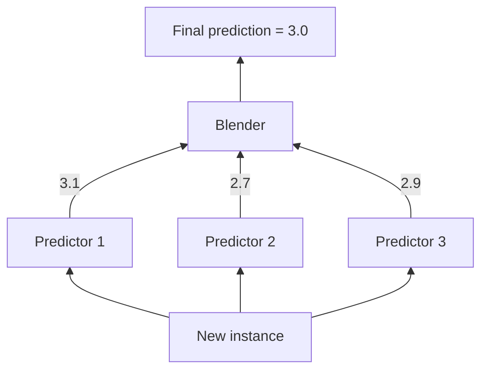

# CITS5508 Machine Learning — Ensemble Learning and Random Forests

**Lecturer:** Associate Professor Du Huynh
**Reference:** *Hands-on Machine Learning with Scikit-Learn & TensorFlow*, Aurélien Géron, O'Reilly Media, 2022 — Chapter 7.

---

## 1. Ensemble Learning — Core Concept

- **Wisdom of the crowd:** aggregating many predictions often beats a single expert.
- An **ensemble** = group of predictors (classifiers/regressors).
- An **ensemble method** combines predictions of the group to produce a single, typically stronger model.
- Example: a **Random Forest** = ensemble of Decision Trees; each tree trained on a different random subset; majority vote = ensemble's prediction.

### Resampling Background
- **Training error rate**: avg error on training data.
- **Test error rate**: avg error on unseen test data.
- Goal: low test error AND low variance.
- Decision trees are **high variance** (different splits → very different trees). Bagging and Random Forests reduce variance.

---

## 2. Voting Classifiers

### Hard Voting
- Aggregate predictions from diverse classifiers, predict the **majority class**.
- Even if each is a **weak learner**, the ensemble can be a **strong learner**, provided:
  - Enough learners.
  - They are sufficiently **diverse** (independent, make different errors).
- One way to achieve diversity: train using very different algorithms.

### Soft Voting
- Each classifier outputs class probabilities (`predict_proba()`); ensemble predicts class with highest **average probability**.
- Often outperforms hard voting because high-confidence votes are weighted more.

### Implementation (scikit-learn)

```python
from sklearn.datasets import make_moons
from sklearn.ensemble import RandomForestClassifier, VotingClassifier
from sklearn.linear_model import LogisticRegression
from sklearn.model_selection import train_test_split
from sklearn.svm import SVC

X, y = make_moons(n_samples=500, noise=0.30, random_state=42)
X_train, X_test, y_train, y_test = train_test_split(X, y, random_state=42)

voting_clf = VotingClassifier(
    estimators=[
        ('lr',  LogisticRegression(random_state=42)),
        ('rf',  RandomForestClassifier(random_state=42)),
        ('svc', SVC(random_state=42))
    ]
)
voting_clf.fit(X_train, y_train)

# Switch to soft voting:
voting_clf.voting = "soft"
voting_clf.named_estimators["svc"].probability = True
voting_clf.fit(X_train, y_train)
```

**Example results (moons dataset):**
- LogReg = 0.864, RF = 0.896, SVC = 0.896
- Hard-voting ensemble = **0.912**
- Soft-voting ensemble = **0.92**

---

## 3. Bagging and Pasting

- Same algorithm trained on **different random subsets** of the training set.
- **Bagging** (Bootstrap Aggregating): sampling **with replacement**.
- **Pasting**: sampling **without replacement**.

### Bootstrapping Procedure
1. Randomly select $m$ observations **with replacement** ($m$ = training set size).
2. Fit the model and estimate parameters on this sample.
3. Repeat $B$ times (one per predictor).
4. Aggregate the predictions from all $B$ predictors.

Aggregation function:
- **Classification:** statistical mode (majority vote).
- **Regression:** average of predictions.

**Net effect:** ensemble has similar/lower bias but **lower variance** than a single predictor on the full training set.

### Bagged Decision Trees Procedure
1. Create $B$ bootstrapped training sets.
2. Fit a deep, **unpruned** tree on each set (high variance, low bias).
3. For each test instance, get predictions from all $B$ trees.
4. Average (regression) or majority vote (classification).

### Implementation

```python
from sklearn.ensemble import BaggingClassifier
from sklearn.tree import DecisionTreeClassifier

bag_clf = BaggingClassifier(
    DecisionTreeClassifier(),
    n_estimators=500,
    max_samples=100,
    n_jobs=-1,
    random_state=42
)
bag_clf.fit(X_train, y_train)
```

- `bootstrap=True` → bagging (default); `bootstrap=False` → pasting.
- BaggingClassifier auto-applies **soft voting** when the base classifier supports `predict_proba()`.

---

## 4. Out-of-Bag (OOB) Evaluation

- With bootstrapping, on average ≈ **2/3** of instances are sampled per predictor; remaining ≈ **1/3** = **OOB instances**.
- Different OOB sets per predictor.
- For each instance, predict using only the trees for which it was OOB → average (regression) or majority vote (classification) → single OOB prediction.
- Aggregate over all $m$ instances → **OOB MSE** or **OOB classification error** (free validation set).

### Implementation

```python
bag_clf = BaggingClassifier(
    DecisionTreeClassifier(), n_estimators=500,
    oob_score=True, n_jobs=-1, random_state=42
)
bag_clf.fit(X_train, y_train)

bag_clf.oob_score_                  # 0.896
bag_clf.oob_decision_function_[:3]  # OOB class probabilities
```

---

## 5. Random Patches and Random Subspaces

`BaggingClassifier` supports feature sampling via `max_features` and `bootstrap_features`.

| Method | Sample Instances | Sample Features | Settings |
|--------|------------------|-----------------|----------|
| **Random Patches** | Yes | Yes | `bootstrap=True`, `max_samples<1.0`, `bootstrap_features=True`, `max_features<1.0` |
| **Random Subspaces** | No (use all) | Yes | `bootstrap=False`, `max_samples=1.0`, `bootstrap_features=True`, `max_features<1.0` |

Useful for high-dimensional data (e.g., images).

### Example — Bagging with Random Patches

```python
bag_clf = BaggingClassifier(
    DecisionTreeClassifier(max_depth=4),
    max_features=2, n_estimators=5, random_state=42
)
bag_clf.fit(iris.data, iris.target)

# Inspect features assigned to each base estimator
bag_clf.estimators_features_
# e.g. [array([2,0]), array([0,3]), array([1,0]), array([3,2]), array([3,0])]
```

> **Important:** in a `BaggingClassifier`, each base estimator only sees the features assigned to it during training. The Bagging classifier stores `estimators_features_` and routes the same features at inference.

---

## 6. Random Forests

A **Random Forest (RF)** = ensemble of Decision Trees, generally trained via bagging.

**Key distinction from BaggingClassifier:** when splitting a node, an RF searches for the best feature among a **random subset of features** (default = $\sqrt{n}$ features for classification), introducing extra randomness.

```python
from sklearn.ensemble import RandomForestClassifier

RF_clf = RandomForestClassifier(
    n_estimators=5, max_features=2,
    max_depth=4, n_jobs=-1, random_state=42
)
RF_clf.fit(iris.data, iris.target)
```

- `RandomForestRegressor` available for regression.
- Inspecting which samples appeared in tree 0:

```python
tree0_samples = RF_clf.estimators_samples_[0]
len(tree0_samples)              # 150 (with bootstrapping)
len(np.unique(tree0_samples))   # ~101 unique (≈ 2/3 of m)
```

> **Note:** `BaggingClassifier(DecisionTreeClassifier(...), max_features=2, ...)` fixes the same 2 features per tree. `RandomForestClassifier(max_features=2, ...)` resamples 2 features **at every node split**, giving greater tree diversity.

---

## 7. Extra-Trees (Extremely Randomized Trees)

- Like RF, but uses **random thresholds** for each feature when splitting (instead of optimal thresholds).
- More bias, less variance, **much faster** to train than a regular RF.
- Classes: `ExtraTreesClassifier`, `ExtraTreesRegressor`.

---

## 8. Feature Importance

For a feature $x_i$, importance is the **average total decrease in impurity** (weighted by node sample count) across all nodes (across all trees) that split on $x_i$:
- Regression trees: decrease in **MSE**.
- Classification trees: decrease in **Gini index** (or entropy).

### Scikit-Learn computation:
1. Collect all nodes (across all trees) splitting on $x_i$.
2. Compute impurity reduction at each, weighted by number of training instances at the node.
3. Average over those nodes.
4. Normalize so importances sum to 1.

Access via `feature_importances_`.

### Example — Iris

```python
rnd_clf = RandomForestClassifier(n_estimators=500, random_state=42)
rnd_clf.fit(iris.data, iris.target)
# Output:
# 0.11 sepal length, 0.02 sepal width,
# 0.44 petal length, 0.42 petal width
```

---

## 9. Boosting

Train predictors **sequentially**, each correcting its predecessor. Combines weak learners → strong learner. Most popular: **AdaBoost** and **Gradient Boosting**.

### 9.1 AdaBoost Algorithm

For the $j^{th}$ predictor:

**Weighted error rate:**

$$r_j = \sum_{\substack{i=1 \\ \hat{y}_j^{(i)} \neq y^{(i)}}}^{m} w^{(i)}$$

(initial weights $w^{(i)} = 1/m$)

**Predictor weight:**

$$\alpha_j = \eta \log\left(\frac{1 - r_j}{r_j}\right)$$

where $\eta$ = learning rate (default 1). More accurate predictor → larger $\alpha_j$.

**Instance weight update** (boost misclassified):

$$w^{(i)} \leftarrow \begin{cases} w^{(i)} & \text{if } \hat{y}_j^{(i)} = y^{(i)} \\ w^{(i)} \exp(\alpha_j) & \text{if } \hat{y}_j^{(i)} \neq y^{(i)} \end{cases}$$

Then **normalize** all weights: $w^{(i)} \leftarrow w^{(i)} / \sum_{i=1}^{m} w^{(i)}$, used by the $(j+1)^{th}$ predictor.

### Prediction with AdaBoost (N estimators)

**Regression:**

$$\hat{y}(\mathbf{x}) = \frac{\sum_{j=1}^{N} \alpha_j \, \hat{y}_j(\mathbf{x})}{\sum_{j=1}^{N} \alpha_j}$$

**Classification:** weight per class $k$:

$$\text{weight}(k) = \sum_{\substack{j=1 \\ \hat{y}_j(\mathbf{x}) = k}}^{N} \alpha_j, \quad k = 1, \dots, K$$

$$\hat{y}(\mathbf{x}) = \arg\max_{k} \text{weight}(k)$$

### AdaBoost — Implementation

```python
from sklearn.ensemble import AdaBoostClassifier

# Example 1: SVC base estimators
ada_clf = AdaBoostClassifier(
    SVC(C=0.2, gamma=0.6, probability=True, random_state=42),
    learning_rate=0.05, n_estimators=50, random_state=42
)
ada_clf.fit(X_train, y_train)
# train acc = 0.933, test acc = 0.888

# Example 2: 30 Decision Stumps (max_depth=1) -- the default base estimator
ada_clf = AdaBoostClassifier(
    DecisionTreeClassifier(max_depth=1),
    n_estimators=30, learning_rate=0.5, random_state=42
)
# train acc = 0.941, test acc = 0.904
```

- Inspect via `estimator_weights_` ($\alpha_j$) and `estimator_errors_`.
- A **Decision Stump** = decision tree with `max_depth=1` (1 decision node + 2 leaves).
- **Overfitting tip:** reduce `n_estimators` or regularize the base estimator more.
- Sequential nature → cannot parallelize across machines.

### 9.2 Gradient Boosting

Sequentially fit each new predictor to the **residual errors** of the previous predictor (not instance weights).

With Decision Trees as base predictors → **Gradient Boosted Regression Trees (GBRT)**.

#### GBRT — Manual Construction

```python
from sklearn.tree import DecisionTreeRegressor

# y = 3x^2 + Gaussian noise
tree_reg1 = DecisionTreeRegressor(max_depth=2); tree_reg1.fit(X, y)

y2 = y - tree_reg1.predict(X)
tree_reg2 = DecisionTreeRegressor(max_depth=2); tree_reg2.fit(X, y2)

y3 = y2 - tree_reg2.predict(X)
tree_reg3 = DecisionTreeRegressor(max_depth=2); tree_reg3.fit(X, y3)

# Ensemble prediction = sum of all tree predictions
y_pred = sum(tree.predict(X_new)
             for tree in (tree_reg1, tree_reg2, tree_reg3))
```

#### GBRT — Built-in Class

```python
from sklearn.ensemble import GradientBoostingRegressor

gbrt = GradientBoostingRegressor(max_depth=2, n_estimators=3, learning_rate=1.0)
gbrt.fit(X, y)
```

#### Shrinkage (Regularization)
- Low `learning_rate` (e.g., 0.05) → more trees needed → **better generalization**.
- High `learning_rate` with few trees → underfitting risk.

#### Early Stopping

```python
gbrt_best = GradientBoostingRegressor(
    max_depth=2, learning_rate=0.05,
    n_estimators=500, n_iter_no_change=10
)
gbrt_best.fit(X, y)
gbrt_best.n_estimators_   # e.g., 92 (stopped early)
```

- `n_iter_no_change` too low → underfit; too high → overfit.
- Recommended: small `learning_rate`, large `n_estimators`, with early stopping.

#### Gradient Boosting for Classification
- Loss is **log loss** (binary cross-entropy for binary; multiclass log loss for $K$ classes) instead of residual MSE.

```python
from sklearn.ensemble import GradientBoostingClassifier

gb_clf = GradientBoostingClassifier(
    n_estimators=30, max_depth=1, learning_rate=0.5
)
gb_clf.fit(X_train, y_train)
# train acc ≈ 0.939, test acc ≈ 0.904
```

---

## 10. Stacking (Stacked Generalization)

Instead of trivial aggregation (e.g., hard voting), train a model — the **blender** — to combine the base predictions.



### Algorithm — Main Steps
1. **Train base predictors using cross-validation** on the training set.
2. **Generate cross-validated predictions** for each instance (out-of-fold predictions).
3. **Build a blending training set** where the input features are the base predictors' out-of-fold predictions and targets remain the original labels.
4. **Train the blender** on this new dataset to learn the aggregation.
5. After blender is trained, **retrain base predictors on the full original training set**.

### Blending Training Set Structure (3 predictors)

| predictor 1 output | predictor 2 output | predictor 3 output | ground truth |
|---|---|---|---|
| xxx | xxx | xxx | yyy |
| xxx | xxx | xxx | yyy |
| ... | ... | ... | ... |

(With 5-fold CV, each estimator trains on 4 folds, predicts on 1 → 5 prediction sets concatenated form the blender's input features.)

### Implementation

```python
from sklearn.ensemble import StackingClassifier

stacking_clf = StackingClassifier(
    estimators=[
        ('lr',  LogisticRegression()),
        ('rf',  RandomForestClassifier()),
        ('svc', SVC(probability=True))
    ],
    final_estimator=RandomForestClassifier(),
    cv=5
)
stacking_clf.fit(X_train, y_train)
```

Also available: `StackingRegressor`.

---

## 11. Summary Table

| Method | Base Estimators | Diversity Source | Training | Notes |
|--------|----------------|------------------|----------|-------|
| **Voting** | Different (diverse) | Different algorithms | Parallel | Hard or soft voting |
| **Bagging / Pasting** | Same | Different data subsets (with/without replacement); optionally feature subsets | Parallel | Reduces variance |
| **Random Forest** | Decision Trees | Bootstrap samples + random feature subset ($\sqrt{n}$) at each split | Parallel | Default ensemble of trees |
| **Extra-Trees** | Decision Trees | RF + random split thresholds | Parallel | Faster than RF; more bias, less variance |
| **AdaBoost** | Any | Reweighting misclassified instances | **Sequential** | Cannot parallelize across machines |
| **Gradient Boosting** | **Decision Trees only** | Fits residual errors / log-loss gradient | **Sequential** | Use shrinkage + early stopping |
| **Stacking** | Any (diverse) | Trained blender aggregates predictions | Parallel base + blender | Blender trained on out-of-fold predictions |