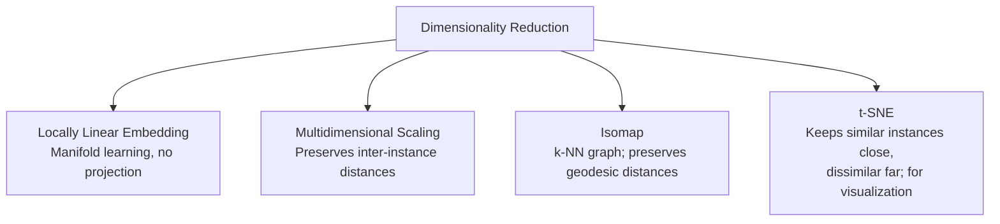

# Dimensionality Reduction

**CITS5508 Machine Learning** — Associate Professor Du Huynh, Semester 1, 2026

## Reading

Chapter 8 – *Hands-on Machine Learning with Scikit-Learn & TensorFlow*, Aurélien Géron, O'Reilly Media, 2022. Companion notebook: `handson-ml3/08_dimensionality_reduction.ipynb`.

## Topics Covered

- Main Approaches in Dimensionality Reduction
- Principal Component Analysis (PCA)
- Kernel PCA
- Other Dimensionality Reduction Techniques

---

## The Curse of Dimensionality

High-dimensional training data (thousands to millions of features) causes:

- Long training times
- Difficulty finding good solutions

This is the **curse of dimensionality**. In practice, the number of features can often be reduced significantly.

**Example:** In MNIST, boundary pixels carry little classification information and can be dropped — this is *feature selection*, which (unlike the unsupervised DR methods in this lecture) is a **supervised** technique.

### Key Notes on DR

- DR always loses some information.
- DR speeds up training but may hurt performance and complicate the pipeline.
- Useful for **data visualization** (projecting high-dim data to 2D/3D).
- The DR techniques covered here are **unsupervised** — used as preprocessing for downstream supervised tasks.

---

## Main Approaches for Dimensionality Reduction

### 1. Projection

Inspect whether the data lie close to a lower-dimensional subspace, then project onto that subspace.

> Projection example: 3D data points $(x_1, x_2, x_3)$ lie approximately on a 2D plane embedded in 3D space. After projection, the data are expressed in new coordinates $(z_1, z_2)$ on that plane, reducing dimensionality from 3 to 2.

### 2. Manifold Learning

Projection fails when the subspace twists (e.g., the **Swiss roll** dataset). Simply dropping a coordinate squashes different layers together; we instead want to *unroll* the manifold.

**Manifold definition:** A $d$-dimensional manifold is a part of an $n$-dimensional space (with $d < n$) that locally resembles a $d$-dimensional hyperplane. For the Swiss roll, $d=2$, $n=3$.

- Many DR algorithms model the manifold the data lie on → **manifold learning**.
- Relies on the **manifold assumption / hypothesis**.
- Implicit second assumption: classification/regression is *simpler* in the lower-dim manifold.
- **Caveat:** the decision boundary is not always simpler in lower dimensions — DR speeds up training but may not yield a better/simpler solution.

---

## Principal Component Analysis (PCA)

PCA is a **linear** DR technique. It finds the hyperplane closest to the data and projects data onto it. Key idea: **find the projection that preserves the variance of the data as much as possible.**

### Principal Axes and Principal Components

For an $n$-dim dataset, PCA identifies:
- The 1st axis: direction of largest variance.
- The 2nd axis: orthogonal to the 1st, with the next largest variance.
- The 3rd axis: orthogonal to the first two, with the next largest variance.
- ... and so on.

The unit vector defining the $i$-th axis is the $i$-th **principal axis** (principal component axis). Projecting a data vector onto it yields a **principal component (PC)**. The *direction* of each PC axis is not unique (either sign is valid).

### Finding Principal Axes via SVD

Singular Value Decomposition factorizes the (mean-centered) data matrix:

$$\mathbf{X} = \mathbf{U}\,\boldsymbol{\Sigma}\,\mathbf{V}^\top$$

where each row of $\mathbf{X}$ stores one data point and the columns of $\mathbf{V}$ store the principal axes:

$$\mathbf{V} = \begin{bmatrix} | & | & & | \\ \mathbf{c}_1 & \mathbf{c}_2 & \cdots & \mathbf{c}_n \\ | & | & & | \end{bmatrix}$$

**Dimensions:** $\mathbf{X}$ is $m \times n$, $\mathbf{U}$ is $m \times n$, $\boldsymbol{\Sigma}$ is $n \times n$, $\mathbf{V}$ is $n \times n$, with $m \gg n$.

$\boldsymbol{\Sigma}$ is diagonal containing singular values sorted in decreasing order. To reduce to $d$ dimensions, keep the top $d$ singular values:

$$\mathbf{X} \approx \widetilde{\mathbf{X}} = \widetilde{\mathbf{U}}\,\widetilde{\boldsymbol{\Sigma}}\,\widetilde{\mathbf{V}}^\top$$

where $\widetilde{\mathbf{U}}$ is $m \times d$, $\widetilde{\boldsymbol{\Sigma}}$ is $d \times d$, $\widetilde{\mathbf{V}}$ is $n \times d$.

### NumPy Implementation

```python
X_centered = X - X.mean(axis=0)
U, s, Vt = np.linalg.svd(X_centered)
c1 = Vt.T[:, 0]
c2 = Vt.T[:, 1]
```

Notes:
- Must center the data (origin at the mean).
- `np.linalg.svd` returns $\mathbf{V}^\top$ — transpose with `Vt.T` to access columns of $\mathbf{V}$.
- `s` is returned as a vector, not a diagonal matrix.

### Projecting the Data

Define the projection matrix $\mathbf{W}_d$ as the first $d$ columns of $\mathbf{V}$ (size $n \times d$). Then:

$$\mathbf{X}_{d\text{-proj}} = \mathbf{X}\,\mathbf{W}_d$$

$\mathbf{X}$ is $m \times n$, $\mathbf{W}_d$ is $n \times d$, $\mathbf{X}_{d\text{-proj}}$ is $m \times d$. Note: $\mathbf{X}$ must be mean-centered.

```python
W2 = Vt.T[:, :2]
X2D = X_centered.dot(W2)
```

### Scikit-Learn Implementation

```python
from sklearn.decomposition import PCA
pca = PCA(n_components=2)
X2D = pca.fit_transform(X)
# Access PC axes:
# pca.components_.T[:, 0]  -> 1st PC axis
# pca.components_.T[:, 1]  -> 2nd PC axis
```

### Explained Variance Ratio

```python
>>> pca.explained_variance_ratio_
array([0.84248607, 0.14631839])
```

In this example the discarded 3rd PC accounts for only ~1.2% of variance.

### Choosing the Number of Dimensions

Choose $d$ to retain a target fraction of total variance (commonly 95%):

```python
pca = PCA()
pca.fit(X)
cumsum = np.cumsum(pca.explained_variance_ratio_)
d = np.argmax(cumsum >= 0.95) + 1
pca = PCA(n_components=d)
X_reduced = pca.fit_transform(X)
```

Simpler equivalent:

```python
pca = PCA(n_components=0.95)
X_reduced = pca.fit_transform(X)
```

Alternative: plot `cumsum` vs. dimensions and look for the **elbow** where explained variance stops growing quickly.

### PCA for Compression

For MNIST, dropping 5% of variance reduces 784 → 154 dimensions, speeding up downstream classifiers (e.g., SVM) substantially.

Inverse transform reconstructs the data; the mean squared distance between original and reconstructed data is the **reconstruction error**:

$$\mathbf{X}_{\text{recovered}} = \mathbf{X}_{d\text{-proj}}\,\mathbf{W}_d^\top$$

```python
pca = PCA(n_components=154)
X_reduced = pca.fit_transform(X)
X_recovered = pca.inverse_transform(X_reduced)
```

### Feature Normalization

When features have different units (e.g., Diabetes dataset: age in years, BMI in kg/m², blood pressure in mmHg), **scale features to unit standard deviation before PCA**.

Even when features share units, normalization is often acceptable. After normalization, variances are distributed more uniformly across features.

- **If features are in the same unit and uncorrelated:** normalization may destroy useful relative-scale information → may not be suitable.
- **If features are correlated (e.g., Iris petal length vs. width):** normalization is fine.

Iris example (variance along 2 principal axes):
- Before normalization: $[0.99025066,\ 0.00974930]$
- After normalization: $[0.98143272,\ 0.01856728]$

### Randomized PCA

Stochastic approximation of the top $d$ PCs.

- **Complexity:** $O(m d^2) + O(d^3)$ vs. standard PCA's $O(m n^2) + O(n^3)$.
- Dramatically faster when $d \ll n$.

```python
rnd_pca = PCA(n_components=154, svd_solver="randomized")
X_reduced = rnd_pca.fit_transform(X_train)
```

### Incremental PCA (IPCA)

Standard PCA requires the full dataset in memory. IPCA processes mini-batches → enables online learning.

```python
from sklearn.decomposition import IncrementalPCA
n_batches = 100
inc_pca = IncrementalPCA(n_components=154)
for X_batch in np.array_split(X_train, n_batches):
    inc_pca.partial_fit(X_batch)
X_reduced = inc_pca.transform(X_train)
```

Alternative for large arrays: NumPy's `memmap` class.

---

## Kernel PCA (kPCA)

The **kernel trick** implicitly maps instances to a high-dim feature space, enabling nonlinear methods via linear ones (e.g., SVM). Applying it to PCA gives **Kernel PCA**, which performs nonlinear projections for DR.

### Motivating Example: Concentric Circles

```python
X, y = make_circles(n_samples=1_000, factor=0.3, noise=0.05, random_state=0)
X_train, X_test, y_train, y_test = train_test_split(X, y, stratify=y, random_state=0)
```

Two classes (inner + outer ring) — **not linearly separable** in 2D.

### Explicit Approach: Polynomial Features + PCA

```python
poly = PolynomialFeatures(degree=5)
Xpoly_train = poly.fit_transform(X_train)
Xpoly_test  = poly.transform(X_test)
# Xpoly_train.shape = (750, 21)

lr_clf = LogisticRegression()
lr_clf.fit(Xpoly_train, y_train)
# Training accuracy = 1.0000
# Testing  accuracy = 1.0000

pca = PCA(n_components=5)   # reduce 21 -> 5
Xpoly5D_train = pca.fit_transform(Xpoly_train)
Xpoly5D_test  = pca.transform(Xpoly_test)

lr_clf.fit(Xpoly5D_train, y_train)
# Training accuracy = 1.0000
# Testing  accuracy = 1.0000
```

Two features alone are not separable, but 5 PCs preserve enough structure to achieve 100% accuracy.

### Implicit Approach: KernelPCA with RBF

```python
kernel_pca = KernelPCA(n_components=2, kernel="rbf", gamma=10,
                       fit_inverse_transform=True, alpha=0.1)
Xrbf2D_train = kernel_pca.fit_transform(X_train)
Xrbf2D_test  = kernel_pca.transform(X_test)

lr_clf.fit(Xrbf2D_train, y_train)
# Training accuracy = 1.0000
# Testing  accuracy = 0.9880    # 1.0 if LinearSVC is used instead
```

### Kernel Comparison on Swiss Roll

Swiss roll reduced to 2D using kPCA with different kernels:

- **Linear kernel** — produces a circular layout that does not unroll the manifold.
- **RBF kernel** ($\gamma = 0.04$) — produces a curved/triangular embedding.
- **Sigmoid kernel** ($\gamma = 10^{-3}$, $r = 1$) — produces a tight ring-like embedding.

---

## Other Dimensionality Reduction Techniques



1. **Locally Linear Embedding (LLE)** — manifold learning method that does not use projection.
2. **Multidimensional Scaling (MDS)** — preserves pairwise distances between instances.
3. **Isomap** — builds a $k$-nearest-neighbour graph and preserves *geodesic* distances along the manifold.
4. **t-Distributed Stochastic Neighbour Embedding (t-SNE)** — preserves local similarity; mostly used for visualization (e.g., visualizing clusters in high-dim data). Reference: van der Maaten & Hinton, *JMLR*, 2008.

### Example: t-SNE on MNIST (784 → 2D)

```python
from sklearn.manifold import TSNE
# ... load MNIST ...
X_sample, y_sample = X_train[:5000], y_train[:5000]  # subset for speed

tsne = TSNE(n_components=2, init="random",
            learning_rate="auto",
            random_state=42)
%time X_reduced = tsne.fit_transform(X_sample)
# CPU times: user 39.5 s, sys: 11.2 ms, total: 39.5 s
# Wall time: 38.2 s
```

t-SNE produces well-separated clusters in 2D, one per digit class.

---

## Summary

- Motivation for DR and the curse of dimensionality.
- PCA: mechanism, merits, limitations, and variants (Incremental PCA, Randomized PCA, Kernel PCA).
- Understand the data to choose the best DR technique; data visualization helps build that understanding.