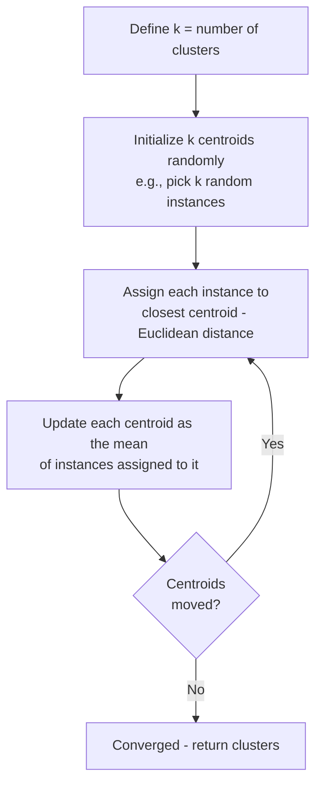
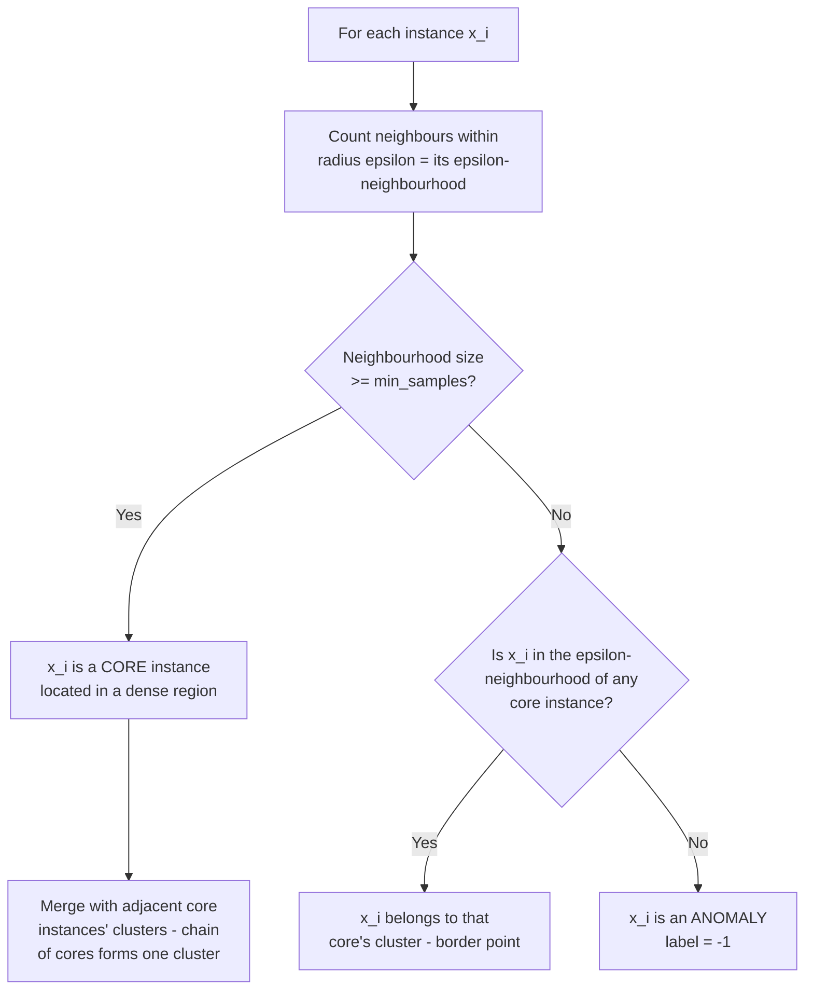

# CITS5508 Machine Learning — Unsupervised Learning Techniques

**Lecturer:** Associate Professor Du Huynh
**Reference:** Chapter 9, *Hands-on Machine Learning with Scikit-Learn & TensorFlow*, Aurélien Géron, O'Reilly Media, 2022.

---

## 1. Introduction to Unsupervised Learning

Focus of this chapter: two clustering algorithms — **k-means** and **DBSCAN**.

### Common Applications
- Fraud detection
- Defective product detection in manufacturing
- Recommender systems
- Semi-supervised learning (propagate labels within clusters to expand labelled data)
- Image segmentation
- Image retrieval (cluster image database; find query image's cluster)
- Anomaly detection (e.g. users with unusual request rates)

### Clustering vs Classification
- **Classification:** supervised; each instance has a known class label.
- **Clustering:** unsupervised; algorithm identifies similar instances and groups them without given labels.
- No universal definition of a "cluster" — different algorithms capture different cluster shapes:
  - **Centroid-based** (e.g. k-means): instances grouped around a central point.
  - **Density-based** (e.g. DBSCAN): continuous regions of densely packed instances; can take any shape.

---

## 2. K-Means Clustering

### 2.1 Algorithm



**Convergence guarantee:** The mean squared distance between instances and their closest centroids monotonically decreases at each step and is bounded below by zero, so the algorithm converges in a finite number of steps.

### 2.2 Scikit-Learn Implementation

```python
from sklearn.cluster import KMeans
from sklearn.datasets import make_blobs

X, y = make_blobs(...)        # X: 2D points; y: ground truth cluster IDs
k = 5
kmeans = KMeans(n_clusters=k, random_state=42)
y_pred = kmeans.fit_predict(X)
```

Useful attributes/methods:
- `kmeans.labels_` — cluster IDs of training instances (same as `y_pred`).
- `kmeans.cluster_centers_` — coordinates of the $k$ centroids.
- `kmeans.predict(X_new)` — predict cluster for new instances.
- `kmeans.transform(X_new)` — Euclidean distance from each instance to every centroid (soft clustering).

**Note:** Predicted cluster IDs may not align with ground-truth IDs (they can be in any order).

### 2.3 Hard vs Soft Clustering

| Type | Output for $m$ instances, $k$ clusters | Description |
|---|---|---|
| Hard | Vector of $m$ elements in $\{0, \ldots, k-1\}$ | Each instance assigned to one cluster |
| Soft | $m \times k$ matrix of scores (e.g. inverse distance) | Each instance scored against every cluster |

### 2.4 Voronoi Diagram

Plotting decision boundaries (only feasible in 2D) yields a Voronoi tessellation. The decision boundary between centroids $\mathbf{c}_1$ and $\mathbf{c}_2$ is the line segment perpendicular to $\overline{\mathbf{c}_1\mathbf{c}_2}$ and equidistant from both.

---

## 3. K-Means Drawbacks and Remedies

### 3.1 Drawback 1 — Sensitivity to Centroid Initialization

K-means always converges, but may converge to a **local optimum** depending on initial centroid placement.

#### Method 1 — Supply known good centroids
```python
good_init = np.array([[-3, 3], [-3, 2], [-3, 1], [-1, 2], [0, 2]])
kmeans = KMeans(n_clusters=5, init=good_init, n_init=1, random_state=42)
kmeans.fit(X)
```

#### Method 2 — Multiple random initializations
Run the algorithm `n_init` times (default 10) and keep the model with the lowest **inertia**.

**Inertia** = sum of squared distances between instances and their closest centroids:
$$\text{inertia} = \sum_{i=1}^{m} \| \mathbf{x}_i - \mathbf{c}_{\text{closest}(i)} \|^2$$

- `kmeans.inertia_` — the lower, the better.
- `kmeans.score(X)` = $-\text{inertia}$ — the higher, the better.

#### Method 3 — K-means++ Initialization (Arthur & Vassilvitskii, 2007)
Scikit-Learn's default. Selects initial centroids that tend to be distant from one another.

**Algorithm:**

1. Pick the first centroid $\mathbf{c}^{(1)}$ uniformly at random from the dataset.
2. For each remaining data point $\mathbf{x}_i$ ($i = 1, \ldots, m$), compute $D(\mathbf{x}_i)^2$ = squared distance from $\mathbf{x}_i$ to its closest already-chosen centroid. Convert to probabilities:
$$P(\mathbf{x}_i) = \frac{D(\mathbf{x}_i)^2}{\sum_{j=1}^{m} D(\mathbf{x}_j)^2}$$
Points with high probability (i.e., far from existing centroids) are more likely to be sampled as the next centroid.
3. Repeat Step 2 until $k$ centroids have been initialized.

### 3.2 Drawback 2 — Choosing the Optimal $k$

A wrong $k$ produces poor clustering (small $k$ → clusters merge; large $k$ → clusters split).

#### Approach A — Elbow Method
Inertia decreases monotonically with $k$, so it cannot be naively minimized. Look for an **elbow** in the inertia-vs-$k$ curve.

Example values:
- $k = 3$: inertia = 653.2
- $k = 5$: inertia = 211.6
- $k = 8$: inertia = 119.1

Curve has an elbow at $k = 4$ — but the elbow is often misleading (the true optimum here is $k = 5$).

#### Approach B — Silhouette Score (preferred)

The **silhouette coefficient** of instance $\mathbf{x}_i$:
$$s_i = \frac{b - a}{\max(a, b)}$$

where
- $a$ = mean distance from $\mathbf{x}_i$ to other instances in the same cluster (mean intra-cluster distance);
- $b$ = mean distance from $\mathbf{x}_i$ to instances of the *nearest* other cluster (minimised over all clusters except $\mathbf{x}_i$'s own).

Range: $s_i \in [-1, +1]$.

| Value | Interpretation |
|---|---|
| $\approx +1$ | Well inside own cluster, far from others |
| $\approx 0$ | Near a cluster boundary |
| $\approx -1$ | Likely assigned to wrong cluster |

**Silhouette score** = mean of $s_i$ over all instances. Higher is better.

#### Approach C — Silhouette Diagram
A horizontal "knife" shape per cluster. Inspect:
- Vertical dashed line = overall silhouette score.
- Instances stopping short of the line → that cluster is poor.
- Thick knife → large cluster.
- Prefer $k$ where all knives are of similar size and most extend past the score line (even at slightly lower mean score).

### 3.3 Drawback 3 — Cluster Shape Limitations

K-means performs poorly when clusters have:
- Varying sizes
- Different densities
- Non-spherical (e.g. elliptical) shapes

Because assignment depends only on distance to a single centroid.

**Remedy:** Use a **Gaussian Mixture Model (GMM)**, which estimates a covariance matrix per cluster and can handle elliptical shapes.

---

## 4. Using Clustering for Semi-Supervised Learning

Use case: limited labelled data, abundant unlabelled data. Demonstrated on the `load_digits` dataset (1,797 images of $8 \times 8$ grayscale digits 0–9; 1,400 train / 397 test).

### 4.1 Baseline — 50 Random Labelled Instances

```python
from sklearn.linear_model import LogisticRegression
n_labelled = 50
log_reg = LogisticRegression(max_iter=10_000)
log_reg.fit(X_train[:n_labelled], y_train[:n_labelled])
log_reg.score(X_test, y_test)   # 0.7481  (74.8%)
```

### 4.2 Step 1 — Label Cluster Representatives

```python
k = 50
kmeans = KMeans(n_clusters=k, random_state=42)
X_digits_dist = kmeans.fit_transform(X_train)             # 1400 x 50
representative_digit_idx = np.argmin(X_digits_dist, axis=0)  # 50 indices
X_representative_digits = X_train[representative_digit_idx]  # 50 x 64
# Manually label the 50 representative images
y_representative_digits = np.array([1, 3, 6, 0, 7, 9, 2, ..., 5, 1, 9, 9, 3, 7])

log_reg.fit(X_representative_digits, y_representative_digits)
log_reg.score(X_test, y_test)   # 0.8489  (84.9%)
```

### 4.3 Step 2 — Label Propagation Within Clusters

```python
y_train_propagated = np.empty(len(X_train), dtype=np.int64)
for i in range(k):
    y_train_propagated[kmeans.labels_ == i] = y_representative_digits[i]

log_reg.fit(X_train, y_train_propagated)
log_reg.score(X_test, y_test)   # 0.8942  (89.4%)
```

### 4.4 Step 3 — Partial Propagation (Drop Outliers)

Drop the 1% of instances furthest from their cluster centroid:

```python
X_train_partially_propagated = X_train[partially_propagated]
y_train_partially_propagated = y_train_propagated[partially_propagated]
log_reg.fit(X_train_partially_propagated, y_train_partially_propagated)
log_reg.score(X_test, y_test)   # 0.9093  (90.9%)

# Accuracy of the propagated labels themselves:
(y_train_partially_propagated == y_train[partially_propagated]).mean()  # 0.9756
```

This **90.9%** beats the **90.7%** baseline obtained from training on all 1,400 truly-labelled instances.

### 4.5 Summary of Accuracy Progression

| Approach | Test Accuracy |
|---|---|
| 50 random labels | 74.8% |
| 50 cluster representative labels | 84.9% |
| Full label propagation | 89.4% |
| Partial propagation (drop 1% outliers) | **90.9%** |
| Full ground-truth training set (1400 labels) | 90.7% |

### 4.6 Related Scikit-Learn Tools
- `sklearn.semi_supervised.LabelSpreading`
- `sklearn.semi_supervised.LabelPropagation`
- `sklearn.semi_supervised.SelfTrainingClassifier` — train on labels, predict unlabelled, retrain using high-confidence predictions.

---

## 5. DBSCAN (Density-Based Spatial Clustering of Applications with Noise)

### 5.1 Algorithm

Two hyperparameters: $\epsilon$ (`eps`) and `min_samples`.



**Key idea:** Long sequences of neighbouring core instances form a single connected cluster of arbitrary shape.

### 5.2 Scikit-Learn Example

```python
from sklearn.cluster import DBSCAN
from sklearn.datasets import make_moons

X, y = make_moons(n_samples=1000, noise=0.05)
dbscan = DBSCAN(eps=0.05, min_samples=5)
dbscan.fit(X)
```

Useful attributes:
- `dbscan.labels_` — cluster index per instance (`-1` = anomaly).
- `dbscan.core_sample_indices_` — indices of core instances.
- `dbscan.components_` — feature vectors of the core samples.

#### Effect of `eps`

| `eps` value | Number of outliers (anomalies) |
|---|---|
| 0.05 | 84 |
| 0.20 | 0 |

Larger `eps` → more neighbours included → fewer anomalies; can also merge separate clusters incorrectly.

### 5.3 Predicting New Instances

DBSCAN has **no** `predict()` method. Train a k-NN classifier on the core samples:

```python
from sklearn.neighbors import KNeighborsClassifier
knn = KNeighborsClassifier(n_neighbors=50)
knn.fit(dbscan.components_, dbscan.labels_[dbscan.core_sample_indices_])

X_new = np.array([[-0.5, 0], [0, 0.5], [1, -0.1], [2, 1]])
knn.predict(X_new)         # array([1, 0, 1, 0])
knn.predict_proba(X_new)
```

### 5.4 Re-introducing Anomaly Detection at Prediction Time

To label a new point as anomaly when it's far from any core sample, use a distance threshold:

```python
y_dist, y_pred_idx = knn.kneighbors(X_new, n_neighbors=1)
y_pred = dbscan.labels_[dbscan.core_sample_indices_][y_pred_idx]
y_pred[y_dist > 0.2] = -1     # threshold = 0.2
y_pred.ravel()                # array([-1, 0, 1, -1])
```

### 5.5 Summary — Pros and Cons

**Pros**
- Identifies clusters of **any shape**.
- Detects any number of clusters automatically.
- Only **two** hyperparameters.
- Built-in anomaly detection.

**Cons**
1. Struggles when **density varies significantly** across clusters, or when there is no sufficiently low-density region between clusters.
2. Computational complexity is approximately $O(m^2 n)$ — the quadratic term in the number of instances $m$ means it does **not scale well to large datasets**.